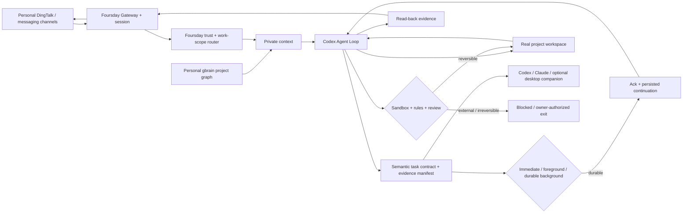

<div align="center">


# Foursday

**A personal-memory-driven work twin for real projects.**

Trusted message → personal context → real workspace → verified work → natural reply.

[简体中文](./docs/指南/中文首页.md) · [Pilot test](./docs/指南/同企业真实工作灰度测试指南.md) · [Architecture](./docs/en/architecture.md) · [Install](./docs/en/deployment.md) · [Security](./SECURITY.md) · [Contributing](./CONTRIBUTING.md)

[](https://github.com/ruiwang20010702/foursday/actions/workflows/check.yml)
[](https://github.com/ruiwang20010702/foursday/actions/workflows/security.yml)
[](https://github.com/ruiwang20010702/foursday/releases)
[](./LICENSE)

</div>

## What it does

Foursday is an AI work twin for people who want an agent to work inside their real projects—not a chatbot that needs a new workflow for every question.

For a direct-message sender whose stable identity is verified in the current DingTalk organization, Foursday can:

- read an exact shared DingTalk link in an isolated intake, let Codex choose a primary work scope and related projects from evidence, and bind the next turn to the real workspace;
- read authorized pages from your personal gbrain;
- use Codex inside the real workspace;
- search, calculate, edit files, run tests, and recover from failures;
- reply naturally with read-back evidence;
- freeze stale outbound text when the owner intervenes, while preserving or stopping background work according to the owner's intent.

Push, merge, deployment, production writes, irreversible deletion, payment, contracts, HR decisions, and secret disclosure remain hard boundaries.

## Architecture



Foursday uses a pinned, minimally installed [Hermes](https://github.com/NousResearch/hermes-agent) control plane internally; Codex is the only work-planning and reply-generating loop. Foursday ships:

- an isolated `foursday` Profile;
- DWS personal DingTalk and work-scope router plugins, with Stream event wake-up, filesystem wake-up, bounded fallback, exact enterprise dual-identity binding, and private bounded retry for temporary directory failures;
- an isolated Codex home with an App Server policy proxy, workspace sandboxing, forbidden command rules, automatic approval review, and a Foursday MCP;
- scope-bound live DingTalk reads through that MCP: common sources may be registered, while exact links from verified current-enterprise direct-message senders become short-lived `provided_N` sources outside the model. DWS, node IDs, URLs, contact/global search, writes, and paths outside the current primary workspace remain unavailable to the Codex shell;
- a project-work Skill;
- a private semantic task ledger: Codex derives the goal, deliverables, acceptance criteria and evidence state from full context, while Foursday enforces identity, revision and lifecycle boundaries; the model cannot mark its own work accepted;
- a durable long-task lane: Codex semantically declares the execution shape before substantive tools, runtime activity can promote an underestimated task, DWS sends at most one generation-fenced acknowledgement, and Hermes queues an internal continuation that resumes the same Codex Thread after the acknowledgement Turn; restart recovery replays only the current leased generation;
- small host-side bridges for credentials and personal-memory promotion.
- an owner-intervention fence that invalidates stale delivery first, then asks a no-tool Codex classification turn for one bounded control intent; the connector—not the model—applies the revisioned state change;
- one host-neutral Foursday Control MCP, with thin Codex and Claude plugins, a macOS desktop companion that combines the task worksite with folded system diagnostics, and a hidden read-only browser fallback for non-macOS or recovery use.

The installation gate verifies that the pinned runtime bypasses its own foreground tool loop in `codex_app_server` mode. Foursday also disables upstream built-in memory, memory/skill nudges, background review, automatic title generation, and the curator; durable learning goes only through the Foursday MCP and personal-gbrain promotion path.

Profile behavior, routed project details, and personal-memory context are explicitly bridged into Codex rather than assumed to flow through the embedded runtime. A private 15-minute token binds each turn to one workspace and Session; the proxy removes the internal marker before reasoning, labels gbrain text as data rather than instructions, and prevents the token from leaving in a reply.

The previous custom Agent Runtime, capability manifests, approval UI, managed Gateway, compatibility installer, and duplicated documentation were removed. Git history remains the recovery path.

## Open work scopes, constrained execution

Foursday does not require every business relationship to be encoded in a manifest. Its private registry contains only the minimum needed to execute safely: real workspaces, repository pointers, aliases, optional parent scopes, and exact gbrain page pointers. Personal gbrain supplies the broader and changing project graph.

For each task, Codex may choose:

- one executable primary scope;
- zero or more related registered scopes;
- zero or more related personal-gbrain project pages.

Parent scopes provide inherited context, while related scopes never expand filesystem permission. Codex can revise the selection on later evidence; it asks a person only when unresolved business meaning would materially change the outcome. Registry v1 remains readable, while new installations use the workspace/scope-separated v2 format in [`distribution/projects.example.json`](./distribution/projects.example.json).

## Next capability boundary

Foursday uses a Codex-first capability model: Hermes owns message ingress, sessions, cron/event triggers, and delivery; Codex owns thread resume/fork, subagents, shell/Python, web, images, approved MCPs, isolated skills/working memory, project execution, scope selection, and the final answer. Foursday binds identity, primary workspace, authority, human intervention, receipts, and stable-fact promotion. Its lightweight work-scope graph is routing context for Codex, not a second executor or Agent Loop.

Inside a selected registered workspace, reversible work runs autonomously. Safety is enforced at identity, workspace, consequence, and delivery boundaries rather than through a capability checklist. The personal default allowlist is the current DingTalk organization: each direct-message sender must resolve to the same stable user ID through the current-organization contact chain; external or unresolved identities are dropped. Any verified enterprise sender may grant one context-bound read by providing an exact DingTalk document link. Codex may select another registered workspace for ordinary reversible work on the next turn. Business meaning and acceptance questions go to the requester; production, unregistered workspace access, personal high-authority connectors, secrets, and irreversible actions go to the owner. Real sending and production activation remain separate release gates.

## Install

Requirements: macOS, Git, Node.js 22+, DWS `v1.0.59+` for Stream event wake-up (older versions degrade to filesystem wake-up and bounded fallback), and access to a personal gbrain endpoint.

```bash
git clone https://github.com/ruiwang20010702/foursday.git
cd foursday
npm ci --ignore-scripts
npx --no-install foursday setup
npx --no-install foursday setup --apply
```

`foursday setup` detects Node, Git, Codex and DWS, reads the current DingTalk profile and Codex saved projects, connects the private configuration, installs the Foursday Profile, starts a send-disabled trial, and runs one real read-only Codex verification. It asks at most for the DingTalk account and allowed project roots. Setup always ends in **trial mode: no automatic DingTalk replies**; activation remains a separate decision.

The setup state is private and resumable. It stores completed step names and counts, never credentials, account IDs, chat content or absolute project paths. Missing PostgreSQL or gbrain configuration produces one action in the Codex/Claude plugin instead of a terminal stack trace.

<details><summary>Advanced and recovery commands</summary>

`foursday install` remains available for diagnosis and recovery. It verifies the pinned upstream installer, skips browser, Computer Use and bundled skills, and atomically prunes optional Node dependencies only after runtime checks still pass.

Then create private copies of:

- [`deploy/foursday.example.json`](./deploy/foursday.example.json)
- [`distribution/projects.example.json`](./distribution/projects.example.json)

When Codex already has local projects saved, Foursday can generate the private v2 registry instead of asking you to rewrite every workspace by hand. Export the Codex project catalog to a private JSON file, preview discovery, then write a separate candidate:

```bash
npx --no-install foursday projects discover \
  --catalog /absolute/private/codex-projects.json \
  --output /absolute/private/projects.v2.json

npx --no-install foursday projects discover \
  --catalog /absolute/private/codex-projects.json \
  --output /absolute/private/projects.v2.json \
  --apply
```

Discovery preserves existing project authority, infers the nearest saved parent project, matches only exact gbrain project identities, excludes the whole user home and paths outside it, and never overwrites the active registry. The generated file is a private candidate; `configure` and production activation remain separate gates.

Configure and start in send-disabled shadow mode:

```bash
FOURSDAY_CONFIG_FILE=/absolute/private/foursday.json npx --no-install foursday configure --apply --registry /absolute/private/projects.json
FOURSDAY_CONFIG_FILE=/absolute/private/foursday.json npx --no-install foursday login --apply
FOURSDAY_CONFIG_FILE=/absolute/private/foursday.json npx --no-install foursday verify --apply
npx --no-install foursday gateway install-shadow --apply
npx --no-install foursday gateway start-shadow --apply
```

Activation is deliberately separate and requires a current shadow-acceptance receipt bound to the exact Foursday commit. See [deployment](./docs/en/deployment.md).

`foursday verify` runs one real Codex turn against an ephemeral fixture. It requires tool evidence, checks an unpredictable fact token, proves the workspace digest is unchanged, and performs no DingTalk send, production write, or deployment.

</details>

## Operate from Codex or Claude

Foursday is operated from an installed agent host, not from a separate administration product. Both plugin packages call the same local Control MCP:

- [`plugins/foursday`](./plugins/foursday)
- [`distribution/claude-plugins/foursday`](./distribution/claude-plugins/foursday)

Install either or both agent-host entries from the cloned repository:

```bash
foursday_cli_package=$(mktemp -d)
npm pack --ignore-scripts --pack-destination "$foursday_cli_package"
npm install --global --ignore-scripts "$foursday_cli_package"/foursday-*.tgz

codex plugin marketplace add .
codex plugin add foursday@foursday-local

claude plugin marketplace add . --scope user
claude plugin install foursday@foursday-local --scope user
```

Start a new Codex task or Claude Code session after installation so the new Skill and MCP are discovered. Both hosts use the installed `foursday` CLI; they do not bundle a second runtime.

The Control MCP exposes privacy-safe status, tasks, schedules, project-memory scope and evidence. Memory status distinguishes fixed workspace bindings from the number of project pages discoverable in personal gbrain; a temporary gbrain listing failure degrades only that count. Pause, takeover, correction and resume require the exact current `revision`; they cannot enable sending, deploy, delete data or expand permissions.

The same surface is available from the CLI:

```bash
npx --no-install foursday control status
npx --no-install foursday control tasks
npx --no-install foursday control schedules
```

The macOS companion is the default visual worksite. Build it locally without installing it:

```bash
npm run pet:build
npm run pet:build -- --apply
open ".runtime/foursday-pet/Foursday Pet.app"
```

The expanded worksite shows tasks by project and responsibility. Its secondary **Settings & System Diagnostics** surface reads the same status, schedules, memory, evidence and version projections from the Control service; engineering fields stay folded by default. It never exposes raw reasoning, commands, chat bodies, stable identity IDs, absolute paths or tool arguments.

When the companion is unavailable, or on non-macOS hosts, start the hidden read-only browser fallback:

```bash
npx --no-install foursday dashboard
# http://127.0.0.1:9466/
```

The fallback stores no independent state and exposes no write endpoint. Port `9465` belongs to the removed legacy administration runtime and is not a current source of truth. Upgrades may stop and archive the old service, but never remove PostgreSQL, Keychain entries or gbrain data as part of that cleanup.

The companion is a transparent, draggable, always-on-top work surface. It reuses an installed Codex pet, maps the same task ledger to animation, and expands into a native worksite with needs-me, AI-owned, and recent summaries above one project-first task tree. Every project appears once and expands its tasks in place, while each task carries its own responsibility state. AI-owned means responsibility remains with the agent, not that a Turn is running at that instant; actual progress comes from the semantic lifecycle and activity trail. The Control projection first selects a binding that exactly matches the current owner revision and send generation, then falls back to the newest valid binding. A fresh unbound task is shown as routing; a stale legacy record without a project, contract, or Codex Thread moves to recent history instead of appearing as AI-owned. Project discovery is automatic—requesters never need to create a Foursday folder or project entry. The worksite shows a bounded requester label and channel, the Foursday/Codex executor, Thread location, deterministic progress, bounded evidence, missing proof, and sanitized App Server activity such as read/search/edit/test. Missing task contracts are reported as evidence-not-started instead of misleading zero counts. Pause, resume, communication takeover, and task takeover reuse the existing revision-fenced Control service rather than creating another state machine or approval workflow. A Codex deep link is shown only when the bound Thread is actually visible to the current desktop data space; isolated Threads are explicitly described as absent from the main sidebar and expose only a copyable diagnostic ID.

Project folders are expanded by default and collapse locally when their header is clicked; this never changes task ownership or Codex execution. New tasks use the semantic title written by Codex. A local, preview-first backfill can derive a bounded title for legacy tasks from the exact isolated Codex Thread; it stores only the title and generation, never the source conversation, and skips ambiguous or sensitive history.

## Memory ownership

| Store | Responsibility |
|---|---|
| Personal PRIVATE gbrain Git | Durable business knowledge |
| gbrain PostgreSQL | Rebuildable search and graph projection |
| Foursday Session store | Conversation and tool history, provided by the embedded control plane |
| Foursday private task ledger | Current task contract, lifecycle and bounded evidence summary |
| Foursday PostgreSQL | Encrypted memory-promotion queue only |

Foursday does not create a second knowledge repository or copy personal pages into its own Git repository.

## Status

The current source candidate is `v0.9.0-rc.3`; the latest GitHub Release remains `v0.8.0-rc.1`. The candidate adds guided setup, privacy-safe reviewed-task evidence, staged detection latency and a lower-overhead unified macOS worksite with responsive native dragging to the shared Control MCP and one-Codex-loop architecture. A source candidate, GitHub Release, technical deployment and production activation are separate states.

Installing this repository does not inherit any existing instance's authority, credentials, allowlist, send permission, or production state.

Run the verified checks locally:

```bash
npm run check:full
npm run check:golden
npm run check:python
npm run reuse:verify
npm run check:security
```

## Documentation

- [Architecture](./docs/en/architecture.md)
- [Deployment](./docs/en/deployment.md)
- [生产迁移与回滚](./docs/指南/生产迁移与回滚.md)
- [Integration guide](./docs/en/integrations.md)
- [产品需求文档](./docs/产品需求文档.md)
- [技术设计文档](./docs/技术设计文档.md)
- [中文首页](./docs/指南/中文首页.md)

## License

[MIT](./LICENSE)
