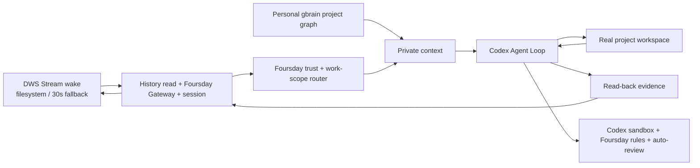

# Architecture

Foursday is a work-twin product with one Codex Agent Loop. A pinned, minimally installed Hermes runtime supplies the internal Gateway, session lifecycle, scheduling, and future channel adapters; it does not plan work or write the final reply.

The current public version is `v0.8.0-rc.1`. Source validation, a GitHub release, technical deployment and production activation are separate states. The detailed product contract lives in the [PRD](../产品需求文档.md).

## Ownership

| Layer | Owner |
|---|---|
| Work planning, project tools, and final reply | Codex app-server |
| Gateway, session lifecycle, scheduling, future standard channels | embedded upstream Hermes runtime |
| Personal DingTalk | DWS `v1.0.59+` Stream wake, filesystem/30s degradation, `dws_personal` plugin and host sidecar |
| Workspace selection | `project_router` plugin |
| Personal-memory context | DWS platform context provider and read-only bridge |
| Memory promotion | Foursday MCP with short-lived message-bound tokens |
| Risk enforcement | isolated Codex home, App Server policy proxy, OS sandbox, forbidden rules, and automatic approval review |
| Work behavior | Foursday Profile and project-work Skill |
| Durable business knowledge | personal PRIVATE gbrain Git |
| Memory promotion queue | minimal Foursday PostgreSQL schema |

Foursday has no Hermes fork, core patch, second Agent Loop, capability-manifest workflow, or second business-memory repository.

## Operator surface

Codex and Claude are the primary operator hosts. Their thin plugins call one local Foursday Control MCP for privacy-safe status, tasks, schedules, project-memory scope, evidence, and revision-fenced pause/takeover/correction/resume actions. The control file contains no task body or identity and is checked by DWS before message processing and again before transport.

`foursday dashboard` is an optional loopback-only, GET-only projection of the same service. It stores no state and exposes no control endpoint. The legacy service on port 9465 is not part of the current architecture.

## Codex-first capability boundary

The target split is deliberately asymmetric. Hermes owns channel ingress, platform sessions, cron/event triggers, and delivery. Codex owns task threads, work-scope selection, safe resume/fork, workspace-bounded subagents, shell/Python, controlled web and image tools, approved MCP servers, Skills, working memory, project execution, verification, and the final answer. Foursday owns stable identity, real-workspace binding, the task authority envelope, owner intervention, high-risk exits, delivery receipts, and evidence-gated promotion into personal gbrain.

The v2 private registry separates executable `workspaces` from business `scopes`. A scope may inherit a parent workspace and exact gbrain pages, while open-ended relationships are discovered from personal gbrain by Codex. Each task binds one primary executable scope and may retain several related scopes/pages. Related context never grants additional filesystem access, and the selection may be revised on later evidence.

An authorized request grants the reversible work needed to finish its goal; Foursday does not ask for approval before every tool call. Codex may select another registered workspace for ordinary reversible work on the next turn. Business meaning, priority, content, and acceptance questions return to the requester. Production, unregistered workspaces, personal high-authority MCPs, secrets, privilege expansion, and irreversible actions return to the owner.

The Foursday Profile fixes Hermes busy input to `queue`. Text fragments that arrive after a Codex turn has started are merged into the next turn instead of being redirected into a turn that still owns an older delivery generation. The old answer remains suppressed; the queued turn rebinds delivery from its final event metadata, so only an answer that owns the latest `ownerRevision/sendGeneration` can become visible.

The current source candidate implements this contract. Bound `thread/resume` and same-task `thread/fork` survive Gateway restarts; Codex web/image, isolated Skills/Memory and native multi-agent support are enabled; the Foursday MCP exposes only evidence-gated memory and current-message attachment tools. Untrusted dynamic tools, model overrides, arbitrary shell network and high-risk exits remain blocked.

## Version scope

The source candidate covers personal DingTalk through DWS, Stream-event wake with explicit degradation, adaptive outbound stability for 5–8 second message fragments, allowlist enforcement, project routing, personal gbrain context, Codex Thread resume/same-task fork, subagents, web/image, scoped MCP, isolated Skills/Memory, attachments, read-back, five-state owner intervention, safety boundaries, and shadow verification. It also contains the local-only Hermes Cron/Monitor-to-Codex core. Feishu, Slack, Teams, cross-platform Session recovery, user-facing scheduled-work configuration and proactive-work recipes remain P1. Enterprise governance and ecosystem features remain P2.

Installation verifies the locked upstream source still bypasses its foreground tool loop in `codex_app_server` mode. The Foursday Profile disables upstream built-in memory, memory/skill nudges, background-review forks, automatic title generation, and the curator so no post-turn auxiliary model or Agent Loop reappears behind Codex.

The upstream adapter does not automatically forward Profile, Skill, or ephemeral channel context into Codex. Foursday closes that boundary explicitly: the router binds the upstream public Session-CWD context to the real project; trusted Profile instructions are injected on `thread/start`; each DWS turn carries only a random marker whose private, 15-minute host record binds the routed workspace, project context, personal-gbrain data, requester handle, and Session. The proxy validates and removes the marker before it injects context into `turn/start`; personal-memory text is marked data-only and the outbound DLP rejects the token.

## Trust boundaries

Unknown users and unmentioned groups are rejected before a Session is created. Project terminal commands are confined to the routed workspace and have no network. Host credentials remain in narrow sidecars. External or irreversible actions are blocked and must use a separate owner-authorized exit.

The embedded control plane's own approval layer is disabled deliberately: a headless Gateway otherwise declines ordinary Codex commands before Foursday can apply its policy. The Foursday App Server proxy is the single decision point—Codex auto-reviews reversible work under the forced profile, while the proxy declines escalation and high-risk operations before the control plane can approve them.

See the [technical design](../技术设计文档.md) for exact invariants.
