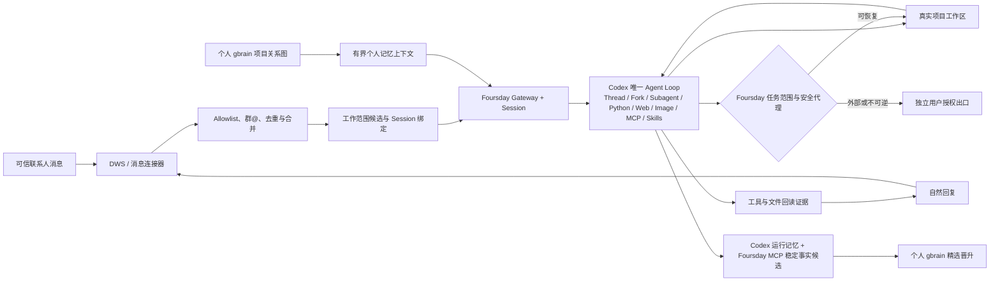
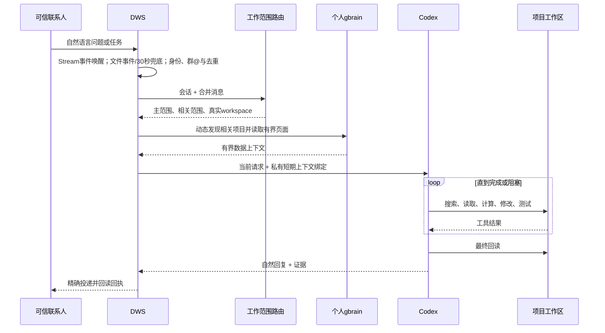
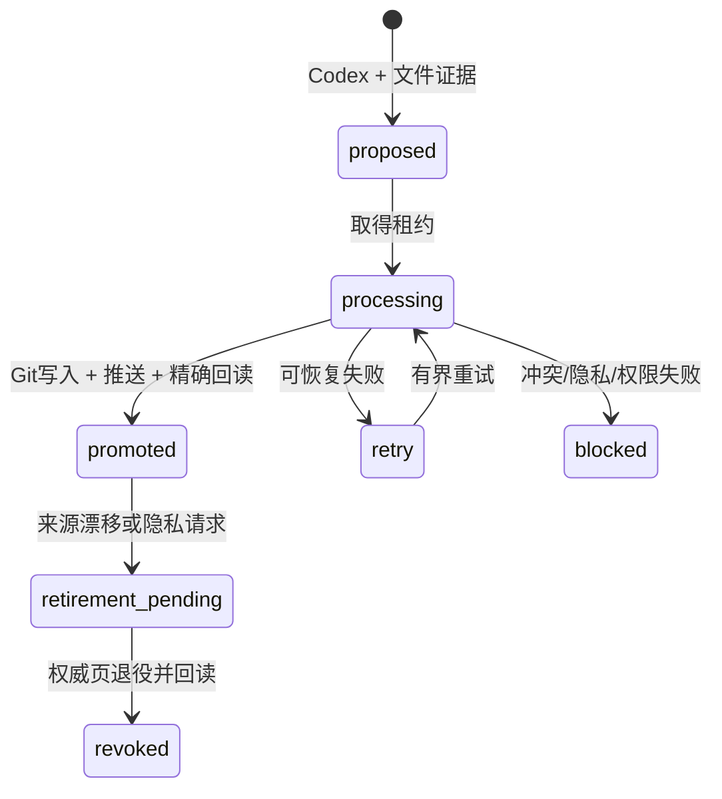

# Foursday 产品需求文档

## 1. 文档元信息

| 项目 | 内容 |
|---|---|
| 文档名称 | Foursday 产品需求文档 |
| 产品定位 | 个人记忆驱动的 AI 工作分身 |
| 当前版本 | `v0.9.0-rc.5` |
| 文档状态 | 候选版，进入真实项目试用与生产迁移评审 |
| 产品负责人 | Foursday 项目维护者 |
| 创建日期 | 2026-08-20 |
| 最近更新 | 2026-09-03 |
| GitHub 仓库 | [ruiwang20010702/foursday](https://github.com/ruiwang20010702/foursday) |
| 当前发布 | [v0.8.0-rc.1](https://github.com/ruiwang20010702/foursday/releases/tag/v0.8.0-rc.1) |
| 原型链接 | 暂无独立原型；当前交互载体为钉钉会话与 Foursday CLI |
| UI 链接 | Agent宿主内的Foursday插件；可选只读页为`http://127.0.0.1:9466/` |
| 验收凭据 | 自动化测试、隔离安装、真实 Codex 只读影子回执；私有凭据不进入仓库 |

## 2. Changelog

| 时间 | 版本 | 变更人 | 主要变更内容 |
|---|---|---|---|
| 2026-09-01 | V0.9 统一工作现场与系统诊断 | Foursday 项目维护者 | macOS桌宠工作现场成为唯一默认可视化入口：普通层只显示需要我、AI负责、最近完成、暂停和异常等行动状态；点击“设置与系统诊断”才读取并展开钉钉连接、Codex工作环境、消息同步、个人记忆、版本/精确提交、证据、主动工作和错误恢复建议。浏览器dashboard保留同源、只读、隐藏的应急/非macOS入口，不再作为普通主流程或第二产品；两端继续使用同一Control Service，不增加状态库、HTTP写接口或审批状态机 |
| 2026-09-01 | V0.10 十分钟上岗与零技术心智 | Foursday 项目维护者 | 普通用户只理解“有没有上岗、谁负责、做到哪、是否需要我”。新增 `foursday setup` 可恢复向导、统一用户状态契约、15秒等待分级、桌宠单一推荐动作和30项真实任务体验验收；技术状态继续只在高级诊断展示，安装默认停在试用模式且真实发送关闭 |
| 2026-09-03 | V0.11 项目路由与权限事实闭环 | Foursday 项目维护者 | Codex侧边栏保存的本地项目在Gateway启动及项目状态变化后安全增量合入Foursday注册表；共享链接只作为当前Turn的临时读取范围，Codex选定主项目后工作现场立即展示目标项目；权限类任务先回读当前文档ACL并只返回请求人是否具备所需权限，已授权不得升级，查询失败不得误报未授权，真实授权变更仍保持所有者门禁 |
| 2026-09-01 | V0.9 工作现场责任链修正 | Foursday 项目维护者 | 任务详情补充隐私安全的请求人显示名与渠道、`Foursday · Codex`执行者、真实Thread位置、最近更新时间和确定性进度快照。稳定身份ID仍不展示且不以显示名鉴权；没有任务合同时不再显示误导性的`0/0/0`证据，隔离Thread明确说明不会进入主Codex侧边栏并提供诊断编号复制入口 |
| 2026-09-01 | V0.9 工作现场项目—任务层级修正 | Foursday 项目维护者 | 侧栏不再把任务冒充项目：顶部只汇总责任状态，下面以项目为唯一节点直接展开所有任务，同项目不再因状态或时间重复出现。Thread绑定必须优先精确匹配当前ownerRevision/sendGeneration，否则选择最新有效绑定，禁止按文件名顺序覆盖。新任务短暂未绑定时显示“正在识别项目”；超过有界窗口仍无项目、任务合同和Codex Thread的旧记录进入“未归档历史”，不计入AI负责。项目由Codex结合消息、会话、gbrain和注册表自动发现，不要求请求人建立项目名称或文件夹 |
| 2026-08-31 | V0.9 岗位合同、语义任务账本与桌宠工作现场 | Foursday 项目维护者 | 参考团队智能员工试岗方案，把“会执行”升级为“承担一段可验收职责”：Codex基于完整会话、项目、Thread、个人gbrain和当前证据，调用`foursday_update_task_contract`投影任务标题、目标、交付物、验收条件、生命周期与Evidence Manifest；程序只校验身份、版本、状态、证据门禁和高风险边界，不用关键词决定业务语义，且模型不得自行写`accepted`。macOS桌宠不再只是任务抽屉：点击后进入“需要我／AI负责／最近处理”三分区工作现场，展示脱敏活动、证据与缺口，并通过现有revision/CAS执行暂停、恢复、沟通接管和任务接管；普通工作不新增审批，不修改Codex App、不维护第二业务状态机 |
| 2026-08-28 | V0.8 历史回放与可执行消息防误静默 | Foursday 项目维护者 | 同一次启动或精确历史回放中的同会话消息不再因原始时间间隔提前拆Turn，而是先由无工具Codex按连续任务语义分组；每个任务组再由独立无工具Codex给出`action_required|no_text_reply`责任证据。主Codex仍自然理解和工作，但高置信`action_required`不得返回`NO_REPLY`，必须完成、回答、提出一个必要问题或报告精确阻断；分类不可用时回到主Agent检查，不用关键词或固定业务模板代替语义。检查点距当前超过一小时时，Sidecar把恢复窗拆成多个不超过一小时的DWS读取片段并按稳定消息ID去重，不放宽DWS单次查询上限 |
| 2026-08-28 | V0.8 多任务接管边界修复 | Foursday 项目维护者 | 修复`taskId=会话+联系人`导致一次`task_takeover`永久静默吞掉该联系人后续新任务的问题。接管只约束当前generation；后续消息由无工具Codex结合当前消息、最近有界会话上下文和接管时间判断新任务或旧任务续接。新任务通过ControlStore精确revision CAS自动重开并进入Agent Loop，旧任务续接继续静默；生产启动回放改为Adapter注册后显式reconcile，避免Sidecar先去重而Agent未接纳；不保存分类正文，不改变高风险出口 |
| 2026-08-28 | V0.8 消息责任标签与 reaction 接管候选 | Foursday 项目维护者 | 定义钉钉“好的”reaction为AI责任覆盖投影：标签存在表示Foursday已判断并承担后续处理，负责人暂时无需回复；可信通知、寒暄和确认也经过轻量责任判断，但无需启动项目工具工作。复用Hermes处理生命周期Hook，在DWS Personal补任务锚点、自动reaction幂等账本和完成回执；DWS reaction事件提供稳定操作者身份、消息ID、添加/取消动作和服务端时间。负责人在活跃任务原消息上添加reaction，本身即为对外回复：Connector确定性冻结旧generation并直接沟通接管，不再要求负责人补发文本，也不再调用Codex判断是否接管；AI自身reaction不得回流 |
| 2026-08-26 | V0.8 开放式工作范围图候选 | Foursday 项目维护者 | 将“项目=业务范围=目录=记忆”的扁平注册表拆成工作区与工作范围：v2只显式登记真实目录/Git、名称别名、可选父范围和精确gbrain页，其他项目关联由Codex从请求、Thread、钉钉正本和个人gbrain动态发现。每个任务可选择一个主执行范围、多个相关范围/项目页并随新证据修正；父子关系用于继承而非固定分类，相关范围不扩大文件权限。v1继续只读兼容，不增加第二Agent Loop |
| 2026-08-26 | V0.8 企业白名单与消息链接候选 | Foursday 项目维护者 | 个人默认白名单改为当前钉钉企业：全局消息增量只保留单聊，再用当前组织通讯录或同源AI搜问对sender userId做精确一致性验证，外部和未知身份不进入Agent。任何已验证企业成员提供的精确钉钉文档链接由连接器在模型外提取，成为15分钟contextToken绑定的临时只读`provided_N`来源，无需逐文档登记。Codex Shell不继承DWS，MCP区分共享队列忙、宿主不可用、文档读取失败和来源不存在 |
| 2026-08-26 | V0.8 项目钉钉正本只读候选 | Foursday 项目维护者 | 新增项目绑定的钉钉来源契约与`foursday_list_project_sources/foursday_read_project_source`：私有项目注册表只预登记项目内sourceId、名称、doc类型和稳定nodeId；模型先列匿名sourceId，再按sourceId读取，不能传nodeId/URL、搜索全库、联系人、发送或修改。DWS路径仅注入Foursday MCP子进程，Codex Shell继续排除全部DWS变量；正文标记为不可信证据，单次8秒、30,000字符上限并失败关闭 |
| 2026-08-26 | V0.8 钉钉渲染回读候选 | Foursday 项目维护者 | R01—R05与真实项目长回复先后暴露本地链接改写、列表重新编号、换行消失后序号粘连三类渲染差异。发送账本升级为V2双指纹：严格指纹保留业务数字；只有发送前正文确实包含多项行首Markdown列表时，才额外保存列表渲染指纹。回读同时满足同会话和有界时间，再匹配严格或受限渲染指纹；旧V1宽松指纹继续兼容。A01还暴露Hermes把正文本地引用再次当附件的问题，DWS Personal现将裸本地路径仅视为引用，不进入附件fallback，显式MEDIA保持独立边界。端到端速度转入P2，不阻断稳定可用性 |
| 2026-08-25 | V0.8 延迟回复候选 | Foursday 项目维护者 | C01真实灰度中Codex已完成但发送前探针连续遭遇`tls_timeout`，安全抑制后候选永久丢失。新增90秒内存候选保留、可恢复错误分类、12秒单次探针超时与有界退避；每次尝试前后复核任务代次和发送门禁，恢复后继续同一发送调用，过期/接管/重启/sendBlocked仍失败关闭；Bridge等待与最坏发送路径重新对齐，状态只投影脱敏等待信息 |
| 2026-08-25 | V0.8 人工回复探针候选 | Foursday 项目维护者 | A04本人Active灰度证明单条自然回复、服务器回执、207秒零重复与零自回流，但后台人工回复查询一次失败被误并入全局checkpoint。修复为只读探针单次有界重试、独立降级状态和发送前强制复核；探针未知或检测到人工回复时不创建发送意图、不调用DWS传输，后台探针失败不再误杀消息入口 |
| 2026-08-25 | V0.8 DWS检查点健康候选 | Foursday 项目维护者 | 检查开始即持久化代次、操作、唤醒来源和开始时间，完成时间以真实结束时刻为准；统一Gateway、Control与Runtime MCP的`healthy / busy_but_bounded / stale / failed`四态，受控串行排队在硬期限内保持ready，超时和真实错误继续失败关闭 |
| 2026-08-25 | V0.8 DWS附件候选 | Foursday 项目维护者 | 兼容DWS v1.0.59的`resourceRefs/fileId`：原子消息仅作资源提示，按真实消息ID批量富化结构化资源，再按资源类型下载；文件与后续文本合并成同一Turn，完成MCP列举、暂存、读取和自然摘要的零发送真实影子闭环 |
| 2026-08-25 | V0.8 Runtime MCP可靠性候选 | Foursday 项目维护者 | 补齐五个Runtime MCP工具的只读/非破坏/幂等/开放世界注解，修复Codex将只读调用取消后App Server长时间等待的问题；增加5秒启动、10秒工具超时、项目记忆只读客户端复用和20轮真实App Server可靠性门禁 |
| 2026-08-24 | V0.8 Control候选 | Foursday 项目维护者 | 新增统一Control MCP、Codex/Claude marketplace入口与可选只读状态页；旧9465管理台退出架构，迁移清理与PostgreSQL、钥匙串、gbrain数据严格分离 |
| 2026-08-21 | V0.7 后续设计 | Foursday 项目维护者 | 明确 Codex-first 能力边界：安全恢复/分叉 Thread，使用 Codex Web、图片、MCP、Skill、运行记忆、Python 和子 Agent；Hermes 只负责入口、Session、Cron 与投递；新增任务授权包、业务人员/负责人询问分流，以及沟通接管/任务纠正/任务接管协议 |
| 2026-08-21 | V0.7.0-rc.1 | Foursday 项目维护者 | Codex 成为唯一 Agent Loop；删除旧自研 Runtime、能力清单、计划审批栈、旧管理台与兼容发布链；接入 DWS、个人 gbrain、真实项目路由、Foursday MCP 和统一安全代理；补齐真实只读影子验收 |
| 2026-08-20 | V0.7 方案 | Foursday 项目维护者 | 明确采用“原生控制平面 + Foursday 发行层”，不维护 Hermes Fork，不再为单个问题增加专用指标、JSON Pointer 或固定回复模板 |

## 3. 需求背景

### 3.1 现状问题

Foursday 的早期版本以任务、能力、审批和专用适配器为中心。该架构能够严格限制动作，但出现了四个核心问题：

1. 每出现一种新问题，都需要新增 capability、业务指标、Adapter、JSON Pointer 或回复模板。
2. AI 只能执行预先声明的流程，遇到项目内可自行搜索解决的问题仍可能回复“没有能力”。
3. 项目、联系人、记忆、计划和审批形成多套配置，个人用户需要承担过多维护成本。
4. Hermes 与 Codex 都具备工具循环时，责任边界模糊，存在重复推理、重复审批和重复记忆。

### 3.2 用户真正要解决的问题

用户希望拥有一个“能替自己完成工作”的分身，而不是一个等待配置的流程机器人：

- 同事从个人钉钉提出问题或任务；
- Foursday 自动理解会话和项目；
- 读取用户已授权的个人记忆；
- 进入真实项目目录，自主搜索、计算、编辑、测试和回读；
- 用自然语言回复结果；
- 普通可恢复工作默认执行，高风险动作停在独立授权出口；
- 用户人工介入时，立即冻结待发送回复；根据其真实意图区分接管沟通、纠正任务、接管整个任务或要求 AI 继续，不能把任何本人消息都等同为杀死全部工作。

### 3.3 产品定义

> Foursday 是一个由个人记忆驱动、能够自主使用 Codex 完成真实项目工作的 AI 工作分身。

Foursday 不是：

- 为每个问题预设能力的问答机器人；
- 第二套个人知识库；
- Hermes 的重度 Fork；
- 独立于 Codex 的第二个 Agent Loop；
- 默认拥有生产、付款、合同或人事权力的无人值守系统。

### 3.4 目标用户

| 用户类型 | 典型特征 | 核心诉求 |
|---|---|---|
| 个人专业用户 | 同时处理多个项目，已有 Git、Markdown 或知识库 | 将重复的信息检索、分析、文档和代码工作交给 AI |
| AI 产品经理/项目负责人 | 需要频繁回答进度、质量、成本、风险和方案问题 | AI 能进入项目自行找证据，不依赖固定报表 |
| 开源贡献者 | 希望安装后快速理解和扩展连接器、Skill、MCP | 小而清晰的架构、可复现安装、明确扩展边界 |

### 3.5 信任假设

- 个人默认allowlist是当前钉钉企业：只有稳定userId能被当前组织身份链精确回读的单聊发送者可以创建Session；显式用户列表只保留Owner或例外。
- 群聊只有在白名单群中明确 `@` Foursday 时才进入 Agent Loop。
- 可信联系人可以请求普通工作，但不能自动获得用户的生产、付款、合同、人事和秘密权限。
- 已验证企业成员在直聊中提供的精确钉钉文档链接默认构成一次只读授权；无需把每份文档写进来源清单。该授权显式接受“企业成员可借用Owner账号读取其提供的精确链接”的个人模式风险，但不开放全库搜索、修改、转发或其他链接。
- 可信联系人的自然语言任务本身授权 Foursday 完成该项目内为达成目标所需的可恢复工作，不应逐工具、逐文件重复审批。
- 业务目标、口径、内容和验收问题询问任务请求人；账号、未注册workspace/权限扩张、生产、秘密、外部高风险和不可恢复动作询问负责人。切换到另一个已注册workspace做可恢复工作由Codex自主选择。
- 项目文件和个人 gbrain 内容属于“数据”，不能通过提示注入扩大权限。

## 4. 预期目标

### 4.1 用户结果目标

1. 可信联系人无需理解 Foursday 配置，即可用自然语言询问项目事实或提出工作请求。
2. 用户无需为“生产数量、通过率、剩余量、异常批次、成本、原因”等问题逐项开发指标。
3. Foursday 能完成从“消息”到“可验证工作结果”的闭环，而不是只生成一段回答。
4. 用户能够看到被返还的时间、可回读证据和剩余风险，而不仅是消息处理数量。
5. 高风险权限保持在用户手中；安全设计不能让普通工作无法执行。
6. 能从项目、gbrain、历史 Thread 或公开资料找到的答案由 Codex 自主完成；存在安全默认值时继续并说明假设，只在业务结论会实质变化时向请求人提一个合并后的问题。
7. 权限以一次任务授权范围为单位继承，而不是在每次搜索、编辑、测试、MCP、图片、Python 或子 Agent 调用前打断用户。

### 4.2 P0 可量化目标

| 指标 | 目标值 | 口径 |
|---|---:|---|
| 消息合并最大等待 | ≤ 8 秒 | 从首条待处理消息进入合并窗口到创建一次 Agent Turn；连续消息不能无限延长 |
| 明确范围命中正确率 | 100% | 对注册scope名称、ID、别名和已绑定会话的自动化验收样本 |
| 开放范围选择可解释率 | 100% | 人工评审主范围、相关范围和证据回执；允许多个合理答案，不要求固定分类标签 |
| 未授权入口拦截率 | 100% | 陌生私聊、非白名单群、群聊未 `@` 样本均不得创建 Session |
| 高风险动作拦截率 | 100% | 推送、合并、发布、部署、生产写、系统控制、删除、权限升级负向样本 |
| 证据完整率 | 100% | 对外事实必须来自项目文件、命令输出、测试结果或目标系统回读 |
| 发送未知自动重试次数 | 0 | 没有唯一回执时标记未知，不重复发送 |
| 人工介入生效 | 100% | 用户相关回复到达后旧发送版本立即失效；沟通接管不误杀后台工作，任务接管能停止 Codex/子 Agent，任务纠正进入同一 Thread |
| 安装默认外部动作 | 0 | 安装不得启动 Gateway、发送消息、写生产数据库或继承既有权限 |

### 4.3 成功判定

技术测试通过不等于产品成功。P0 同时满足以下条件才算可用：

- 至少三个不同类型的真实任务闭环：事实核对、文档/分析、代码修改与测试；
- 连续追问不要求新增专用代码；
- 回复包含可审计证据；
- 人工接管和高风险阻断真实生效；
- 用户确认结果确实减少了本人工作时间。

## 5. 需求概览

### 5.1 版本范围与优先级

| 优先级 | 能力 | 用户价值 | 当前版本状态 |
|---|---|---|---|
| P0 | 个人钉钉 DWS 入口 | 同事直接在用户原有会话中提出问题，不迁移到机器人会话 | 长连接唤醒、自适应发送与`mediaId/fileId`附件候选已实现，待精确提交上的 DWS `v1.0.59+` 影子验收 |
| P0 | 企业身份与群 `@` 门禁 | 当前企业成员可直接使用；外部联系人、未知身份和未`@`群消息不能触发Agent | 本地候选已实现，待Shadow门禁 |
| P0 | 项目自动发现与会话路由 | 不为每个联系人逐项目授权，同一会话可连续追问 | 已实现 |
| P0 | 项目钉钉最新正本只读 | 当前结论先核对项目常用来源或请求人本轮提供的精确钉钉链接，不把本地草稿或gbrain当实时权威 | 常用来源已完成Shadow；动态链接为本地候选，待发布门禁 |
| P0 | 消息内钉钉链接只读 | 任一已验证企业成员直接发精确链接即可读取，不维护逐文档白名单 | 本地候选已实现，待完整回归与生产门禁 |
| P0 | 个人 gbrain 上下文 | 工作分身理解用户的项目、偏好、原则和历史决策 | 已实现只读链路 |
| P0 | 唯一 Codex Agent Loop | 自主搜索、读取、计算、编辑、测试、回读和自然回复 | 已实现 |
| P0 | 语义岗位合同与任务账本 | 用户看到AI当前负责什么、做到什么算完成、有什么证据、是否等待验收；业务语义由Codex判断，程序不写死岗位模板 | 本地候选已实现私有任务账本、`foursday_update_task_contract`与只读投影，待完整回归和Shadow验收 |
| P0 | Foursday 安全代理 | 普通工作自动执行，高风险动作硬阻断 | 已实现 |
| P0 | Runtime MCP可靠性 | 状态、附件、项目记忆和钉钉正本不会因缺少权限元数据被误取消或卡住整个Turn | 状态/附件/记忆/来源列表循环基准与一次真实来源读取纳入发布门禁 |
| P0 | 记忆晋升候选 | 将稳定项目事实写入候选队列，经证据门禁后进入个人 gbrain | 已实现；生产默认可关闭写入 |
| P0 | 影子验证与人工接管 | 上岗前证明能工作且可被用户随时停止 | 已实现 |
| P0 | reaction 人工接管 | 负责人用钉钉reaction接管沟通时，旧AI回复立即失效，不要求另发文字 | 本地候选已实现稳定事件、确定性接管与自回流排除；待真实Shadow验收 |
| P1 | “好的”责任标签 | 用户能看出AI是否已承担当前消息，及时决定是否需要人工回复 | 本地候选已实现Hermes生命周期Hook、无工具Codex多任务分组、任务锚点、静默终态和幂等reaction投影；待真实Shadow验收 |
| P1 | Codex 原生能力恢复 | 安全使用 Thread resume/fork、Session 历史、Web、图片、MCP、Skills、运行记忆和子 Agent，不重复 Hermes 工具循环 | 源码候选已实现，待发布门禁 |
| P1 | 多平台 Session 恢复 | 飞书、Slack、Teams 间保持项目和上下文连续 | 规划中 |
| P1 | 定时任务与主动工作 | 日报、进度追踪、逾期提醒和风险预警开箱即用 | Hermes Cron/Hook→Codex核心已实现，产品配置入口待补 |
| P0 | Codex/Claude操作入口与桌宠工作现场 | 在Agent宿主或桌面宠物中看见AI负责什么、正在做什么、证据/缺口和是否需要人；可暂停、恢复、沟通接管、任务接管并在可见模式下打开原生Codex Thread | Control MCP与两端插件已实现；桌宠工作现场进入本地实现阶段，保持普通工作无审批 |
| P1 | 时间返还 | 展示可回溯到任务证据且由用户确认的真实节省时间 | 规划中 |
| P1 | 会议到执行闭环 | 会议记录自动形成决策、待办、日程、记忆和跟进 | 规划中 |
| P2 | Gmail、Google Workspace、更多办公入口 | 扩大海外与跨组织使用范围 | 规划中 |
| P2 | Skill、连接器和配方市场 | 社区贡献行业工作方法，不修改 Agent Runtime | 规划中 |
| P2 | 端到端响应时延优化 | 在不削弱证据回读、人工介入和防重复门禁的前提下缩短复杂任务等待 | 规划中；当前P0以任务闭环、单次投递和零回流为准 |

### 5.2 总体架构

### 5.3 主流程

### 5.4 本期非目标

- 生产自动迁移旧 `0.6.x` 数据库和服务；
- 直接继承用户默认 Codex Home、全部个人 MCP 凭据或登录态浏览器；Codex Browser/Computer Use 必须使用 Foursday 专属身份与环境；
- 允许项目内 `.codex` 配置扩大 Foursday 权限；
- 为每种业务问题维护固定指标和回复模板；
- 建设第二套个人知识库；
- 默认开放群聊自动回复、生产部署、付款或不可逆操作。

## 6. 需求功能说明

### 6.1 安装与初始化

| 需求模块 | 交互样式 | 需求详细说明 |
|---|---|---|
| 安装预览 | CLI：`foursday install` | 1. 默认只输出安装计划，不写磁盘。 2. 显示 Foursday 组件清单，不向普通用户暴露第二产品心智。 3. 校验锁定上游版本、完整提交、安装器 SHA-256 和许可证。 4. 不读取凭据、不启动 Gateway、不发送消息、不写生产数据。 |
| 一键上岗向导 | CLI：`foursday setup` | 1. 将检测、账号选择、项目根目录、安装、配置、Codex登录、试用启动和只读验证编排成一个可恢复流程。 2. 普通路径最多两次人工输入；只有多个账号或根目录无法推断时询问。 3. 默认只预览；`--apply`也始终只启动试用模式，真实发送、gbrain写入、计划任务和生产部署保持关闭；正式上岗是验收后的独立决定。 4. 每步写入不含凭据的私有恢复状态，失败后从第一个未完成步骤继续；账号、根目录或配置变化使旧完成状态失效。 5. 输出只显示用户步骤、结果与一个下一动作，技术证据放入折叠详情或私有报告。 |
| 应用安装 | CLI：`foursday install --apply` | 1. 使用锁定官方安装器安装控制平面。 2. 跳过浏览器、Computer Use、上游 Skills 和交互式 setup。 3. 安装 Foursday Profile、DWS、项目路由、项目工作 Skill 和宿主桥。 4. 裁剪四组非必需 Node 依赖前先移至可恢复位置；版本、插件 doctor 和 Git 跟踪回读通过后才删除备份。 5. 失败时恢复旧 Profile/CLI，Gateway 保持停止。 |
| 私有配置 | JSON + CLI：`foursday configure` | 1. 用户从 `deploy/foursday.example.json` 和 `distribution/projects.example.json` 创建私有配置。 2. 文件必须为用户私有普通文件，权限不宽于 `600`。 3. 秘密只能使用 `env://` 或 `keychain://` 引用。 4. 项目目录必须是绝对、真实、存在的规范路径。 5. 未识别字段、复合值、内联秘密和符号链接失败关闭。 |
| 项目自动接入 | CLI：`foursday projects discover` | 1. 读取Agent宿主导出的本地项目清单和现有私有注册表，默认只预览。 2. 保留已有workspace/scope ID、固定gbrain页、钉钉来源和运行说明；重复执行结果幂等。 3. 新项目按规范路径去重，以最近的已保存父目录建立父子范围；项目关系不按联系人推断。 4. 自动排除整个用户主目录、家目录外路径、缺失目录、符号链接和重复目录。 5. 只对项目名称、目录名和gbrain项目身份做精确匹配；不确定关系留给运行时Codex动态发现。 6. `--apply`只写权限600的独立v2候选，禁止覆盖Active注册表；配置、Shadow和Active继续独立授权。 |
| Codex 登录 | CLI：`foursday login --apply` | 1. 使用独立 `CODEX_HOME`。 2. 不读取、复制或硬链接用户默认 `~/.codex/auth.json`。 3. 浏览器登录后执行 `login status` 回读。 4. 凭据写入不等于生产写入，结果必须分别记录。 |
| 真实只读验证 | CLI：`foursday verify --apply` | 1. 创建临时项目和随机事实文件。 2. Codex 必须使用项目工具读取并在自然回复中包含随机令牌。 3. 验收至少一条工具证据。 4. 工作区树摘要前后一致。 5. 不加载 DWS 发送、不写生产数据库、不部署。 6. 临时目录在成功或可捕获失败后清理。 |

### 6.2 消息接入与信任门禁

| 需求模块 | 交互样式 | 需求详细说明 |
|---|---|---|
| 私聊入口 | 个人钉钉会话 | 1. `FOURSDAY_DINGTALK_ENTERPRISE_USERS=true`时，用全局时间窗增量查询发现企业单聊，群聊结果在入口过滤；本人自聊单独按self userId读取。 2. 企业模式不再对显式同事列表逐人重复抓取，`FOURSDAY_DINGTALK_USERS`只保留Owner/身份例外；其他同事统一走企业增量入口。 3. 响应含staff userId时必须通过当前组织身份链精确回读；只有openDingTalkId时可用显示名定位候选，但必须以相同openDingTalkId唯一反解staff userId，显示名、正文和查询参数不能自证企业身份。 4. 组织策略明确拒绝、身份不一致和外部联系人永久拒收；瞬时目录/网络失败进入私有有界身份隔离队列，验证前不创建Session、不读取链接/项目、不调用模型、不回复。 5. 通过门禁的当前消息由Adapter设置逐事件`role_authorized`交给Hermes Gateway复核；标记不持久且不可跨消息复用。DWS渠道不使用pairing，未授权私聊统一静默拒绝。 |
| 消息内文档链接 | 连接器模型外提取 | 1. 仅识别已验证企业成员direct消息中的精确`https://alidocs.dingtalk.com/i/nodes/<nodeId>`；最多4个并按nodeId去重。 2. 只把nodeId、请求人角色和源消息哈希写入600权限短期上下文，不保存URL查询参数或正文。 3. Owner和其他企业成员均默认只读；群聊、计划和文档正文中的嵌套链接不产生临时来源。 4. 模型只看到`provided_N`，不能传入nodeId、URL、联系人或搜索条件。 |
| 实时唤醒 | DWS Stream + 降级链 | 1. DWS `v1.0.59+` 使用个人 IM Stream 长连接作为主唤醒。 2. 事件只触发历史读取，不把事件正文直接交给模型。 3. 长连接未就绪或断开时保留本机文件事件。 4. 最终以 30 秒有界读取兜底；历史检查点保留 120 秒投影保护窗，事件先到而正文后到时继续补抓。 5. Gateway启动时按初始回看窗口重放未去重消息；旧 DWS 自动降级但状态必须显示未就绪。 6. 当前用户自己发送的消息由文件事件和短兜底发现。 |
| 群聊入口 | 白名单群 + `@` | 1. 会话必须在 `FOURSDAY_DINGTALK_GROUPS`。 2. 必须有明确 `mentionedSelf=true`。 3. 未 `@` 的消息仅保留在钉钉，不进入 Agent Loop。 4. 群成员无需进入私聊 allowlist，但不能借群聊切换到未注册项目或扩大权限。 |
| 短消息合并 | 后台自动 | 1. 同发送者、同会话的连续消息先合并。 2. 默认安静窗口 3 秒。 3. 从第一条开始总等待不超过 8 秒。 4. 乱序补录的旧消息不得冒充后续补充。 5. 生成一次 Agent Turn，不逐条抢答。 |
| 消息责任判断 | 轻量Codex判断 | 1. 所有通过身份门禁的任务组都要判断“Foursday是否承担后续处理”；需要搜索、推理、工具、回答、澄清或交付的消息标记为`action_required`并继续完整项目工作。 2. `action_required`是主Agent的通用语义门禁，不是固定回复模板：主Codex必须自然完成、回答、提出一个必要问题或报告精确阻断，不能返回`NO_REPLY`。 3. 仅当整组都是通知、寒暄、确认、致谢或明确无需回复且没有未决行动时，才可标记`no_text_reply`；该判断只是提示，主Agent发现行动要求时必须覆盖它。 4. 语义分类不可用时保守交给主Agent完整阅读，不用关键词猜测，不直接生成套话。 5. 未授权身份、无法形成安全任务边界或明确需要负责人处理的消息不得显示AI已接管。 |
| “好的”责任标签 | 钉钉reaction | 1. 标签存在表示Foursday已看见、已判断并承担后续处理，负责人暂时无需回复；标签不是任务数据库或完成证明。 2. 同一任务跨多条消息时，标签只保留在当前最后一条任务锚点；新补充被纳入同一任务后以精确generation迁移，Shadow标签也不能滞留在上一句。 3. 多个任务分别锚定各自最后一条消息；单条消息包含多个任务时，一个reaction只能代表整条消息已接纳，子任务状态由任务回执或控制面展示。 4. 可见最终回复取得唯一服务端回执后取消；无需回复的终态保留，作为唯一“已判断”证据；人工接管、取消、撤回、永久失败或需要负责人行动时取消或改为明确等待状态。 5. 添加、迁移和取消均以`messageId + taskIdHash + generation + reactionKind`幂等记录；重启后对账。reaction写失败不阻断后台工作，但不得让系统假设负责人已经看见标签。 6. 负责人reaction先于消息正文投影到达时，只缓存经稳定身份验证的事件信封，最多5分钟、128条；正文锚点出现后按原服务端时间重放接管，不要求负责人再点一次。 |
| 长任务判断 | Codex预判 + 运行时纠偏 | 1. 主Codex理解完整目标后、执行实质工具前，形成`instant／foreground／background`执行计划；判断依据包括步骤、交付物、外部等待、构建/测试/批处理、跨Session恢复和阻塞可能性，不使用关键词能力清单。 2. 程序不相信单一时间估算：foreground运行超过15秒且已有实质工具活动时进入一次普通接单；未声明background但运行超过20秒且已有至少2次实质工具活动，或进入明确等待/长运行工具时，才升级为background。 3. `instant`直接回复；`foreground`在同一Turn完成；`background`进入耐久续跑。 4. 分类不可用时先按foreground执行，运行时监督器仍可纠偏；高风险出口始终独立门禁。 |
| 任务接单 | reaction + 一次文字确认 | 1. 15秒内完成的instant不发送接单套话；超过15秒的foreground和background最多发送一次Codex生成的自然接单文本，说明已接手、正在做什么、何时再次回报，不输出虚假完成度。 2. foreground接单后仍在当前Turn完成，不创建后台租约；只有background进入排队、跨重启恢复与最终结果幂等链。 3. 接单文本必须绑定`taskId + ownerRevision + sendGeneration + executionId`，发送前复核人工回复、代次、全局暂停和sendBlocked；失败或unknown不得重试冒充成功。 4. 接单属于`interim_ack`，不能清除“好的”责任标签、不能把任务标记完成，也不能消费最终结果的幂等键。 |
| 后台续跑与最终回报 | Hermes内部事件 + 同一Codex Thread | 1. 首Turn只完成任务合同、执行计划和接单；接单处理成功后，Sidecar持久化并投递一个不可见的内部续跑事件，Hermes在同一Session排队，Codex恢复同一Thread继续工作，不启动第二Agent Loop。 2. 耐久记录只保存项目、Thread、代次、计划摘要、状态、租约、尝试次数、时间、错误码和正文哈希；不复制聊天正文、原始推理或完整命令。 3. 重启时仅恢复当前代次的`queued/running`任务；过期租约重新排队一次，旧代次、暂停、任务接管和不可恢复失败直接取消。 4. 最终回复仍经过人工探针、安静窗、generation、唯一回执和unknown停发；`executionId + final`作为幂等投递身份，重跑不能产生第二条结果。 5. 中途只在阻塞、需要业务输入或明确里程碑时通知，不按工具逐条刷屏。 |
| 自适应发送稳定 | 后台自动 | 1. Codex不因固定长聚合窗口延后启动。 2. 回复发送前至少等待8秒会话稳定，并按实际消息发现延迟自适应延长，最长20秒。 3. 5—8秒内的新碎片递增`sendGeneration`，旧答案即使完成也不能发送。 4. 首Turn运行期间到达的碎片进入Hermes队列并按发送者合并；保留全部可见文本但只保留最终事件的工作上下文token。 5. 同一次启动或精确历史回放捕获的同会话消息共享reconcile批次，即使源时间间隔超过实时bundle上限，也先交给无工具Codex按任务语义分组；同一任务合成一个MessageEvent，独立任务仍分别进入Turn。该规则不得改变日常实时消息的聚合窗口。 6. 历史检查点距当前超过一小时时，Connector按连续时间片拆成多个不超过一小时的DWS读取，合并后以稳定消息ID去重；单次DWS查询上限不放宽，任一片失败都不推进检查点。 7. Gateway主处理函数返回时冻结它实际消费到的最新消息版本；只有带最终通知标记、锚定本次处理根消息且该消费快照仍等于会话当前最新版本的回复，才能采用快照中的`ownerRevision/sendGeneration`。 8. 空锚点、中间回复、错会话、处理返回后新到消息或接管后的回复保持旧版本并失败关闭。 9. 最后一条消息稳定后只发送一个最终答案，不显示busy/redirect内部提示或工作区拒绝错误。 |
| 去重 | 后台自动 | 1. 使用稳定消息 ID 去重。 2. 重启后保留最多 5000 条近期消息 ID。 3. 抓取重叠窗口用于防漏，不得产生重复回复。 |
| 当前运行状态 | 连接器实时快照 + 只读工具 | 1. 钉钉入口在路由时注入经过权限和版本校验的实时Profile快照，避免模型工具调用延迟阻塞回复；其他入口调用`foursday_runtime_status`。 2. 状态问题不注入gbrain运行历史。 3. 两种实时来源均不可用时明确无法确认，不得引用旧Session、README或记忆猜测。 |

### 6.3 项目识别与会话路由

| 需求模块 | 交互样式 | 需求详细说明 |
|---|---|---|
| 工作范围注册表 | 私有 JSON v2 | 1. `workspaces`只保存工作区ID、绝对目录、无凭据Git remote和运行说明。 2. `scopes`保存范围ID、名称、别名、可选`parentId/workspaceId`、精确gbrain slugs和最多20个常用`dingtalkSources`；子范围可继承父范围的workspace、记忆页和来源。 3. 不允许requester、capability、业务指标、JSON Pointer、固定模板、任意关系枚举、URL、秘密或Shell。 4. v1项目表映射成“一项目一工作区一范围”继续读取。 |
| 本地项目发现 | 预览→私有候选 | 1. Agent宿主提供已保存本地项目清单，Foursday不盲扫整块磁盘。 2. 发现结果只增加可执行候选，不等于生产放权；Active注册表保持不变。 3. 非Git目录默认提示只读，除非任务明确授权可恢复修改并存在撤销副本。 4. 整个用户主目录永远不能作为自动发现workspace。 |
| 明确范围命中 | 自动候选 | 对ID、名称和别名做边界匹配；唯一强命中可直接绑定。多个命中、范围过宽或证据冲突时进入fallback，由Codex继续判断，不把字符串匹配当业务结论。 |
| Codex范围发现 | `foursday_discover_work_scopes` | 1. 结合当前请求、历史Thread、已读钉钉来源和个人gbrain只读搜索。 2. 返回无本机路径的可执行范围目录，以及有界的相关gbrain项目页和证据摘要。 3. Codex自主选择一个主范围和零到多个相关范围；关系类型不要求预先枚举。 |
| 范围绑定 | `foursday_select_work_scope` | 1. 主范围必须映射真实注册workspace。 2. 相关范围/项目页只扩充上下文，不扩大文件权限。 3. 绑定只写匿名Session哈希，下一Turn生效，可被后续证据修正。 4. 若引用`provided_N`或gbrain项目页，必须来自当前token的成功读取/发现回执。 |
| 连续追问与跨Session | 自动 | 复用主范围、相关范围和Codex Thread；相关范围可随证据增减。主workspace未变化时权限不扩大；切换workspace时重新建立隔离执行边界。 |
| 歧义处理 | Codex先判断，必要时一次澄清 | 多个相关项目不是自动提问理由。存在可恢复假设时先执行并说明；只有业务含义、优先级、内容或验收差异会实质改变结果时，才向当前请求人提一个合并问题。 |

### 6.4 个人 gbrain 上下文

| 需求模块 | 交互样式 | 需求详细说明 |
|---|---|---|
| 授权读取 | 后台自动 | 1. 使用专用只读 OAuth 客户端读取`default`个人知识源。 2. 注册范围页可精确读取；范围发现可按当前任务做有界项目搜索，返回结果形成短期回执。 3. 查询、响应数量、单页正文、总页数和总字节数有上限。 4. 不复制正文到Foursday Git，不允许Codex写个人库。 5. gbrain保留权威原文；Foursday只在当前Turn生成安全投影。密钥、凭据、`confidential`和人物页敏感内容整页拒绝；项目页可按Markdown块脱敏，二次扫描通过且仍有实质正文才可使用。 |
| 上下文绑定 | 私有短期文件 | 1. 每次消息生成256位随机令牌。 2. 私有`600`文件绑定主范围、相关范围/项目页、唯一workspace、Session哈希、匿名请求人句柄、角色、记忆正文和最多4个消息内文档节点。 3. 有效期15分钟，最多32项；文档正文不写入该文件。 4. 模型可提出下一Turn范围选择，但不能伪造workspace、请求人、角色、Session或nodeId。 |
| 注入 Codex | App Server 代理 | 1. `thread/start` 注入可信 Profile 和项目工作说明。 2. `turn/start` 验证令牌、有效期和当前 workspace。 3. 项目配置标记为 owner-configured。 4. gbrain 正文标记为 data-only，不能作为系统指令。 5. 项目页安全投影必须携带`redacted/redactionCount`和Privacy提示，模型不得声称读取了完整原文。 6. 内部 HTML 标记在送入模型前移除。 |
| 降级 | 自然回复 | gbrain 不可用时，仍可基于当前项目证据工作，但必须说明缺少长期背景；不得编造记忆或把空结果说成完整查询。 |

### 6.5 Codex 自主工作循环

| 需求模块 | 交互样式 | 需求详细说明 |
|---|---|---|
| 唯一 Agent Loop | Codex App Server | 1. Codex 负责计划、工具选择、连续推理和最终回复。 2. 内嵌控制平面只负责 Gateway、Session、调度和未来渠道。 3. 上游工具循环在 `codex_app_server` 分支前直接返回。 4. 上游内置 memory、用户档案、memory/skill nudge、标题模型、background review 和 curator 全部关闭。 |
| Thread 连续性 | Codex App Server | 1. 同一业务任务优先复用 Codex Thread。 2. `thread/resume` 绑定 Foursday Profile、稳定请求人、项目、规范 workspace、Hermes Session 与权限版本后可跨重启恢复。 3. `thread/fork` 仅在同项目、同权限边界内创建分支，结果回到父 Thread；不得借 Fork 切换项目或扩大权限。 |
| 工作范围工具 | Foursday Runtime MCP | `foursday_discover_work_scopes`从注册表和个人gbrain返回有界候选；`foursday_select_work_scope`保存一个主范围、相关范围和证据回执。旧`list/select_project`仅作v1兼容。选择对下一Turn生效，不能在当前Turn改变CWD；相关范围不扩大权限。 |
| Codex项目增量接入 | 启动同步 + 状态变化防抖同步 | 1. 用户保存到Codex侧边栏的本地项目视为明确的Foursday项目接入授权。 2. Gateway启动时读取Codex私有项目状态，并监听该文件所在目录的原子替换事件；变化后防抖并串行增量同步，无需重启。 3. 只合入真实、规范、位于用户目录下且不是整个主目录、系统/敏感目录或宽泛一级目录的项目。 4. 保留现有名称、别名、父子关系、gbrain页面和钉钉来源；只新增或补全，不因Codex侧删除而自动移除已有授权。 5. 写入使用600权限、跨进程锁、原子替换、旧版本恢复副本和精确回读；失败不阻断消息入口，但本轮不得声称新项目已接入。 |
| 语义任务合同 | `foursday_update_task_contract` | 1. 每个`action_required`任务由Codex结合完整消息组、当前Thread、主/相关工作范围、个人gbrain与真实工具证据，生成或更新标题、目标、交付物、验收条件、生命周期和证据摘要。 2. 不按联系人、项目名、关键词或预设岗位模板决定业务语义；同一请求在新证据出现后允许修正。 3. 程序只校验contextToken、匿名任务ID、项目绑定、`ownerRevision/sendGeneration`单调性、字段边界、敏感信息和合法状态。 4. 可恢复工作完成且证据充分时Codex可设置`completed`；只有任务本身确实需要业务签收时才进入`waiting_acceptance`。Codex不得设置`accepted`，最终验收必须来自经过身份验证的请求人或负责人反馈。 5. 任务合同是当前责任投影，不替代Codex Thread、项目正本或发送账本。 |
| 任务生命周期 | 私有任务账本 | `intake → planning → working → verifying → completed`是默认自主闭环；需要业务签收时走`verifying → waiting_acceptance → accepted`。反馈可进入`rework_requested`后回到工作，真实域外或缺权限进入`escalated`，不可恢复失败进入`failed`。注册表或精确source访问变化会触发同一Codex Thread的静默复核，不把项目归档和陈旧状态清理转嫁给用户。当前JSON候选权限600、最多1000项；正式多任务历史与统计迁移PostgreSQL前必须保持可回滚。 |
| Evidence Manifest | 任务合同证据摘要 | Codex按`message/memory/source/file/tool/test/delivery/runtime`记录`observed/verified/missing`；摘要不能包含凭据、聊天原文或个人敏感信息。它帮助用户看见证据缺口，但不允许模型以自述替代真实文件、工具、测试、投递或业务签收。 |
| 项目搜索 | Codex 工具 + Foursday MCP | 项目声明钉钉为当前权威或企业成员消息提供精确链接时，先列举常用来源与本轮`provided_N`，再按contextToken只读。随后才读项目说明、AGENTS、台账、脚本和输出；不把archive、smoke、样例、派生统计、gbrain或本地草稿当实时正本。来源失败或截断时明确覆盖缺口。权限相关任务在同一次只读来源调用中声明`accessRequired=read|download|edit|manage`，宿主使用请求人稳定身份哈希与完整ACL匹配，只返回是否满足和有界角色，不暴露成员名单或ID。 |
| 事实计算 | Codex 工具 | 数量、通过率、剩余量、批次、成本和原因由项目证据即时搜索和计算；不得要求预设 `produced_questions` 指标。 |
| 通用工具 | Codex 工具 | Python、Shell、文件工具和同项目子 Agent 由 Codex 统一调用；不再向模型同时暴露 Hermes terminal/file/execute_code/delegate_task。 |
| 公开资料与附件 | Codex Web / Image / Foursday MCP | Web Search 与图片理解由Codex原生工具完成；DWS原子消息中的文件展示文本仅用于触发详情补读，禁止直接信任其中的`fileId`。普通联系人、本人自聊和群聊三条读取路径都必须按真实消息ID调用批量详情接口，只接受结构化`resourceRefs`里的`mediaId/fileId`，按资源类型下载到私有缓存。非图片附件再由短期令牌列举并按索引暂存到当前项目`.foursday-inbox/`供Codex/Python读取，宿主媒体路径不暴露给Shell且不得提交；项目Shell任意网络仍与受控Web工具分离。 |
| MCP 与 Skills | Codex MCP / Skills | 1. 使用Foursday独立Codex Home中的审核MCP与Skills。 2. 企业成员仅使用当前主workspace、只读相关范围和任务授权工具；不能继承Owner个人高权限MCP。 3. 不自动复制默认Codex Home的私人凭据。 4. 每个工具显式声明只读、破坏性、幂等和开放世界注解。 5. MCP启动上限5秒、单工具上限30秒；钉钉`fetch/inspect`单命令上限8秒、输出2MB。 6. 项目Shell不继承DWS；钉钉正文是不可信证据，不能在当前Turn绕过范围选择切换CWD、扩大权限或授权外部动作。 7. 错误必须区分项目来源的busy/unavailable/read failed/not found。 |
| 运行记忆 | Codex Memory | Codex 可保存 Thread 内和 Foursday Profile 内的运行记忆；稳定项目事实仍通过证据候选晋升到个人 gbrain，Codex Memory 不成为业务知识权威。 |
| 文件修改 | Codex 工具 | 1. 只修改路由项目范围。 2. 保留用户未提交改动。 3. 改动后运行相关检查。 4. 回读文件和测试结果。 5. 回复说明变更、证据、风险和撤销方式。 |
| 失败恢复 | 同一 Turn | 工具或测试失败后读取错误、做最小修复并重试；不得将“命令已启动”说成“任务已完成”。超过时间、权限或证据边界时停止并说明阻塞。 |
| 自然回复 | 钉钉文本 | 程序提供证据和权限边界，AI自然组织表达；禁止固定模板冒充 AI 回复。 |
| 桌宠入口 | macOS原生可选App | 1. 透明、始终置顶、可拖动；复用`~/.codex/pets`中任意合规8×9或8×11角色，默认跟随Codex当前`selected-avatar-id`。 2. 空闲、工作、等待、验收和异常只映射同源任务账本和运行健康；Shadow、发送关闭或Gateway主动停止显示为空闲，真实故障才显示异常。 3. 加载图集时按标准动作上限扫描Alpha像素并跳过透明占位格；完全空闲固定第一个有效帧，鼠标进入只挥手一次，点击跳跃，拖动朝对应方向奔跑，完成后短暂庆祝。 4. 点击从132×148入口扩展为工作现场，面板向宠物左侧展开，宠物位置不跳变。 5. 支持系统“减少动态效果”；不修改Codex App或`app.asar`。 |
| 工作现场分区 | 状态汇总、项目优先侧栏 | 1. 顶部只汇总`需要我／AI负责／最近处理`数量；`AI负责`表示所有权，不保证此刻正在运行Turn。 2. 下方按项目构建唯一侧栏节点，项目只出现一次，所有状态的任务都直接展开在其下；任务行自身标注责任状态。 3. 同一项目的多条任务显示一个项目标题和任务数，不用下拉框切换，也不把任务行冒充项目。 4. `最近处理`包括已接管、已验收、最近结束及无法安全归属的遗留记录。 5. 任务使用语义标题；旧任务没有语义合同时显示日期时间。内部projectId、taskId和稳定联系人ID均不作主标题；联系人显示名仅出现在任务责任详情且不参与鉴权。 6. 同一任务只出现一次，状态由确定性规则计算，不建立第二套任务状态。 |
| 项目展开与任务标题 | 本机侧栏 | 1. 项目文件夹默认展开；点击整个文件夹标题可收起或再次展开，只改变本机展示，不暂停任务、不修改所有权。 2. 新任务必须由主Codex在任务合同时写入6—24字的行动—对象标题，不能使用“历史任务”“处理中”等状态词代替任务含义。 3. 旧任务可通过显式本机回填，从精确绑定的隔离Codex Thread中选取目标时间附近的请求，由无工具Codex生成一句标题；只保存标题、ownerRevision、sendGeneration和时间，不保存请求正文。 4. 回填检测到秘密、Thread不唯一、证据不足或置信度不足时跳过，继续显示时间，不猜测。 |
| 项目归属 | 自动路由与遗留降级 | 1. 请求人无需创建项目名、文件夹或逐项目授权；Codex根据当前消息、会话上下文、项目别名、gbrain和本地项目注册表自动选择主项目及关联子项目。 2. `shared_link`只表示当前Turn使用安全fallback读取消息内链接，不是项目名。Codex写入主范围选择后，Control立即读取路由状态并按已选项目分组，同时明确真实workspace将在下一Turn切换；不得继续把任务展示为`shared_link`。 3. Control读取多个Thread绑定时，先选择与当前`ownerRevision + sendGeneration`精确一致的绑定；无精确项时只回退到同任务最新有效绑定，禁止依赖文件名或遍历顺序。 4. 新控制记录尚未产生项目、任务合同和Thread时，在10分钟有界窗口内显示“正在识别项目”，继续归入AI负责。 5. 超过窗口仍三者皆无的记录标记为`legacy_unassigned`，显示在最近处理的“未归档历史”节点，不产生红点、不计入AI负责，也不得猜测项目。 6. 项目自动发现失败不代表请求人缺少文件夹；详情应解释路由证据缺失，并允许后续Codex重新识别。 |
| 任务详情 | 工作现场主栏 | 1. 先展示责任关系：经稳定身份校验后的请求人显示名与渠道、执行者`Foursday · Codex`、Thread是否绑定及所在数据空间；不展示userId、openId、会话ID或聊天正文。 2. 展示目标、交付物、验收条件、Evidence Manifest计数和`missing`证据摘要；没有任务合同时显示“尚未开始统计”，禁止用`0/0/0`表示未知进度。 3. 展示确定性进度快照、最近更新时间和最多20条由真实Codex App Server事件投影的活动：分析、读取、搜索、工具、修改、测试、验证、完成或失败。 4. 活动只保存类型、短摘要、短细节、时间和幂等ID；禁止保存原始reasoning、完整命令、聊天正文、绝对路径、稳定身份ID和工具参数。 5. loading、empty、degraded、revision冲突、操作成功和操作失败均有明确状态。 |
| 工作现场操作 | 本机按钮 | 1. `暂停`、`恢复`、`我来回复`、`接管任务`调用同一Control服务语义，必须携带刚回读的精确revision和taskId；revision冲突先刷新，不盲目重试。 2. `我来回复`只冻结AI对外发送，允许有用后台分析继续；`接管任务`停止当前Turn和子工作；`恢复`重新校验权限。 3. 普通任务不出现“批准后执行”，工作现场是观察、纠正和接管入口，不是逐任务审批中心。 4. 面板不能开启发送、部署、扩大权限、删除数据、写gbrain或执行高风险出口。 |
| 统一可视化入口 | 桌宠展开面板 | 1. macOS默认入口只有桌宠工作现场，点击宠物在同一Panel内打开，不再要求普通用户另开浏览器页面。 2. 默认页只回答“谁需要我、AI正在负责什么、最近完成什么、是否暂停或异常”，禁止出现Checkpoint、generation、Profile和错误码。 3. `设置与系统诊断`是面板内的次级入口，关闭或重新打开面板时默认回到工作现场。 4. Codex/Claude插件仍是深度操作入口；桌宠不复制插件能力，也不修改Codex App。 |
| 设置与系统诊断 | 面板次级页 + 折叠技术详情 | 1. 同时读取Control Service现有`status/tasks/schedules/memory/evidence`投影，不新增数据源。 2. 第一层用用户语言展示：钉钉连接、Codex工作环境、消息同步、个人记忆、版本、证据和主动工作。 3. 技术详情默认折叠，展开后才显示Shadow/Active、sendEnabled、Checkpoint状态/代次、Event Wake、reaction、固定绑定数、可发现项目数、完整提交和固定错误码。 4. 不展示聊天正文、稳定身份ID、绝对路径、原始日志、命令、凭据或思维链。 5. 任一异常只给一个推荐动作；信息不足时推荐“在Codex中检查Foursday状态”，不得同时堆叠多个运维按钮。 |
| 状态翻译 | 用户行动语言 | `shadow+ready→试用中，不会自动回复`；`active+ready→已上岗`；全局暂停→`已暂停`；Checkpoint运行→`正在同步新消息`；`sendBlocked→自动回复已暂停`；gbrain目录失败→`历史背景暂不可用，当前任务可继续`；服务不可达→`Foursday状态暂不可用`。技术状态仍原样保留在折叠详情供诊断。 |
| 查看Codex | 原生Thread入口 | 1. 只有任务Thread能够被当前Codex桌面数据空间解析时才显示“在Codex查看”；点击使用`codex://threads/<id>`，不复制执行日志。 2. 隔离模式继续使用Foursday专属`CODEX_HOME`，明确说明该Thread不会出现在主Codex侧边栏，并允许复制非秘密Thread编号用于诊断；禁止展示无效深链。 3. 桌面可见模式必须作为显式配置：使用主Codex数据空间和独立Foursday配置Profile，仍强制workspace、工具和高风险门禁；不能静默继承未审查的个人MCP。 4. 界面只展示脱敏活动，不宣称公开模型原始思维链。 |

智能判断与确定性门禁必须分层，不能互相替代：

| 由Codex语义判断 | 由程序确定性约束 |
|---|---|
| 是否形成任务、是否同一任务、项目/子项目关系、目标、交付物、验收条件、是否缺一个关键问题、是否返工、是否域外升级、证据意味着什么 | 企业身份、群`@`、工作区根目录、contextToken、版本与generation、幂等和去重、合法状态转移、证据最小条件、DLP、高风险出口、发送回读和回滚 |

语义判断使用完整上下文和结构化输出，可以随新证据修正；不得以关键词表、联系人绑定、固定JSON Pointer、专用业务指标或回复模板冒充智能。确定性门禁只回答“是否允许、是否仍是当前版本、是否有可核验证据”，不得替模型决定业务结论。

### 6.6 回复、发送与人工接管

| 需求模块 | 交互样式 | 需求详细说明 |
|---|---|---|
| 回复生成 | 自然语言 | 先给结论，再给关键证据、剩余风险和下一步。没有证据时明确“不确定/尚未核对”，不回复“没有能力”来替代可执行搜索。 |
| DLP | 发送前自动 | 拒绝私钥、密码、API Key、Token、连接串、短期上下文令牌、个人敏感信息和不可撤销承诺。正文命中时不发送，并记录固定错误码，不记录秘密内容。 |
| 精确投递 | DWS | 1. 私聊使用经过身份绑定的目标类型。 2. 群聊回复原会话。 3. 发送前再次校验会话稳定窗口、`ownerRevision`和`sendGeneration`。 4. 正文转换为稳定钉钉纯文本；优先使用服务器message ID，否则结合会话、时间和V2双指纹唯一回读。严格指纹只忽略Markdown样式、空白和本地链接路径，保留所有序号与业务数字；仅当发送前检测到至少两项行首有序列表时，账本才额外保存渲染指纹，用于兼容列表重新编号及换行消失后紧邻中文标点的序号。标题、链接行号、普通数字和正文变化仍必须可区分；没有版本字段的V1账本先尝试严格指纹，仅对历史宽松列表指纹做只读兼容。 5. 正文中的裸本地路径和行号链接仅作为引用，不进入Hermes自动附件fallback；显式MEDIA或真正交付物走独立文件交付能力，不能在正文成功后再发“文件无法投递”提示。 6. 未知结果立即`sendBlocked`，Adapter返回内部抑制回执，禁止网络重试、纯文本fallback和后续真实发送。 |
| 发送关闭 | Shadow 模式 | `DWS_PERSONAL_SEND_ENABLED=false` 时拒绝真实发送，但保留路由、推理、工具和验收证据。 |
| 询问业务人员 | 自然回复 | 当业务口径、内容、优先级或验收标准无法从证据判断且会实质改变结果时，向任务请求人提一个合并后的简洁问题；请求人回答后同一 Thread 自动继续。 |
| 询问负责人 | 独立授权出口 | 仅对Push、Merge、Release、生产部署/写入、未注册workspace、个人高权限MCP、秘密、付款、合同、人事、不可恢复删除和权限扩张询问负责人；已注册workspace之间的普通可恢复任务无需额外批准。先完成全部可恢复工作，再一次性提交目标、证据、影响和撤销方案。 |
| 权限事实先行 | ACL只读回验 | 1. “帮我开权限／我没权限／权限是否已开”不能直接等同于权限扩张。 2. 先使用当前消息的精确文档来源读取完整ACL，并以请求人稳定身份哈希匹配所需`read/download/edit/manage`权限。 3. 已满足时自然回复已具备权限并完成任务，不得留下“需要负责人”状态。 4. 明确不满足时只准备授权对象和所需角色，再进入所有者门禁；Foursday Runtime MCP不提供权限写工具。 5. ACL不完整、身份无法对应或DWS读取失败时返回`unverified`并表述为“权限暂时无法核验”，不得断言未授权。 |
| 沟通接管 | 用户真实回复 | 1. 消息到达后先冻结旧发送版本，再解释语义。 2. 受限、无工具的Codex分类回合结合当前消息、最近任务上下文、是否本人自聊和任务状态，只能返回固定枚举与置信度。 3. “我来对外说、你先别插话、我接管沟通”等自然表达无需预设完整关键词表。 4. Connector按精确revision执行，Codex不能直接修改控制状态；分类服务失败时保守转为沟通接管。 5. Codex可继续后台分析，默认不与用户重复对外发言。 |
| 任务纠正 | 用户真实回复 | 1. 旧generation先失效。 2. Codex语义分类识别业务口径、目标、优先级或验收标准变化；Connector将纠正作为同一Thread中的受信介入事件。 3. 若用户已完成对外回答，AI保持沉默。 |
| 任务接管/恢复 | 用户真实回复 | 1. 明确“停下/我来处理”时停止当前 Turn、Fork/子 Agent 和该任务的后续主动触发。 2. `taken_over`只绑定当前任务generation，不绑定联系人永久权限；同一会话可以继续出现其他项目和独立任务。 3. 后续消息由无工具Codex输出`new_task|same_task + confidence`：明确旧任务补充继续由负责人处理；新任务以ControlStore精确revision重开active generation并正常进入Agent Loop。 4. 分类只读取当前消息、最近24小时最多8条有界DWS上下文和时间，不保存正文；分类不可用时允许新任务进入，但推送、部署、生产写入、付款、合同、人事、秘密和不可恢复删除仍需独立负责人门禁。 5. 明确“继续/你来处理”仍重新校验权限并恢复同一 Thread。 |
| 人工介入关联 | 稳定消息与版本 | 通过真实 sender、conversation、reply target、项目、Thread、源时间、generation 与 ownerRevision 关联；本人自聊先用宽松候选检测区分普通任务与可能介入，候选只决定是否调用Codex，不决定最终意图。“继续上一条”等有多种含义的表达必须由Codex结合任务状态和最近上下文裁决。少量“立即停止任务/停止AI回复”保留本地紧急快速通道。引用、转发、截图或别人复述“负责人已同意”均不构成接管或授权。 |
| reaction 人工接管 | 钉钉reaction事件 | 1. 只有含稳定负责人userId/openDingTalkId、目标messageId、添加/取消动作和服务端时间的事件才能改变所有权；展示名和reaction快照不能自证身份或时序。 2. 负责人对活跃任务锚点添加reaction，本身即为已完成对外回复：Connector确定性冻结旧`sendGeneration`并直接记录`communication_takeover`，不生成AI文本，也不调用Codex判断是否接管；后台只读分析可继续。 3. 若负责人点击Foursday已添加的同一“好的”导致reaction被移除，也按人工接管处理；其他reaction移除只审计且绝不自动恢复AI发言。 4. 自动“好的”reaction必须先写入独立幂等账本；Hermes/Foursday自己的生命周期reaction不得触发接管。 5. 其他成员reaction、历史reaction、错消息、错会话和无稳定身份事件不改变任务。 6. 接管完成后，晚到的Hermes处理Hook不得补建责任标签；重启清理同会话残留Shadow/不可用责任记录。 7. 消息Stream先提供稳定会话和发送者OpenID，Connector必须在正文投影前预热对应reaction监听，覆盖首条消息后的立即表情；事后仅含显示名的快照不能补做负责人认证。 |
| 撤回 | 钉钉事件 | 记录不含正文的撤回审计；如果任务尚未产生外部副作用则停止，已发生副作用只报告状态，不假装撤销。 |

### 6.7 记忆候选与晋升

| 需求模块 | 交互样式 | 需求详细说明 |
|---|---|---|
| 候选工具 | Foursday MCP | Codex 只能调用 `foursday_remember_project_fact`；必须提交短期上下文令牌、类型、事实键、标题、陈述、敏感度、置信度和文件 SHA-256 证据。 |
| 候选门禁 | 后台自动 | 1. 令牌绑定真实项目和 Session。 2. 置信度 ≥ 0.97。 3. 证据路径必须在项目内且不是符号链接。 4. 文件摘要必须与当前内容一致。 5. 凭据、个人敏感信息、评价和弱证据拒绝。 |
| 候选存储 | Foursday PostgreSQL | 只保存加密候选、来源哈希、状态、租约和权威回读字段；不保存第二份长期知识正文。重复候选幂等复用。 |
| 晋升 | 独立 gbrain checkout | `proposed → processing → Git create-only → push → gbrain 精确回读 → promoted`。冲突不覆盖已有页面；失败保留可重试状态和固定错误码。 |
| 删除/漂移 | 后台自动 | 来源文件变化后旧事实进入 superseded/revoked；隐私删除先擦除 PostgreSQL 敏感载荷，再处理 Markdown 权威页。Git 历史保留恢复能力。 |
| 默认开关 | 私有配置 | `FOURSDAY_GBRAIN_WRITE_ENABLED=false` 时只读，不创建或确认长期记忆。打开写入前必须配置专用 checkout 和远端。 |

### 6.8 权限与高风险边界

| 需求模块 | 交互样式 | 需求详细说明 |
|---|---|---|
| 任务授权包 | 自动推导 | 1. 由稳定请求人、完整目标、主workspace、相关范围、Hermes Session、Codex Thread、有效期和硬边界组成。 2. 已注册workspace内可恢复工作一次授权后自主完成，不做逐工具审批。 3. 业务请求人的回答可改变目标、验收和已注册范围选择，但不能扩大账号、未注册workspace、生产、秘密或不可恢复权限。 |
| 权限 Profile | Codex `config.toml` | 1. 强制 `foursday-workspace`。 2. 默认拒绝根目录，只开放最小系统读取与当前 workspace 写入。 3. `.env`、`.env.*`、`.runtime`、`**/*.env` 拒绝。 4. 项目命令网络关闭。 5. 项目 `.codex` 配置、Hook 和规则按 untrusted 项目处理。 |
| 请求改写 | Foursday App Server 代理 | 对 `thread/start`、`thread/resume/fork` 与每次 `turn/start` 删除未受信的 sandbox、permissions、approvalPolicy、config、environment 和 workspace roots 覆盖，再写入 Foursday 固定策略；允许由 Foursday Profile 明确批准的 Codex Web、Image、MCP、Skill 和 collaboration 配置进入，不能全量剥离。 |
| 线程身份 | Foursday 代理 | 源码候选已持久绑定 Foursday Profile、稳定请求人、项目、规范 CWD、Hermes Session、Codex Thread、权限版本与发送版本；恢复/分叉前逐项重验。 |
| MCP 可见性 | Foursday Codex Profile | Owner、企业成员和群聊分别使用完整审核集、项目任务集和最小只读集；任何人的消息都不能自动继承默认Codex Home的私人凭据和全部MCP。 |
| 工具网络与 Shell 网络 | 分离策略 | Codex Web Search、图片和受控 MCP 可访问其明确目标；项目 Shell 任意出网默认关闭，依赖下载或指定域名访问需独立的有界 egress 规则，避免项目内容任意外传。 |
| 命令阻断 | Exec policy + 协议代理 | 阻断 Git push/reset/clean/restore、PR merge、Release、包发布、部署工具、基础设施 apply/destroy、删除命令、sudo、系统服务、钥匙串、GUI 自动化、磁盘命令、生产数据库、SSH/SCP。绝对路径和 shell wrapper 同样匹配。 |
| 环境隔离 | 双层白名单 | App Server 只接收运行必需变量和三个宿主 MCP 路径；项目 shell 再排除 Foursday、DWS、钉钉、数据库、代理、Token、Secret、Key 等变量。 |
| 独立授权出口 | Foursday 外部流程 | 推送、合并、发布、部署、生产写、付款、合同、人事和秘密外发不在普通 Agent Loop 中完成；必须由用户在独立任务中明确授权并重新回读目标。 |

### 6.9 Gateway、Session 与运行状态

| 需求模块 | 交互样式 | 需求详细说明 |
|---|---|---|
| Shadow | CLI + 后台服务 | 安装、配置和服务安装默认 `shadow/send=false`。可以接收、路由、推理、调用项目工具、记录证据，但 DWS 真实发送拒绝。 |
| Active | 独立激活 | 仅当精确提交、Profile、锁定上游、私有 acceptance、十类影子证据、派生确认值和单写者检查均匹配时切换。安装不能自动激活。 |
| 状态 | `foursday status` | 输出 Foursday 产品状态，不暴露第二产品心智；除运行、检查点、人工回复和企业身份状态外，增加`responsibilityReactionsEnabled`、reaction watcher成功/失败计数、`reactionControlHealthy`和当前责任标签数。身份状态只含计数和固定错误码，不含人员、消息ID、reaction正文或聊天正文；功能开启后reaction控制降级会使`ready=false`。未就绪返回非零退出码。 |
| 检查点 | 私有 JSON | 保存 DWS 游标、去重、收件人、活跃会话、接管、发送账本、事件就绪状态、最近唤醒来源、最近完整成功时间、检查生命周期，以及待验证企业身份的最小消息信封，权限 `600`。身份队列默认30分钟、最多8次、全局128条、单身份8条，按稳定消息ID去重；过期/拒绝只保留脱敏哈希和固定错误码。部分目标拉取失败不能推进失败目标的游标。 |
| 重启 | 后台自动 | 使用有限抓取重叠防漏，依靠消息 ID 和发送账本防重。路由绑定写入私有文件，重启后连续追问仍能找到原项目。 |
| 停止 | CLI | active 停止前先恢复 `shadow/send=false`，再停止并禁用服务。停止失败时以“可能仍运行”处理，不能只看命令退出码。 |
| Agent宿主操作 | Control MCP + Codex/Claude插件 | 状态、任务、定时工作、记忆范围和证据只读；暂停/接管/纠正/恢复必须提交精确revision。插件不创建任务数据库。 |
| 记忆范围状态 | Control MCP + 状态页 | 1. 显示固定绑定范围数与去重后的固定页面数，不再表述为“只允许读取”。 2. 通过default只读OAuth有界分页统计gbrain可发现项目数；不返回标题、正文、路径或身份。 3. 目录读取失败仅显示“暂不可用”，不得使Gateway或消息入口变为不健康。 4. 可发现知识页不等于已注册可执行workspace。 |
| 浏览器应急入口 | `foursday dashboard` | 只监听`127.0.0.1`，默认9466；仅GET只读投影，CSP与Host门禁，不保存状态、不提供控制写接口。它为桌宠提供同源API，并只在桌宠不可用或非macOS环境时作为隐藏应急页面；README普通使用路径不再把它描述为独立工作入口。旧9465不属于新架构。 |

### 6.10 P1 多平台与主动工作

| 需求模块 | 交互样式 | 需求详细说明 |
|---|---|---|
| 飞书、Slack、Teams | 原生消息连接器 | 复用同一入口契约：稳定身份、allowlist、群提及、Session、项目路由、相同 Codex Profile、相同回读和 DLP；禁止为每个平台复制一套 Agent Loop。 |
| 多平台 Session 恢复 | 统一会话身份账本 | 同一可信主体和项目可在不同平台恢复受控 Codex 线程；必须验证平台、租户、用户和项目绑定，不能仅凭显示名合并。 |
| 定时任务 | Hermes Cron → Codex | Hermes原生Cron保存计划、指定注册项目`workdir`并以`local`投递；Hook只接受`platform=cron`的项目标记并生成15分钟工作上下文，随后由Codex完成正文。高风险动作不因定时触发而自动提权。 |
| 主动工作 | Hermes Monitor/Hook → Codex | 可使用原生`monitor-script`只在稳定输出变化时唤醒Codex；Foursday绑定项目、去重和权限，Codex负责判断、执行与证据。无变化不运行，当前源码候选默认只保存本地结果，不自动外发、部署或代表用户承诺。 |

## 7. 数据与状态设计

### 7.1 存储职责

| 存储 | 保存内容 | 权威性 | 删除/恢复 |
|---|---|---|---|
| 个人 PRIVATE gbrain Git | 稳定项目事实、人物公开协作信息、偏好、原则和前瞻事项 | 长期业务知识权威 | Git 可审计、可恢复；删除需传播到检索投影 |
| gbrain PostgreSQL | 搜索、实体和图投影 | 可重建投影 | 从 Git Markdown 重建 |
| Foursday Session store | 会话、工具轨迹、线程和短期执行上下文 | 运行事实 | 按 Session 生命周期与隐私策略清理 |
| Foursday PostgreSQL | 加密记忆候选、来源哈希、租约和晋升回读 | 候选状态权威 | 隐私擦除先清敏感载荷；不是业务知识正文 |
| 项目 Git/文件系统 | 代码、文档、数据、台账和交付物 | 当前项目事实权威 | 项目自身 Git/备份负责恢复 |
| DWS 私有检查点 | 消息游标、去重、收件人、接管和发送账本 | 传输恢复权威 | 可重建部分状态；发送未知账本不得丢失后盲重试 |
| Foursday Control文件 | 全局暂停、匿名任务控制状态、ownerRevision/sendGeneration和一次性介入事件 | 用户控制权威 | 私有600文件、revision CAS、ACK后消费；不保存任务正文或身份 |

### 7.2 记忆生命周期

### 7.3 权限与询问矩阵

| 动作/不确定性 | 默认行为 | 询问任务请求人 | 询问负责人 |
|---|---|---|---|
| 搜索、读取、计算、Web、图片、项目只读 MCP | 自动执行 | 不需要 | 不需要 |
| 修改当前项目文件、Python、测试、本地 commit、同项目子 Agent | 自动执行并回读 | 不需要 | 不需要 |
| 业务口径、优先级、内容与验收标准无法从证据判断 | 暂停相关分支 | 必须，一个合并问题 | 不需要 |
| 生成 Codex 运行记忆或 gbrain 稳定事实候选 | 自动，受范围/证据/隐私门禁 | 冲突属于业务事实时询问 | 敏感、未注册workspace或扩大写入范围时询问 |
| 当前会话自然回复 | Active 且 DLP/回读通过后自动 | 请求本身包含回复授权 | 激活模式由负责人授权 |
| Git push、PR merge、Release | 完成全部可恢复准备 | 不接受业务人员授权 | 必须 |
| 生产部署、生产数据库写入、服务控制 | 完成预检、备份和回滚方案 | 不接受业务人员授权 | 必须 |
| 未注册workspace、个人高权限 MCP、登录态 Browser、Shell 任意网络 | 默认不扩大 | 不接受业务人员授权 | 必须 |
| 已验证企业成员提供精确钉钉链接 | 自动生成本轮临时只读来源；结果只回原会话 | 不需要 | 不需要 |
| 不可恢复删除、付款、合同、人事、秘密外发 | 不执行 | 不接受业务人员授权 | 必须且使用专项流程 |

## 8. 异常与降级处理

| 异常场景 | 系统行为 | 用户可见结果 | 禁止行为 |
|---|---|---|---|
| DWS 单目标拉取失败 | 保留该目标旧游标，其他目标继续；记录脱敏错误码 | 状态显示部分失败 | 用整体成功覆盖失败游标 |
| DWS串行队列繁忙 | 检查开始即写入`running`代次；已有近期成功且未超过硬期限时显示`busy_but_bounded`并保持ready | 明确“忙碌但有界”，不误报故障 | 无限延长窗口、永久健康或忽略错误 |
| DWS检查超时/异常退出 | 超过硬期限标记`stale`；显式错误标记`failed`，ready变false；下一次完整成功后恢复 | 状态显示真实异常并停止放量 | 用旧成功时间覆盖、盲目重启发送或自动重试unknown |
| 人工回复探针暂时失败 | 后台探针只做短重试并独立降级；发送边界对`tls_timeout`等可恢复错误在90秒内保留内存候选并退避重试，每次尝试前后复核generation、接管、暂停和sendBlocked；候选不写磁盘 | 状态显示等待次数和脱敏错误码；探针恢复后继续同一发送调用 | 把探针错误当作“无人回复”继续发送、持久化明文回复，或在候选过期/接管后续送 |
| DWS Stream不可用 | 自动降级到文件事件和30秒兜底，保留错误码 | 状态显示event wake未就绪，但消息链仍可用 | 伪装成长连接已就绪或停止读取 |
| 消息乱序/补录 | 按源时间排序；早于当前任务的问题消息不作为补充 | 必要时作为新请求处理 | 错绑等待链 |
| 工作范围歧义 | 在fallback读取当前证据并由Codex发现范围；可恢复时先采用假设 | 仅当业务结果会实质变化时问一个合并问题 | 因多个相关项目而机械提问，或让相关范围扩大文件权限 |
| gbrain 认证/网络失败 | 仅使用当前项目证据 | 明确“未读取到长期背景” | 伪造为空或无限重试 |
| gbrain项目页含人物敏感块 | Foursday按Markdown块省略、二次扫描并标记脱敏；无实质内容或仍敏感则整页拒绝 | 明确长期背景经过脱敏或不可用 | 修改个人gbrain原文、向其他Agent传播Foursday策略、静默声称完整读取 |
| Runtime MCP 审批/超时 | 只读工具按注解自动执行；30秒内结构化失败并终止等待；钉钉状态查询使用连接器实时快照降级 | 明确工具暂不可用，继续完成不依赖该工具的工作 | 把只读工具当成人工审批、复用旧值、等待整个Turn超时 |
| 企业身份瞬时无法验证 | 最小信封进入私有有界队列并指数退避；重启后继续，验证成功才进入Agent | 暂不回复 | 推进后静默丢失、无限队列、让一个候选阻塞全组织，或验证前调用模型 |
| 企业身份永久拒绝/错配 | 不进入Agent；不读取链接或项目；只记录脱敏拒收计数 | 不回复 | 用显示名、外部open ID或消息自称替代企业身份，或对明确策略拒绝继续降级搜索 |
| Hermes与DWS授权状态不一致 | Profile静默拒绝并保持零pairing回复；不得进入Codex或发送运维指令 | 不回复 | 向同事发送pairing code、要求Owner逐人批准，或绕过DWS企业身份门禁 |
| DWS资源详情/下载失败 | 保留该消息未消费状态，下一次读取重新富化并下载；其他目标继续 | 明确附件暂不可用，不把空列表说成文件不存在 | 信任聊天文本里的伪造fileId、跳过失败消息、直接把宿主路径交给Shell |
| 上下文令牌过期/跨目录 | MCP 与 Turn 注入失败关闭 | 请求重新进入当前消息流程 | 接受模型传入的项目身份 |
| Codex 命令被阻断 | Agent 继续寻找安全替代或停止 | 说明受限动作和可选方案 | 绕过代理调用系统命令 |
| 测试失败 | 在项目范围内最小修复并重跑 | 报告最终状态和剩余失败 | 把“已运行”写成“已通过” |
| 人工介入 | 先冻结旧 generation 的发送，再分类为沟通接管、任务纠正、任务接管、恢复或无关消息 | 默认不重复发言；后台工作是否继续取决于分类 | 任何本人消息都杀死全部工作，或晚到旧结果继续发送 |
| 人工回复与证据冲突 | 对外保持沉默，向负责人私下展示差异和证据 | 由负责人决定是否更正 | 自动在群里反驳负责人或直接写入长期记忆 |
| 人工消息延迟/乱序 | 使用服务端源时间、真实 sender、reply target、Thread 和 ownerRevision 关联 | 旧 generation 失效 | 按本地入库时间误判、取消错误任务 |
| reaction读取或写入失败 | 责任标签降级为不可见；主任务可继续，但发送前仍执行人工消息/reaction复核 | 状态显示固定错误码；无法确认负责人reaction时抑制可能冲突的旧发送 | 用展示名猜负责人、把标签写成功当成任务完成、因标签失败丢弃任务 |
| 发送返回未知 | 写入未知账本、持久化`sendBlocked`并让Active状态非ready；恢复Shadow后才清除 | 提醒用户人工检查 | 网络重试、纯文本fallback或继续发送导致重复 |
| Gateway 重启失败 | 恢复 `shadow/send=false` 并保持禁用 | 状态非 ready | 在状态未知时继续发送 |
| 记忆冲突 | 候选 blocked，不覆盖正式页 | 展示冲突和证据 | 自动替代个人正式知识 |

## 9. 数据指标与观测

### 9.1 产品指标

| 指标 | 定义 | 采集时点 | 说明 |
|---|---|---|---|
| 任务闭环率 | 有完成结果且证据回读成功的任务 ÷ 已接纳任务 | Turn 结束 | 被人工接管、权限阻断和用户撤回单独统计，不冒充失败 |
| 首次有效回复时长 | 从首条消息时间到最终可用回复投递时间 | DWS 入站/回执 | 分段记录源消息→发现、合并等待、Agent、发送和回读；同时统计P50/P95 |
| 工作范围选择质量 | 主workspace正确且相关范围有助于任务的评审数 ÷ 已评审任务数 | 标注/试用 | 明确命中、父子范围、跨关联项目、会话复用和证据修正分别统计；不以固定标签唯一一致为目标 |
| 证据完整率 | 回复中可定位事实均存在可读来源 | 回读门禁 | 不以“包含文件名”代替内容匹配 |
| 人工介入正确率 | 人工介入后发送/任务所有权分类正确且无旧 generation 副作用的任务 ÷ 介入任务 | 介入后终态 | 沟通接管、任务纠正、任务接管、恢复和无关消息分开统计 |
| 责任标签正确率 | 标签存在时AI确实承担责任、标签缺失时不误导负责人、终态迁移正确的消息数 ÷ 已尝试标记消息数 | 标签增删与任务终态 | 通知静默处理、跨消息任务、无需回复、失败、人工接管分别统计 |
| 重复发送率 | 同一发送幂等键产生多条消息的次数 ÷ 发送次数 | DWS 回执 | 目标为 0 |
| 记忆晋升准确率 | 晋升后人工确认仍正确的事实 ÷ 已评审晋升事实 | 周期评审 | 来源漂移和自然过期单独统计 |
| 确认时间返还 | 用户确认节省的分钟数 | 任务完成后 | 不允许 Foursday 自己声明节省时间 |

### 9.2 安全指标

- 未授权用户进入 Session 次数；
- 未 `@` 群消息触发次数；
- 权限升级请求及拒绝原因；
- 高风险命令阻断次数；
- 出站 DLP 阻断次数；
- 发送未知次数；
- 主workspace之外路径拒绝次数；
- 记忆隐私/冲突拒绝次数。

所有观测只记录必要 ID 哈希、固定错误码、状态和时间，不记录密钥、完整消息或私人知识正文。

## 10. 测试与验收

### 10.1 P0 真实验收场景

#### 场景 A：项目事实核对

娜娜老师询问：“2.2 目前生产了多少试题？”

验收要求：

1. 自动识别“单词 2.2”项目并进入真实目录。
2. Codex 自行读取项目说明、生产脚本、进度台账和汇总文件。
3. 在冻结验收数据中区分 `81,088` 条释义级源记录与 `68,786` 条生产试题；实际使用时必须重新计算当前数据，不能把验收数字写成固定回复。
4. 自然回复结论、统计口径和项目相对证据。
5. 不要求人工添加请求人，不要求预设 `produced_questions` 指标，不回复“没有能力”。

#### 场景 B：连续追问

在同一会话继续询问：已放行多少、还有多少未通过、哪个批次问题最多、花了多少钱、为什么这批通过率较低。

验收要求：复用同一项目与 Agent Loop，自主搜索、计算和解释，不增加业务专用代码；每个数字说明口径与时间范围。

#### 场景 C：真实项目工作

可信联系人要求整理文档、运行分析或修改项目代码。

验收要求：

1. 在目标项目内完成工作；
2. 保留无关用户改动；
3. 运行相关测试；
4. 回读实际改动和测试结果；
5. 自动回复完成结果；
6. Git push、部署和不可恢复操作仍被阻断。

#### 场景 C2：同一同事跨项目分享链接

同一企业成员先后发送项目A、项目B的钉钉文档链接，消息不一定写项目名。

验收要求：身份只决定入口，不复用“该同事属于某项目”的静态关系；每条带链接消息先进入fallback，旧绑定只保留为历史证据而不控制本轮。Codex读取`provided_N`后结合请求、Thread、可执行范围和gbrain项目关系选择主范围/相关范围；引用该文档时必须带本轮读取回执，下一Turn进入对应workspace。第二个链接可修正选择，显式范围名也可纠错。

#### 场景 C3：父项目、子项目与关联项目

一个业务项目下包含多个子项目，且另一个项目共享素材、方法或交付依赖。Codex应选择最具体且证据充分的主范围，并保留必要相关范围；不得要求预先配置所有关系类型，不因出现多个相关项目机械提问。子范围继承父范围workspace与基础记忆，相关项目只扩充上下文；若需要切换真实workspace，在下一Turn进入新的隔离执行边界。

#### 场景 D：记忆闭环

读取个人 gbrain 精确页面；对稳定低风险事实创建绑定项目/Session/文件摘要的候选；秘密、个人敏感信息、弱证据和冲突候选拒绝；写入关闭时不触碰个人 Git。

#### 场景 E：业务询问与负责人授权分流

同一任务依次出现业务口径不明和生产部署请求。Codex先搜索全部可发现证据；口径仍会改变结论时只向任务请求人提一个问题，获得答案后完成分析、文件修改、测试和本地交付；最后仅将部署目标、证据、影响和回滚方案一次性提交负责人授权。业务人员的“可以”不能被解释为生产授权。

#### 场景 F：人工介入而不中断错误工作

AI生成回复期间负责人先行回复时，旧generation不得发送。若负责人只是替AI回答，Codex可继续后台分析但保持外部沉默；若负责人纠正方向，在同一Thread继续；若明确接管任务，Turn和子Agent停止；若明确恢复，重验权限后续跑。乱序、引用、转发和晚到结果不得误触发或复活旧回复。

#### 场景 G：消息责任标签与reaction接管

可信联系人发送任务、通知、确认和多段补充。Foursday先做责任判断：已承担的当前任务锚点显示“好的”；跨消息补充到达后标签迁移；可见回复唯一回执成功后取消；无需回复的通知保留标签。负责人对活跃锚点添加reaction时，系统以稳定身份和服务端时间先冻结旧generation并确定性沟通接管；reaction本身就是负责人回复，不要求文本、不调用Codex判断是否接管。AI自身reaction、其他成员reaction和历史快照不触发。

#### 场景 H：接管后历史消息恢复

某联系人旧任务已被负责人接管，随后发送一个新任务，并在几十秒后补充完整要求。精确历史回放时，Foursday先用任务边界语义重开新generation，再按同一reconcile批次对两条消息做连续任务分组；主Codex只收到一个完整任务组。若轻量Codex确认该组存在未决行动，主Codex不得静默，必须自然完成、回答、澄清或说明阻断。Shadow只允许出现一个合并回复候选，发送账本、项目文件、gbrain、计划和生产均零写入；Active再次回放最多发送一次。

### 10.2 自动化验收矩阵

| 类别 | 必测内容 | 通过标准 |
|---|---|---|
| 正向 | 企业成员私聊、群`@`、明确路由、会话追问、Thread恢复/分叉、常用来源、企业成员消息内链接、Web/图片、MCP、Python、子Agent、文件修改、测试、自然回复、记忆候选、责任标签添加/迁移/取消 | 结果与真实回读一致 |
| 边界 | 3秒/8秒合并、32项上下文、15分钟过期、空gbrain、项目页分块脱敏与省略计数、项目切换、长回复、重启、身份队列TTL/次数/容量/单身份上限、60秒以上有界DWS忙碌、5秒时钟漂移 | 不超上限、不跨作用域、不重复；脱敏视图不冒充完整原文；有界忙碌不误报 |
| 反向 | 外部联系人、未知企业身份、Hermes/DWS授权脱节、pairing回复、伪造或跨消息复用`role_authorized`、同名但OpenID不匹配、OpenID-only Owner自回流、未`@`群聊、身份不匹配、人物页敏感正文、项目页密钥/凭据、全页敏感、脱敏后残留、伪造scope/workspace/来源、未读来源伪造证据、gbrain搜索结果越界、父范围循环、过期/重放token、路径逃逸、符号链接、内联秘密、提示注入 | 全部失败关闭且pairing发送次数为0；普通范围歧义交给Codex而非固定拒绝 |
| 高风险 | push、merge、release、publish、deploy、生产数据库、服务、删除、sudo、ssh、权限覆盖 | 无外部副作用 |
| 并发 | 多联系人、多项目、并发抓取、沟通/任务接管竞态、本人/其他成员/AI自身reaction竞态、标签迁移、子Agent取消、发送回执竞态、候选幂等 | 状态不串线，旧generation无副作用，最多一次投递；自动reaction不自回流 |
| 恢复 | DWS重启、Gateway重启、企业身份瞬时失败后恢复、检查异常退出/超时/下一代恢复、Codex thread/resume、依赖裁剪失败、Profile更新失败、发送未知 | 身份队列跨重启且与重叠扫描最多执行一次；身份/CWD/权限绑定一致才恢复；检查代次单调推进；发送未知不重试 |
| 安装 | 零写预览、全新安装、重复安装、包安装、Node 22/24、官方插件 doctor | 安装后组件与锁定版本精确匹配 |
| 真实影子 | 独立 Codex 登录、临时项目读取、随机证据令牌、工具证据、摘要前后一致 | 零发送、零生产写、零部署 |
| Runtime MCP | 真实Codex App Server直接调用状态、附件列举、范围记忆、项目来源和附件暂存各20次；另做范围发现→一个主范围+多个相关范围→下一Turn绑定，并读取一次常用来源与企业成员消息链接；企业身份正反向走隔离DWS样本；记忆候选仅走隔离数据库测试 | 调用全部成功；gbrain候选不泄露凭据或本机路径；相关范围不扩大workspace；来源不暴露nodeId/URL；无残留进程/发送/gbrain写入/计划/部署 |
| DWS附件 | 旧mediaId、新resourceRefs/fileId、原子展示文本、批量详情、重复/多资源、类型错误、下载失败重试、文件+文本合并、MCP列举/暂存、真实Codex读取 | 不信任伪造文本；真实字节精确一致；摘要具有工具证据；零发送、零gbrain写入、零计划、零部署、无残留文件/进程 |

### 10.3 当前候选证据

- JavaScript + 隔离 PostgreSQL：254/254；
- Python 插件：50/50；
- 安装复用：24/24；
- 工作范围专项：v1兼容、v2父子继承、循环/重复/路径穿越拒绝、gbrain项目发现、一个主范围+多个相关范围绑定、真实Codex App Server来源读取全部通过；
- npm audit：0 漏洞；
- 动态来源真实Codex App Server：隔离Fake DWS中，企业消息链接只以`provided_1`出现，inspect/fetch完成；已读来源作为证据后，Codex项目选择写入匿名Session哈希并标记下一Turn生效，App Server结果不含nodeId/URL、路径或身份；无模型调用、消息发送或生产写入；
- 企业入口真实DWS：10分钟增量查询完成且零消息；24小时诊断因首次逐人组织身份回读超过一分钟而主动中止，生产设计固定使用10分钟启动窗口、120秒重叠增量和进程内身份缓存，不把24小时全量扫描作为启动门禁；
- 真实DWS只读回验：候选helper读取《单词课 v2.2》41,462字符并取得更新时间与SHA-256；第一次与Active Sidecar并发时8秒超时、同参数重试成功，因此候选增加私有跨进程DWS命令锁并以`host_busy`单独表达，仍待精确提交Shadow验证；
- 上一精确生产提交的Runtime MCP基线为20轮101次成功、失败0；本地动态来源候选不得继承该生产回执，提交部署前必须重新运行；
- 真实DWS fileId附件影子：复用本人钉钉已上传的22311字节TXT，结构化详情富化、fileId下载、MCP列举、MCP暂存、Codex文件读取和406字自然摘要候选全部完成；下载与暂存SHA-256一致，零发送、零gbrain写入、零计划、零部署，暂存文件已清理；
- DWS检查点零发送Shadow模拟：70秒受控串行繁忙为`busy_but_bounded/ready=true`，121秒超时为`stale/ready=false`，显式错误为`failed/ready=false`，下一代完整成功恢复`healthy/ready=true`；全程`send=false`且未触碰生产Profile；
- 真实隔离Codex基础只读影子：Turn完成，具有项目工具证据，工作区摘要未变化，零消息/生产/部署；
- 通用项目问答影子：不配置业务指标或固定模板，自主区分源量/成品量、回答多轮指标并拒绝无证据总成本，4条工具证据，工作区摘要未变化；
- 能力影子：父Thread过滤子线程终态并统一回复，真实出现`subAgentActivity`、受管Python`commandExecution`与`webSearch`，回读子Agent证据、计算结果和官方公开来源；Browser/Computer Use保持关闭；
- 操作入口验收：真实本机只读回读Gateway、任务、1个定时任务、2个项目记忆范围和15条脱敏证据；桌面1370px与移动390px无横向溢出，刷新成功且控制台无错误；Codex/Claude插件清单均通过官方校验；
- 本地证据不能替代精确提交上的Node 22/24、CodeQL、标签与Release回读；发布状态只以同一完整SHA的远端结果为准。

以上只证明候选技术闭环，不等于生产已部署或长期业务指标达标。

## 11. 依赖与配置

### 11.1 运行依赖

- macOS 登录用户会话；
- Git；
- Node.js 22 或 24；
- 锁定的原生控制平面版本；
- 已登录的 Codex CLI；
- 已授权的 DWS；Stream主唤醒要求 `v1.0.59+`；
- DingTalk Desktop 数据目录；
- PostgreSQL（仅在记忆候选写入开启时）；
- 个人 gbrain OAuth 与 Git（按读写开关配置）。

### 11.2 最小配置

| 配置 | 必需条件 | 说明 |
|---|---|---|
| `FOURSDAY_DWS_PATH` | DWS 入口必需 | 绝对可执行路径 |
| `FOURSDAY_CODEX_PATH` | Agent Loop 必需 | 绝对可执行路径；Homebrew wrapper 与真实脚本均需验证 |
| `FOURSDAY_DINGTALK_ENTERPRISE_USERS` | 私聊推荐且默认 | `true`时当前企业成员经稳定身份验证后进入；外部联系人拒绝 |
| `FOURSDAY_DINGTALK_USERS` | 可选 | Owner及显式例外staff ID，不再是个人默认企业白名单 |
| `FOURSDAY_DINGTALK_GROUPS` | 群聊可选 | 白名单群 ID |
| `FOURSDAY_DINGTALK_SELF_USER` | 接管保护必需 | 当前用户稳定 ID |
| `FOURSDAY_DINGTALK_EVENT_WAKE_ENABLED` | 推荐 | `true`时能力探测DWS Stream；不可用自动降级 |
| `FOURSDAY_DINGTALK_RESPONSIBILITY_REACTIONS` | 默认关闭 | 只有稳定reaction事件、自动回流排除和Shadow验收通过后才设为`true`；开启后控制链降级会使运行状态非ready并抑制文本发送 |
| `FOURSDAY_DINGTALK_RESPONSIBILITY_REACTION` | 标签开启时 | 默认`OK`，对应用户可见的“好的”责任标签；只接受有界钉钉reaction名称 |
| `FOURSDAY_DINGTALK_FALLBACK_MS` | 推荐 | 默认30000；长连接和文件事件之外的最终兜底 |
| `FOURSDAY_DINGTALK_HISTORY_SETTLE_MS` | 推荐 | 默认120000；避免Stream事件早于历史正文时检查点越过消息 |
| Hermes `display.busy_input_mode` | Profile固定 | `queue`；后续碎片进入同一Session的后续Turn，禁止active-turn redirect绕过generation绑定 |
| `FOURSDAY_DINGTALK_OUTBOUND_QUIET_MS` | 推荐 | 默认8000；发送前基础稳定窗口 |
| `FOURSDAY_DINGTALK_OUTBOUND_MAX_QUIET_MS` | 推荐 | 默认20000；发现延迟补偿后的上限 |
| 工作范围注册表 | 必需 | 私有；至少一个真实workspace与可执行scope；v1项目表兼容读取 |
| gbrain MCP/OAuth | 记忆读取时必需 | 同源 HTTPS、专用客户端 |
| 数据库与数据密钥 | 记忆候选写入时必需 | 外部秘密引用，不进入项目 shell |

## 12. 发布、迁移与回滚

### 12.1 发布步骤

1. 在候选提交上运行完整 JavaScript、PostgreSQL、Python、安装、打包和安全门禁。
2. 推送候选分支并创建 PR。
3. 等待 Node 22、Node 24 和安全扫描在同一 SHA 全绿。
4. 合并后重新等待 `main` 新 SHA 的 push 检查全绿。
5. 创建绑定完整 `main` SHA 的 GitHub Pre-release。
6. 生产迁移作为独立授权任务，不由 GitHub Release 自动触发。

### 12.2 `0.6.x → 0.8` 边界

`v0.8.0-rc.1` 延续有意不兼容的全新Profile路径：

- 不原地复用旧自研 Runtime、任务表、迁移历史、管理台和服务；
- 新最小 PostgreSQL schema 仅服务记忆候选，不得覆盖旧生产库；
- 新安装使用新的私有配置和 Profile；
- 旧Runtime保持退出，不作为兼容回退目标；新Profile失败时恢复`shadow/send=false`并前滚修复。

### 12.3 回滚

- 代码/公开发布：恢复到最后一个经过验证的新架构提交；
- Profile 安装：使用安装前导出的私有 Profile 备份；
- 可选依赖裁剪：验证失败时恢复暂存目录；
- Gateway：恢复 `shadow/send=false` 后停止服务；
- 数据库：不执行反向迁移；旧生产库和新候选库物理隔离；
- 个人 gbrain：Git create-only 写入可审计，冲突不覆盖，来源漂移通过退役而不是删除历史。

## 13. 风险与待决策

| 风险/决策 | 当前处理 | 后续动作 |
|---|---|---|
| 企业成员入口范围较大 | 当前组织稳定身份验证 + Codex范围选择 + workspace隔离 + 高风险独立出口；企业成员提供的精确链接只授权读取该节点 | 每联系人/部门范围ACL可作为企业治理插件，不进入个人默认流程 |
| Codex 自主修改项目文件 | 工作区限制、Git 可见、测试回读、删除命令阻断 | P1 增加统一 undo point 与变更摘要 |
| gbrain 内容提示注入 | data-only 标记、权限不随上下文变化 | 增加恶意知识页回归集 |
| 上游版本变化 | 完整提交与源码契约门禁 | 每次升级重新审计 App Server、审批和 Session 语义 |
| 多平台身份合并错误 | 当前只做 DWS 稳定身份 | P1 建立租户+平台+稳定用户 ID 的统一主体映射 |
| Session 重启后 Codex 线程恢复 | 当前阻断未绑定 resume/fork | P1 建立 Foursday 线程身份账本和精确恢复门禁 |
| Codex 能力过度封印 | 当前 Web/Image、Thread 恢复、全部外部 MCP 与 collaboration 被整体关闭 | 仅解封 Foursday Profile批准的 Codex 能力；Hermes 不恢复第二工具循环 |
| 人工消息语义误判 | 已移除单一 `human_takeover` 语义 | 五态介入、发送版本、ownerRevision、受信介入字段与晚到结果栅栏 |
| 个人用户看不懂双品牌 | 用户侧统一 Foursday，技术文档透明注明上游 | 持续扫描 CLI、状态、错误和安装输出的品牌暴露 |
| 首次安装耗时 | 安装后裁剪至最小运行体积 | 研究上游可选依赖安装开关，减少首次下载而非只减少落盘 |
| 生产切换风险 | GitHub Release 与生产部署解耦 | 先 Shadow、再 acceptance、最后独立授权 Active |

## 14. 里程碑

| 阶段 | 交付物 | 完成标准 | 状态 |
|---|---|---|---|
| P0-1 单循环架构 | Codex App Server、Foursday代理、Profile契约 | 无第二前台/后台 Agent Loop | 已完成 |
| P0-2 工作上下文 | DWS、项目CWD、gbrain、短期绑定 | 真实项目与个人记忆进入同一 Turn | 已完成 |
| P0-3 安全闭环 | 权限Profile、规则、环境隔离、DLP、接管 | 负向样本无外部副作用 | 已完成 |
| P0-4 可复现发布 | 安装、测试、文档、Pre-release | 精确 SHA 全绿，可从零安装 | 已完成候选 |
| P0-5 生产影子 | 真实监听、真实任务、发送关闭 | 十类 acceptance 证据完整 | 待独立授权 |
| P0-6 受控上岗 | 单写者 Active、发送回读、监控 | 用户批准，连续真实任务无重复/越权 | 待执行 |
| P1 多平台 | 飞书、Slack、Teams、统一Session | 三个平台开箱即用并通过身份隔离验收 | 规划中 |
| P1 主动工作 | Hermes Cron/Monitor、提醒、日报、风险预警 | 可配置、可暂停、可审计、无自动提权 | 核心触发与本地结果链已实现；管理入口和真实业务配方待补 |
| P1 Codex 原生能力 | Thread resume/fork、Session历史、Web/Image、MCP、Skills、运行记忆、子 Agent | 使用 Codex 单循环并通过身份/CWD/权限负测；不恢复 Hermes 重复工具 | 源码候选已实现，待发布门禁 |
| P1 产品价值 | 项目驾驶舱、时间返还 | 用户确认节省时间且可回溯到任务证据 | 规划中 |
