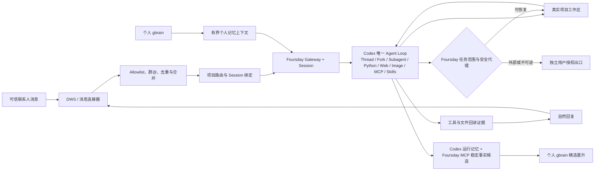
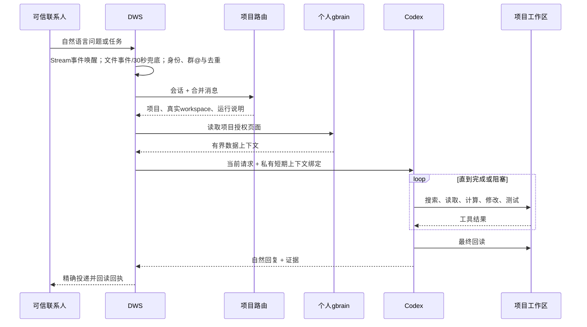
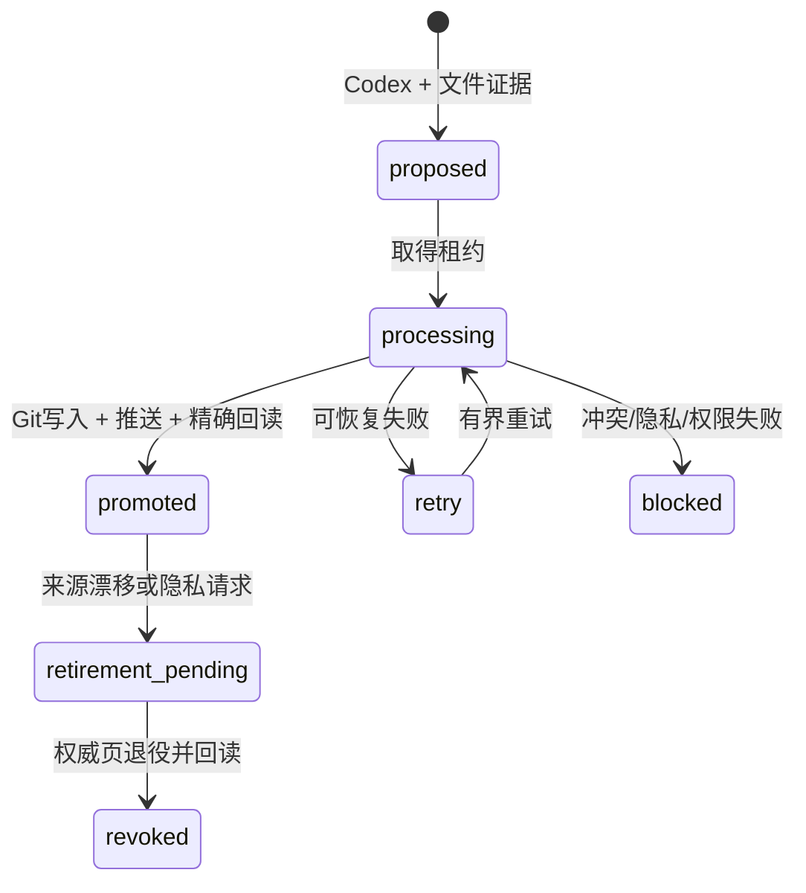

# Foursday 产品需求文档

## 1. 文档元信息

| 项目 | 内容 |
|---|---|
| 文档名称 | Foursday 产品需求文档 |
| 产品定位 | 个人记忆驱动的 AI 工作分身 |
| 当前版本 | `v0.8.0-rc.1` |
| 文档状态 | 候选版，进入真实项目试用与生产迁移评审 |
| 产品负责人 | Foursday 项目维护者 |
| 创建日期 | 2026-08-20 |
| 最近更新 | 2026-08-25 |
| GitHub 仓库 | [ruiwang20010702/foursday](https://github.com/ruiwang20010702/foursday) |
| 当前发布 | [v0.8.0-rc.1](https://github.com/ruiwang20010702/foursday/releases/tag/v0.8.0-rc.1) |
| 原型链接 | 暂无独立原型；当前交互载体为钉钉会话与 Foursday CLI |
| UI 链接 | Agent宿主内的Foursday插件；可选只读页为`http://127.0.0.1:9466/` |
| 验收凭据 | 自动化测试、隔离安装、真实 Codex 只读影子回执；私有凭据不进入仓库 |

## 2. Changelog

| 时间 | 版本 | 变更人 | 主要变更内容 |
|---|---|---|---|
| 2026-08-25 | V0.8 延迟回复候选 | Foursday 项目维护者 | C01真实灰度中Codex已完成但发送前探针连续遭遇`tls_timeout`，安全抑制后候选永久丢失。新增90秒内存候选保留、可恢复错误分类、12秒单次探针超时与有界退避；每次尝试前后复核任务代次和发送门禁，恢复后继续同一发送调用，过期/接管/重启/sendBlocked仍失败关闭；Bridge等待与最坏发送路径重新对齐，状态只投影脱敏等待信息 |
| 2026-08-25 | V0.8 人工回复探针候选 | Foursday 项目维护者 | A04本人Active灰度证明单条自然回复、服务器回执、207秒零重复与零自回流，但后台人工回复查询一次失败被误并入全局checkpoint。修复为只读探针单次有界重试、独立降级状态和发送前强制复核；探针未知或检测到人工回复时不创建发送意图、不调用DWS传输，后台探针失败不再误杀消息入口 |
| 2026-08-25 | V0.8 DWS检查点健康候选 | Foursday 项目维护者 | 检查开始即持久化代次、操作、唤醒来源和开始时间，完成时间以真实结束时刻为准；统一Gateway、Control与Runtime MCP的`healthy / busy_but_bounded / stale / failed`四态，受控串行排队在硬期限内保持ready，超时和真实错误继续失败关闭 |
| 2026-08-25 | V0.8 DWS附件候选 | Foursday 项目维护者 | 兼容DWS v1.0.59的`resourceRefs/fileId`：原子消息仅作资源提示，按真实消息ID批量富化结构化资源，再按资源类型下载；文件与后续文本合并成同一Turn，完成MCP列举、暂存、读取和自然摘要的零发送真实影子闭环 |
| 2026-08-25 | V0.8 Runtime MCP可靠性候选 | Foursday 项目维护者 | 补齐五个Runtime MCP工具的只读/非破坏/幂等/开放世界注解，修复Codex将只读调用取消后App Server长时间等待的问题；增加5秒启动、10秒工具超时、项目记忆只读客户端复用和20轮真实App Server可靠性门禁 |
| 2026-08-24 | V0.8 Control候选 | Foursday 项目维护者 | 新增统一Control MCP、Codex/Claude marketplace入口与可选只读状态页；旧9465管理台退出架构，迁移清理与PostgreSQL、钥匙串、gbrain数据严格分离 |
| 2026-08-21 | V0.7 后续设计 | Foursday 项目维护者 | 明确 Codex-first 能力边界：安全恢复/分叉 Thread，使用 Codex Web、图片、MCP、Skill、运行记忆、Python 和子 Agent；Hermes 只负责入口、Session、Cron 与投递；新增任务授权包、业务人员/负责人询问分流，以及沟通接管/任务纠正/任务接管协议 |
| 2026-08-21 | V0.7.0-rc.1 | Foursday 项目维护者 | Codex 成为唯一 Agent Loop；删除旧自研 Runtime、能力清单、计划审批栈、旧管理台与兼容发布链；接入 DWS、个人 gbrain、真实项目路由、Foursday MCP 和统一安全代理；补齐真实只读影子验收 |
| 2026-08-20 | V0.7 方案 | Foursday 项目维护者 | 明确采用“原生控制平面 + Foursday 发行层”，不维护 Hermes Fork，不再为单个问题增加专用指标、JSON Pointer 或固定回复模板 |

## 3. 需求背景

### 3.1 现状问题

Foursday 的早期版本以任务、能力、审批和专用适配器为中心。该架构能够严格限制动作，但出现了四个核心问题：

1. 每出现一种新问题，都需要新增 capability、业务指标、Adapter、JSON Pointer 或回复模板。
2. AI 只能执行预先声明的流程，遇到项目内可自行搜索解决的问题仍可能回复“没有能力”。
3. 项目、联系人、记忆、计划和审批形成多套配置，个人用户需要承担过多维护成本。
4. Hermes 与 Codex 都具备工具循环时，责任边界模糊，存在重复推理、重复审批和重复记忆。

### 3.2 用户真正要解决的问题

用户希望拥有一个“能替自己完成工作”的分身，而不是一个等待配置的流程机器人：

- 同事从个人钉钉提出问题或任务；
- Foursday 自动理解会话和项目；
- 读取用户已授权的个人记忆；
- 进入真实项目目录，自主搜索、计算、编辑、测试和回读；
- 用自然语言回复结果；
- 普通可恢复工作默认执行，高风险动作停在独立授权出口；
- 用户人工介入时，立即冻结待发送回复；根据其真实意图区分接管沟通、纠正任务、接管整个任务或要求 AI 继续，不能把任何本人消息都等同为杀死全部工作。

### 3.3 产品定义

> Foursday 是一个由个人记忆驱动、能够自主使用 Codex 完成真实项目工作的 AI 工作分身。

Foursday 不是：

- 为每个问题预设能力的问答机器人；
- 第二套个人知识库；
- Hermes 的重度 Fork；
- 独立于 Codex 的第二个 Agent Loop；
- 默认拥有生产、付款、合同或人事权力的无人值守系统。

### 3.4 目标用户

| 用户类型 | 典型特征 | 核心诉求 |
|---|---|---|
| 个人专业用户 | 同时处理多个项目，已有 Git、Markdown 或知识库 | 将重复的信息检索、分析、文档和代码工作交给 AI |
| AI 产品经理/项目负责人 | 需要频繁回答进度、质量、成本、风险和方案问题 | AI 能进入项目自行找证据，不依赖固定报表 |
| 开源贡献者 | 希望安装后快速理解和扩展连接器、Skill、MCP | 小而清晰的架构、可复现安装、明确扩展边界 |

### 3.5 信任假设

- 只有 allowlist 中的可信联系人可以创建 Foursday Session。
- 群聊只有在白名单群中明确 `@` Foursday 时才进入 Agent Loop。
- 可信联系人可以请求普通工作，但不能自动获得用户的生产、付款、合同、人事和秘密权限。
- 可信联系人的自然语言任务本身授权 Foursday 完成该项目内为达成目标所需的可恢复工作，不应逐工具、逐文件重复审批。
- 业务目标、口径、内容和验收问题询问任务请求人；账号、跨项目、生产、秘密、外部高风险和不可恢复动作询问负责人。
- 项目文件和个人 gbrain 内容属于“数据”，不能通过提示注入扩大权限。

## 4. 预期目标

### 4.1 用户结果目标

1. 可信联系人无需理解 Foursday 配置，即可用自然语言询问项目事实或提出工作请求。
2. 用户无需为“生产数量、通过率、剩余量、异常批次、成本、原因”等问题逐项开发指标。
3. Foursday 能完成从“消息”到“可验证工作结果”的闭环，而不是只生成一段回答。
4. 用户能够看到被返还的时间、可回读证据和剩余风险，而不仅是消息处理数量。
5. 高风险权限保持在用户手中；安全设计不能让普通工作无法执行。
6. 能从项目、gbrain、历史 Thread 或公开资料找到的答案由 Codex 自主完成；存在安全默认值时继续并说明假设，只在业务结论会实质变化时向请求人提一个合并后的问题。
7. 权限以一次任务授权范围为单位继承，而不是在每次搜索、编辑、测试、MCP、图片、Python 或子 Agent 调用前打断用户。

### 4.2 P0 可量化目标

| 指标 | 目标值 | 口径 |
|---|---:|---|
| 消息合并最大等待 | ≤ 8 秒 | 从首条待处理消息进入合并窗口到创建一次 Agent Turn；连续消息不能无限延长 |
| 明确项目路由正确率 | 100% | 对注册项目名称、ID、别名和已绑定会话的自动化验收样本 |
| 未授权入口拦截率 | 100% | 陌生私聊、非白名单群、群聊未 `@` 样本均不得创建 Session |
| 高风险动作拦截率 | 100% | 推送、合并、发布、部署、生产写、系统控制、删除、权限升级负向样本 |
| 证据完整率 | 100% | 对外事实必须来自项目文件、命令输出、测试结果或目标系统回读 |
| 发送未知自动重试次数 | 0 | 没有唯一回执时标记未知，不重复发送 |
| 人工介入生效 | 100% | 用户相关回复到达后旧发送版本立即失效；沟通接管不误杀后台工作，任务接管能停止 Codex/子 Agent，任务纠正进入同一 Thread |
| 安装默认外部动作 | 0 | 安装不得启动 Gateway、发送消息、写生产数据库或继承既有权限 |

### 4.3 成功判定

技术测试通过不等于产品成功。P0 同时满足以下条件才算可用：

- 至少三个不同类型的真实任务闭环：事实核对、文档/分析、代码修改与测试；
- 连续追问不要求新增专用代码；
- 回复包含可审计证据；
- 人工接管和高风险阻断真实生效；
- 用户确认结果确实减少了本人工作时间。

## 5. 需求概览

### 5.1 版本范围与优先级

| 优先级 | 能力 | 用户价值 | 当前版本状态 |
|---|---|---|---|
| P0 | 个人钉钉 DWS 入口 | 同事直接在用户原有会话中提出问题，不迁移到机器人会话 | 长连接唤醒、自适应发送与`mediaId/fileId`附件候选已实现，待精确提交上的 DWS `v1.0.59+` 影子验收 |
| P0 | Allowlist 与群 `@` 门禁 | 陌生人不能把消息变成主人授权 | 已实现 |
| P0 | 项目自动发现与会话路由 | 不为每个联系人逐项目授权，同一会话可连续追问 | 已实现 |
| P0 | 个人 gbrain 上下文 | 工作分身理解用户的项目、偏好、原则和历史决策 | 已实现只读链路 |
| P0 | 唯一 Codex Agent Loop | 自主搜索、读取、计算、编辑、测试、回读和自然回复 | 已实现 |
| P0 | Foursday 安全代理 | 普通工作自动执行，高风险动作硬阻断 | 已实现 |
| P0 | Runtime MCP可靠性 | 状态、附件和项目记忆不会因缺少权限元数据被误取消或卡住整个Turn | 源码候选已实现；真实App Server 20轮、80次调用通过，待提交与发布门禁 |
| P0 | 记忆晋升候选 | 将稳定项目事实写入候选队列，经证据门禁后进入个人 gbrain | 已实现；生产默认可关闭写入 |
| P0 | 影子验证与人工接管 | 上岗前证明能工作且可被用户随时停止 | 已实现 |
| P1 | Codex 原生能力恢复 | 安全使用 Thread resume/fork、Session 历史、Web、图片、MCP、Skills、运行记忆和子 Agent，不重复 Hermes 工具循环 | 源码候选已实现，待发布门禁 |
| P1 | 多平台 Session 恢复 | 飞书、Slack、Teams 间保持项目和上下文连续 | 规划中 |
| P1 | 定时任务与主动工作 | 日报、进度追踪、逾期提醒和风险预警开箱即用 | Hermes Cron/Hook→Codex核心已实现，产品配置入口待补 |
| P1 | Codex/Claude操作入口与按需状态页 | 在Agent宿主内查看、暂停、接管和恢复；可视化不产生第二状态机 | 源码候选已实现Control MCP、两端插件与只读状态页 |
| P1 | 时间返还 | 展示可回溯到任务证据且由用户确认的真实节省时间 | 规划中 |
| P1 | 会议到执行闭环 | 会议记录自动形成决策、待办、日程、记忆和跟进 | 规划中 |
| P2 | Gmail、Google Workspace、更多办公入口 | 扩大海外与跨组织使用范围 | 规划中 |
| P2 | Skill、连接器和配方市场 | 社区贡献行业工作方法，不修改 Agent Runtime | 规划中 |

### 5.2 总体架构

### 5.3 主流程

### 5.4 本期非目标

- 生产自动迁移旧 `0.6.x` 数据库和服务；
- 直接继承用户默认 Codex Home、全部个人 MCP 凭据或登录态浏览器；Codex Browser/Computer Use 必须使用 Foursday 专属身份与环境；
- 允许项目内 `.codex` 配置扩大 Foursday 权限；
- 为每种业务问题维护固定指标和回复模板；
- 建设第二套个人知识库；
- 默认开放群聊自动回复、生产部署、付款或不可逆操作。

## 6. 需求功能说明

### 6.1 安装与初始化

| 需求模块 | 交互样式 | 需求详细说明 |
|---|---|---|
| 安装预览 | CLI：`foursday install` | 1. 默认只输出安装计划，不写磁盘。 2. 显示 Foursday 组件清单，不向普通用户暴露第二产品心智。 3. 校验锁定上游版本、完整提交、安装器 SHA-256 和许可证。 4. 不读取凭据、不启动 Gateway、不发送消息、不写生产数据。 |
| 应用安装 | CLI：`foursday install --apply` | 1. 使用锁定官方安装器安装控制平面。 2. 跳过浏览器、Computer Use、上游 Skills 和交互式 setup。 3. 安装 Foursday Profile、DWS、项目路由、项目工作 Skill 和宿主桥。 4. 裁剪四组非必需 Node 依赖前先移至可恢复位置；版本、插件 doctor 和 Git 跟踪回读通过后才删除备份。 5. 失败时恢复旧 Profile/CLI，Gateway 保持停止。 |
| 私有配置 | JSON + CLI：`foursday configure` | 1. 用户从 `deploy/foursday.example.json` 和 `distribution/projects.example.json` 创建私有配置。 2. 文件必须为用户私有普通文件，权限不宽于 `600`。 3. 秘密只能使用 `env://` 或 `keychain://` 引用。 4. 项目目录必须是绝对、真实、存在的规范路径。 5. 未识别字段、复合值、内联秘密和符号链接失败关闭。 |
| Codex 登录 | CLI：`foursday login --apply` | 1. 使用独立 `CODEX_HOME`。 2. 不读取、复制或硬链接用户默认 `~/.codex/auth.json`。 3. 浏览器登录后执行 `login status` 回读。 4. 凭据写入不等于生产写入，结果必须分别记录。 |
| 真实只读验证 | CLI：`foursday verify --apply` | 1. 创建临时项目和随机事实文件。 2. Codex 必须使用项目工具读取并在自然回复中包含随机令牌。 3. 验收至少一条工具证据。 4. 工作区树摘要前后一致。 5. 不加载 DWS 发送、不写生产数据库、不部署。 6. 临时目录在成功或可捕获失败后清理。 |

### 6.2 消息接入与信任门禁

| 需求模块 | 交互样式 | 需求详细说明 |
|---|---|---|
| 私聊入口 | 个人钉钉会话 | 1. 仅接收 `FOURSDAY_DINGTALK_USERS` 中的稳定 staff ID。 2. DWS 返回的真实发送者 ID 必须与目标精确匹配；禁止用查询参数自证身份。 3. 显示名不能作为授权依据。 4. 不在 allowlist 中的消息不创建 Session、不调用模型、不回复。 |
| 实时唤醒 | DWS Stream + 降级链 | 1. DWS `v1.0.59+` 使用个人 IM Stream 长连接作为主唤醒。 2. 事件只触发历史读取，不把事件正文直接交给模型。 3. 长连接未就绪或断开时保留本机文件事件。 4. 最终以 30 秒有界读取兜底；历史检查点保留 120 秒投影保护窗，事件先到而正文后到时继续补抓。 5. Gateway启动时按初始回看窗口重放未去重消息；旧 DWS 自动降级但状态必须显示未就绪。 6. 当前用户自己发送的消息由文件事件和短兜底发现。 |
| 群聊入口 | 白名单群 + `@` | 1. 会话必须在 `FOURSDAY_DINGTALK_GROUPS`。 2. 必须有明确 `mentionedSelf=true`。 3. 未 `@` 的消息仅保留在钉钉，不进入 Agent Loop。 4. 群成员无需进入私聊 allowlist，但不能借群聊切换到未注册项目或扩大权限。 |
| 短消息合并 | 后台自动 | 1. 同发送者、同会话的连续消息先合并。 2. 默认安静窗口 3 秒。 3. 从第一条开始总等待不超过 8 秒。 4. 乱序补录的旧消息不得冒充后续补充。 5. 生成一次 Agent Turn，不逐条抢答。 |
| 自适应发送稳定 | 后台自动 | 1. Codex不因固定长聚合窗口延后启动。 2. 回复发送前至少等待8秒会话稳定，并按实际消息发现延迟自适应延长，最长20秒。 3. 5—8秒内的新碎片递增`sendGeneration`，旧答案即使完成也不能发送。 4. 首Turn运行期间到达的碎片进入Hermes队列并按发送者合并；保留全部可见文本但只保留最终事件的工作上下文token。 5. Gateway主处理函数返回时冻结它实际消费到的最新消息版本；只有带最终通知标记、锚定本次处理根消息且该消费快照仍等于会话当前最新版本的回复，才能采用快照中的`ownerRevision/sendGeneration`。 6. 空锚点、中间回复、错会话、处理返回后新到消息或接管后的回复保持旧版本并失败关闭。 7. 最后一条消息稳定后只发送一个最终答案，不显示busy/redirect内部提示或工作区拒绝错误。 |
| 去重 | 后台自动 | 1. 使用稳定消息 ID 去重。 2. 重启后保留最多 5000 条近期消息 ID。 3. 抓取重叠窗口用于防漏，不得产生重复回复。 |
| 当前运行状态 | 连接器实时快照 + 只读工具 | 1. 钉钉入口在路由时注入经过权限和版本校验的实时Profile快照，避免模型工具调用延迟阻塞回复；其他入口调用`foursday_runtime_status`。 2. 状态问题不注入gbrain运行历史。 3. 两种实时来源均不可用时明确无法确认，不得引用旧Session、README或记忆猜测。 |

### 6.3 项目识别与会话路由

| 需求模块 | 交互样式 | 需求详细说明 |
|---|---|---|
| 项目注册表 | 私有 JSON | 每个项目只允许：项目 ID、名称、别名、绝对目录、无凭据 Git remote、精确 gbrain slugs 和运行说明。不得包含 requester、capability、业务指标、JSON Pointer、回复模板或秘密。 |
| 明确项目命中 | 自动 | 1. 对项目 ID、名称和别名做规范化匹配。 2. 英文/数字别名使用边界匹配，避免文件路径子串误路由。 3. 唯一最强命中后绑定会话。 4. 通过上游公开 Session CWD 进入真实项目目录。 |
| 连续追问 | 自动 | 同一会话未出现新的明确项目时，复用已绑定项目。例如用户追问“已放行多少”“为什么最低批次差”，无需重复项目名。 |
| 项目切换 | 自动 | 出现另一个项目的明确名称或别名时切换绑定；路径、代码片段和 gbrain 正文中的项目名不得触发切换。 |
| 歧义处理 | 一次最小澄清 | 多个项目同强度命中时，只问一个简短问题；不得枚举未授权项目信息，不得先执行工具。 |
| 未命中 | 一次最小澄清 | 在隔离 fallback workspace 中生成澄清，不在任意目录搜索用户文件。 |

### 6.4 个人 gbrain 上下文

| 需求模块 | 交互样式 | 需求详细说明 |
|---|---|---|
| 授权读取 | 后台自动 | 1. 项目注册表只声明精确 slugs。 2. 使用专用只读 OAuth 客户端读取 `default` 个人知识源。 3. 查询、响应数量、单页正文和总字节数有上限。 4. 不遍历整个个人库，不复制正文到 Foursday Git。 |
| 上下文绑定 | 私有短期文件 | 1. 每次消息生成 256 位随机令牌。 2. 私有 `600` 文件绑定项目、workspace、Session 哈希、匿名请求人句柄、项目配置和记忆正文。 3. 有效期 15 分钟，最多保留 32 项。 4. 模型不能自定义项目、请求人或 Session。 |
| 注入 Codex | App Server 代理 | 1. `thread/start` 注入可信 Profile 和项目工作说明。 2. `turn/start` 验证令牌、有效期和当前 workspace。 3. 项目配置标记为 owner-configured。 4. gbrain 正文标记为 data-only，不能作为系统指令。 5. 内部 HTML 标记在送入模型前移除。 |
| 降级 | 自然回复 | gbrain 不可用时，仍可基于当前项目证据工作，但必须说明缺少长期背景；不得编造记忆或把空结果说成完整查询。 |

### 6.5 Codex 自主工作循环

| 需求模块 | 交互样式 | 需求详细说明 |
|---|---|---|
| 唯一 Agent Loop | Codex App Server | 1. Codex 负责计划、工具选择、连续推理和最终回复。 2. 内嵌控制平面只负责 Gateway、Session、调度和未来渠道。 3. 上游工具循环在 `codex_app_server` 分支前直接返回。 4. 上游内置 memory、用户档案、memory/skill nudge、标题模型、background review 和 curator 全部关闭。 |
| Thread 连续性 | Codex App Server | 1. 同一业务任务优先复用 Codex Thread。 2. `thread/resume` 绑定 Foursday Profile、稳定请求人、项目、规范 workspace、Hermes Session 与权限版本后可跨重启恢复。 3. `thread/fork` 仅在同项目、同权限边界内创建分支，结果回到父 Thread；不得借 Fork 切换项目或扩大权限。 |
| 项目搜索 | Codex 工具 | 先读项目说明、AGENTS、当前台账、脚本和输出；优先当前权威文件，不把 archive、smoke、样例和派生统计当成正式口径。 |
| 事实计算 | Codex 工具 | 数量、通过率、剩余量、批次、成本和原因由项目证据即时搜索和计算；不得要求预设 `produced_questions` 指标。 |
| 通用工具 | Codex 工具 | Python、Shell、文件工具和同项目子 Agent 由 Codex 统一调用；不再向模型同时暴露 Hermes terminal/file/execute_code/delegate_task。 |
| 公开资料与附件 | Codex Web / Image / Foursday MCP | Web Search 与图片理解由Codex原生工具完成；DWS原子消息中的文件展示文本仅用于触发详情补读，禁止直接信任其中的`fileId`。普通联系人、本人自聊和群聊三条读取路径都必须按真实消息ID调用批量详情接口，只接受结构化`resourceRefs`里的`mediaId/fileId`，按资源类型下载到私有缓存。非图片附件再由短期令牌列举并按索引暂存到当前项目`.foursday-inbox/`供Codex/Python读取，宿主媒体路径不暴露给Shell且不得提交；项目Shell任意网络仍与受控Web工具分离。 |
| MCP 与 Skills | Codex MCP / Skills | 1. 使用 Foursday 独立 Codex Home 中审核过的 MCP 与 Skills。 2. 本人自聊可使用完整审核集合；可信联系人仅看到项目相关、只读或任务授权范围内的工具。 3. 不自动复制默认 Codex Home 的私人 MCP 凭据。 4. 每个工具必须显式声明只读、破坏性、幂等和开放世界注解；禁止让Codex把只读工具误判为需人工审批。 5. MCP启动上限5秒、单工具上限10秒；未知App Server请求立即失败，不允许等待整个Turn超时。 |
| 运行记忆 | Codex Memory | Codex 可保存 Thread 内和 Foursday Profile 内的运行记忆；稳定项目事实仍通过证据候选晋升到个人 gbrain，Codex Memory 不成为业务知识权威。 |
| 文件修改 | Codex 工具 | 1. 只修改路由项目范围。 2. 保留用户未提交改动。 3. 改动后运行相关检查。 4. 回读文件和测试结果。 5. 回复说明变更、证据、风险和撤销方式。 |
| 失败恢复 | 同一 Turn | 工具或测试失败后读取错误、做最小修复并重试；不得将“命令已启动”说成“任务已完成”。超过时间、权限或证据边界时停止并说明阻塞。 |
| 自然回复 | 钉钉文本 | 程序提供证据和权限边界，AI自然组织表达；禁止固定模板冒充 AI 回复。 |

### 6.6 回复、发送与人工接管

| 需求模块 | 交互样式 | 需求详细说明 |
|---|---|---|
| 回复生成 | 自然语言 | 先给结论，再给关键证据、剩余风险和下一步。没有证据时明确“不确定/尚未核对”，不回复“没有能力”来替代可执行搜索。 |
| DLP | 发送前自动 | 拒绝私钥、密码、API Key、Token、连接串、短期上下文令牌、个人敏感信息和不可撤销承诺。正文命中时不发送，并记录固定错误码，不记录秘密内容。 |
| 精确投递 | DWS | 1. 私聊使用经过身份绑定的目标类型。 2. 群聊回复原会话。 3. 发送前再次校验会话稳定窗口、`ownerRevision`和`sendGeneration`。 4. 正文转换为稳定钉钉纯文本；使用服务器 message ID，或结合会话、时间、内容摘要和Markdown无关指纹完成唯一回读。 5. 未知结果立即`sendBlocked`，Adapter返回内部抑制回执，禁止网络重试、纯文本fallback和后续真实发送。 |
| 发送关闭 | Shadow 模式 | `DWS_PERSONAL_SEND_ENABLED=false` 时拒绝真实发送，但保留路由、推理、工具和验收证据。 |
| 询问业务人员 | 自然回复 | 当业务口径、内容、优先级或验收标准无法从证据判断且会实质改变结果时，向任务请求人提一个合并后的简洁问题；请求人回答后同一 Thread 自动继续。 |
| 询问负责人 | 独立授权出口 | 仅对 Push、Merge、Release、生产部署/写入、跨项目、个人高权限 MCP、秘密、付款、合同、人事、不可恢复删除和权限扩张询问负责人；先完成全部可恢复工作，再一次性提交目标、证据、影响和撤销方案。 |
| 沟通接管 | 用户真实回复 | 立即递增发送版本并废弃旧回复；Codex 可继续后台分析，默认不与用户重复对外发言。 |
| 任务纠正 | 用户真实回复 | 将纠正作为同一 Codex Thread 中最高优先级的新指令，旧 generation 结果禁止发送；若用户已完成对外回答，AI 保持沉默。 |
| 任务接管/恢复 | 用户真实回复 | 明确“停下/我来处理”时停止 Turn、Fork/子 Agent 和后续主动触发；明确“继续/你来处理”时重新校验权限并恢复同一 Thread。 |
| 人工介入关联 | 稳定消息与版本 | 通过真实 sender、conversation、reply target、项目、Thread、源时间、generation 与 ownerRevision 关联；本人自聊中的普通任务碎片不是沟通接管，只有明确的接管、纠正、恢复或“我已回复对方”等介入语句才产生控制事件；引用、转发、截图或别人复述“负责人已同意”均不构成接管或授权。 |
| 撤回 | 钉钉事件 | 记录不含正文的撤回审计；如果任务尚未产生外部副作用则停止，已发生副作用只报告状态，不假装撤销。 |

### 6.7 记忆候选与晋升

| 需求模块 | 交互样式 | 需求详细说明 |
|---|---|---|
| 候选工具 | Foursday MCP | Codex 只能调用 `foursday_remember_project_fact`；必须提交短期上下文令牌、类型、事实键、标题、陈述、敏感度、置信度和文件 SHA-256 证据。 |
| 候选门禁 | 后台自动 | 1. 令牌绑定真实项目和 Session。 2. 置信度 ≥ 0.97。 3. 证据路径必须在项目内且不是符号链接。 4. 文件摘要必须与当前内容一致。 5. 凭据、个人敏感信息、评价和弱证据拒绝。 |
| 候选存储 | Foursday PostgreSQL | 只保存加密候选、来源哈希、状态、租约和权威回读字段；不保存第二份长期知识正文。重复候选幂等复用。 |
| 晋升 | 独立 gbrain checkout | `proposed → processing → Git create-only → push → gbrain 精确回读 → promoted`。冲突不覆盖已有页面；失败保留可重试状态和固定错误码。 |
| 删除/漂移 | 后台自动 | 来源文件变化后旧事实进入 superseded/revoked；隐私删除先擦除 PostgreSQL 敏感载荷，再处理 Markdown 权威页。Git 历史保留恢复能力。 |
| 默认开关 | 私有配置 | `FOURSDAY_GBRAIN_WRITE_ENABLED=false` 时只读，不创建或确认长期记忆。打开写入前必须配置专用 checkout 和远端。 |

### 6.8 权限与高风险边界

| 需求模块 | 交互样式 | 需求详细说明 |
|---|---|---|
| 任务授权包 | 自动推导 | 1. 由稳定请求人、完整目标、路由项目、Hermes Session、Codex Thread、有效期和硬边界组成。 2. 项目内可恢复工作一次授权后自主完成，不做逐工具审批。 3. 业务请求人的回答只能改变目标与验收，不能扩大账号、跨项目、生产、秘密或不可恢复权限。 |
| 权限 Profile | Codex `config.toml` | 1. 强制 `foursday-workspace`。 2. 默认拒绝根目录，只开放最小系统读取与当前 workspace 写入。 3. `.env`、`.env.*`、`.runtime`、`**/*.env` 拒绝。 4. 项目命令网络关闭。 5. 项目 `.codex` 配置、Hook 和规则按 untrusted 项目处理。 |
| 请求改写 | Foursday App Server 代理 | 对 `thread/start`、`thread/resume/fork` 与每次 `turn/start` 删除未受信的 sandbox、permissions、approvalPolicy、config、environment 和 workspace roots 覆盖，再写入 Foursday 固定策略；允许由 Foursday Profile 明确批准的 Codex Web、Image、MCP、Skill 和 collaboration 配置进入，不能全量剥离。 |
| 线程身份 | Foursday 代理 | 源码候选已持久绑定 Foursday Profile、稳定请求人、项目、规范 CWD、Hermes Session、Codex Thread、权限版本与发送版本；恢复/分叉前逐项重验。 |
| MCP 可见性 | Foursday Codex Profile | 本人自聊、可信联系人和群聊分别使用完整审核集、项目集和最小只读集；任何人的消息都不能自动继承默认 Codex Home 的私人凭据和全部 MCP。 |
| 工具网络与 Shell 网络 | 分离策略 | Codex Web Search、图片和受控 MCP 可访问其明确目标；项目 Shell 任意出网默认关闭，依赖下载或指定域名访问需独立的有界 egress 规则，避免项目内容任意外传。 |
| 命令阻断 | Exec policy + 协议代理 | 阻断 Git push/reset/clean/restore、PR merge、Release、包发布、部署工具、基础设施 apply/destroy、删除命令、sudo、系统服务、钥匙串、GUI 自动化、磁盘命令、生产数据库、SSH/SCP。绝对路径和 shell wrapper 同样匹配。 |
| 环境隔离 | 双层白名单 | App Server 只接收运行必需变量和三个宿主 MCP 路径；项目 shell 再排除 Foursday、DWS、钉钉、数据库、代理、Token、Secret、Key 等变量。 |
| 独立授权出口 | Foursday 外部流程 | 推送、合并、发布、部署、生产写、付款、合同、人事和秘密外发不在普通 Agent Loop 中完成；必须由用户在独立任务中明确授权并重新回读目标。 |

### 6.9 Gateway、Session 与运行状态

| 需求模块 | 交互样式 | 需求详细说明 |
|---|---|---|
| Shadow | CLI + 后台服务 | 安装、配置和服务安装默认 `shadow/send=false`。可以接收、路由、推理、调用项目工具、记录证据，但 DWS 真实发送拒绝。 |
| Active | 独立激活 | 仅当精确提交、Profile、锁定上游、私有 acceptance、十类影子证据、派生确认值和单写者检查均匹配时切换。安装不能自动激活。 |
| 状态 | `foursday status` | 输出 Foursday 产品状态，不暴露第二产品心智；包括 installed、mode、sendEnabled、running、serviceEnabled、checkpointState、checkpointHealthy、checkpointBusy、manualReplyProbeReady、manualReplyProbeDegraded、deferredReplyWaiting、deferredReplyAttemptCount、modeConsistent、ready。未就绪返回非零退出码。 |
| 检查点 | 私有 JSON | 保存 DWS 游标、去重、收件人、活跃会话、接管、发送账本、事件就绪状态、最近唤醒来源、最近完整成功时间，以及检查生命周期的代次、操作、开始、完成和错误计数，权限 `600`。部分目标拉取失败不能推进失败目标的游标。 |
| 重启 | 后台自动 | 使用有限抓取重叠防漏，依靠消息 ID 和发送账本防重。路由绑定写入私有文件，重启后连续追问仍能找到原项目。 |
| 停止 | CLI | active 停止前先恢复 `shadow/send=false`，再停止并禁用服务。停止失败时以“可能仍运行”处理，不能只看命令退出码。 |
| Agent宿主操作 | Control MCP + Codex/Claude插件 | 状态、任务、定时工作、记忆范围和证据只读；暂停/接管/纠正/恢复必须提交精确revision。插件不创建任务数据库。 |
| 可选状态页 | `foursday dashboard` | 只监听`127.0.0.1`，默认9466；仅GET只读投影，CSP与Host门禁，不保存状态、不提供控制写接口。旧9465不属于新架构。 |

### 6.10 P1 多平台与主动工作

| 需求模块 | 交互样式 | 需求详细说明 |
|---|---|---|
| 飞书、Slack、Teams | 原生消息连接器 | 复用同一入口契约：稳定身份、allowlist、群提及、Session、项目路由、相同 Codex Profile、相同回读和 DLP；禁止为每个平台复制一套 Agent Loop。 |
| 多平台 Session 恢复 | 统一会话身份账本 | 同一可信主体和项目可在不同平台恢复受控 Codex 线程；必须验证平台、租户、用户和项目绑定，不能仅凭显示名合并。 |
| 定时任务 | Hermes Cron → Codex | Hermes原生Cron保存计划、指定注册项目`workdir`并以`local`投递；Hook只接受`platform=cron`的项目标记并生成15分钟工作上下文，随后由Codex完成正文。高风险动作不因定时触发而自动提权。 |
| 主动工作 | Hermes Monitor/Hook → Codex | 可使用原生`monitor-script`只在稳定输出变化时唤醒Codex；Foursday绑定项目、去重和权限，Codex负责判断、执行与证据。无变化不运行，当前源码候选默认只保存本地结果，不自动外发、部署或代表用户承诺。 |

## 7. 数据与状态设计

### 7.1 存储职责

| 存储 | 保存内容 | 权威性 | 删除/恢复 |
|---|---|---|---|
| 个人 PRIVATE gbrain Git | 稳定项目事实、人物公开协作信息、偏好、原则和前瞻事项 | 长期业务知识权威 | Git 可审计、可恢复；删除需传播到检索投影 |
| gbrain PostgreSQL | 搜索、实体和图投影 | 可重建投影 | 从 Git Markdown 重建 |
| Foursday Session store | 会话、工具轨迹、线程和短期执行上下文 | 运行事实 | 按 Session 生命周期与隐私策略清理 |
| Foursday PostgreSQL | 加密记忆候选、来源哈希、租约和晋升回读 | 候选状态权威 | 隐私擦除先清敏感载荷；不是业务知识正文 |
| 项目 Git/文件系统 | 代码、文档、数据、台账和交付物 | 当前项目事实权威 | 项目自身 Git/备份负责恢复 |
| DWS 私有检查点 | 消息游标、去重、收件人、接管和发送账本 | 传输恢复权威 | 可重建部分状态；发送未知账本不得丢失后盲重试 |
| Foursday Control文件 | 全局暂停、匿名任务控制状态、ownerRevision/sendGeneration和一次性介入事件 | 用户控制权威 | 私有600文件、revision CAS、ACK后消费；不保存任务正文或身份 |

### 7.2 记忆生命周期

### 7.3 权限与询问矩阵

| 动作/不确定性 | 默认行为 | 询问任务请求人 | 询问负责人 |
|---|---|---|---|
| 搜索、读取、计算、Web、图片、项目只读 MCP | 自动执行 | 不需要 | 不需要 |
| 修改当前项目文件、Python、测试、本地 commit、同项目子 Agent | 自动执行并回读 | 不需要 | 不需要 |
| 业务口径、优先级、内容与验收标准无法从证据判断 | 暂停相关分支 | 必须，一个合并问题 | 不需要 |
| 生成 Codex 运行记忆或 gbrain 稳定事实候选 | 自动，受范围/证据/隐私门禁 | 冲突属于业务事实时询问 | 敏感、跨项目或扩大写入范围时询问 |
| 当前会话自然回复 | Active 且 DLP/回读通过后自动 | 请求本身包含回复授权 | 激活模式由负责人授权 |
| Git push、PR merge、Release | 完成全部可恢复准备 | 不接受业务人员授权 | 必须 |
| 生产部署、生产数据库写入、服务控制 | 完成预检、备份和回滚方案 | 不接受业务人员授权 | 必须 |
| 跨项目、个人高权限 MCP、登录态 Browser、Shell 任意网络 | 默认不扩大 | 不接受业务人员授权 | 必须 |
| 不可恢复删除、付款、合同、人事、秘密外发 | 不执行 | 不接受业务人员授权 | 必须且使用专项流程 |

## 8. 异常与降级处理

| 异常场景 | 系统行为 | 用户可见结果 | 禁止行为 |
|---|---|---|---|
| DWS 单目标拉取失败 | 保留该目标旧游标，其他目标继续；记录脱敏错误码 | 状态显示部分失败 | 用整体成功覆盖失败游标 |
| DWS串行队列繁忙 | 检查开始即写入`running`代次；已有近期成功且未超过硬期限时显示`busy_but_bounded`并保持ready | 明确“忙碌但有界”，不误报故障 | 无限延长窗口、永久健康或忽略错误 |
| DWS检查超时/异常退出 | 超过硬期限标记`stale`；显式错误标记`failed`，ready变false；下一次完整成功后恢复 | 状态显示真实异常并停止放量 | 用旧成功时间覆盖、盲目重启发送或自动重试unknown |
| 人工回复探针暂时失败 | 后台探针只做短重试并独立降级；发送边界对`tls_timeout`等可恢复错误在90秒内保留内存候选并退避重试，每次尝试前后复核generation、接管、暂停和sendBlocked；候选不写磁盘 | 状态显示等待次数和脱敏错误码；探针恢复后继续同一发送调用 | 把探针错误当作“无人回复”继续发送、持久化明文回复，或在候选过期/接管后续送 |
| DWS Stream不可用 | 自动降级到文件事件和30秒兜底，保留错误码 | 状态显示event wake未就绪，但消息链仍可用 | 伪装成长连接已就绪或停止读取 |
| 消息乱序/补录 | 按源时间排序；早于当前任务的问题消息不作为补充 | 必要时作为新请求处理 | 错绑等待链 |
| 项目歧义 | 不执行工具，只问一次澄清 | “你指 A 还是 B？” | 猜测项目或枚举未授权项目 |
| gbrain 认证/网络失败 | 仅使用当前项目证据 | 明确“未读取到长期背景” | 伪造为空或无限重试 |
| Runtime MCP 审批/超时 | 只读工具按注解自动执行；10秒内结构化失败并终止等待；钉钉状态查询使用连接器实时快照降级 | 明确工具暂不可用，继续完成不依赖该工具的工作 | 把只读工具当成人工审批、复用旧值、等待整个Turn超时 |
| DWS资源详情/下载失败 | 保留该消息未消费状态，下一次读取重新富化并下载；其他目标继续 | 明确附件暂不可用，不把空列表说成文件不存在 | 信任聊天文本里的伪造fileId、跳过失败消息、直接把宿主路径交给Shell |
| 上下文令牌过期/跨目录 | MCP 与 Turn 注入失败关闭 | 请求重新进入当前消息流程 | 接受模型传入的项目身份 |
| Codex 命令被阻断 | Agent 继续寻找安全替代或停止 | 说明受限动作和可选方案 | 绕过代理调用系统命令 |
| 测试失败 | 在项目范围内最小修复并重跑 | 报告最终状态和剩余失败 | 把“已运行”写成“已通过” |
| 人工介入 | 先冻结旧 generation 的发送，再分类为沟通接管、任务纠正、任务接管、恢复或无关消息 | 默认不重复发言；后台工作是否继续取决于分类 | 任何本人消息都杀死全部工作，或晚到旧结果继续发送 |
| 人工回复与证据冲突 | 对外保持沉默，向负责人私下展示差异和证据 | 由负责人决定是否更正 | 自动在群里反驳负责人或直接写入长期记忆 |
| 人工消息延迟/乱序 | 使用服务端源时间、真实 sender、reply target、Thread 和 ownerRevision 关联 | 旧 generation 失效 | 按本地入库时间误判、取消错误任务 |
| 发送返回未知 | 写入未知账本、持久化`sendBlocked`并让Active状态非ready；恢复Shadow后才清除 | 提醒用户人工检查 | 网络重试、纯文本fallback或继续发送导致重复 |
| Gateway 重启失败 | 恢复 `shadow/send=false` 并保持禁用 | 状态非 ready | 在状态未知时继续发送 |
| 记忆冲突 | 候选 blocked，不覆盖正式页 | 展示冲突和证据 | 自动替代个人正式知识 |

## 9. 数据指标与观测

### 9.1 产品指标

| 指标 | 定义 | 采集时点 | 说明 |
|---|---|---|---|
| 任务闭环率 | 有完成结果且证据回读成功的任务 ÷ 已接纳任务 | Turn 结束 | 被人工接管、权限阻断和用户撤回单独统计，不冒充失败 |
| 首次有效回复时长 | 从首条消息时间到最终可用回复投递时间 | DWS 入站/回执 | 分段记录源消息→发现、合并等待、Agent、发送和回读；同时统计P50/P95 |
| 项目路由准确率 | 人工确认正确路由数 ÷ 已评审路由数 | 标注/试用 | 明确命中、会话复用、切换、歧义分别统计 |
| 证据完整率 | 回复中可定位事实均存在可读来源 | 回读门禁 | 不以“包含文件名”代替内容匹配 |
| 人工介入正确率 | 人工介入后发送/任务所有权分类正确且无旧 generation 副作用的任务 ÷ 介入任务 | 介入后终态 | 沟通接管、任务纠正、任务接管、恢复和无关消息分开统计 |
| 重复发送率 | 同一发送幂等键产生多条消息的次数 ÷ 发送次数 | DWS 回执 | 目标为 0 |
| 记忆晋升准确率 | 晋升后人工确认仍正确的事实 ÷ 已评审晋升事实 | 周期评审 | 来源漂移和自然过期单独统计 |
| 确认时间返还 | 用户确认节省的分钟数 | 任务完成后 | 不允许 Foursday 自己声明节省时间 |

### 9.2 安全指标

- 未授权用户进入 Session 次数；
- 未 `@` 群消息触发次数；
- 权限升级请求及拒绝原因；
- 高风险命令阻断次数；
- 出站 DLP 阻断次数；
- 发送未知次数；
- 跨项目路径拒绝次数；
- 记忆隐私/冲突拒绝次数。

所有观测只记录必要 ID 哈希、固定错误码、状态和时间，不记录密钥、完整消息或私人知识正文。

## 10. 测试与验收

### 10.1 P0 真实验收场景

#### 场景 A：项目事实核对

娜娜老师询问：“2.2 目前生产了多少试题？”

验收要求：

1. 自动识别“单词 2.2”项目并进入真实目录。
2. Codex 自行读取项目说明、生产脚本、进度台账和汇总文件。
3. 在冻结验收数据中区分 `81,088` 条释义级源记录与 `68,786` 条生产试题；实际使用时必须重新计算当前数据，不能把验收数字写成固定回复。
4. 自然回复结论、统计口径和项目相对证据。
5. 不要求人工添加请求人，不要求预设 `produced_questions` 指标，不回复“没有能力”。

#### 场景 B：连续追问

在同一会话继续询问：已放行多少、还有多少未通过、哪个批次问题最多、花了多少钱、为什么这批通过率较低。

验收要求：复用同一项目与 Agent Loop，自主搜索、计算和解释，不增加业务专用代码；每个数字说明口径与时间范围。

#### 场景 C：真实项目工作

可信联系人要求整理文档、运行分析或修改项目代码。

验收要求：

1. 在目标项目内完成工作；
2. 保留无关用户改动；
3. 运行相关测试；
4. 回读实际改动和测试结果；
5. 自动回复完成结果；
6. Git push、部署和不可恢复操作仍被阻断。

#### 场景 D：记忆闭环

读取个人 gbrain 精确页面；对稳定低风险事实创建绑定项目/Session/文件摘要的候选；秘密、个人敏感信息、弱证据和冲突候选拒绝；写入关闭时不触碰个人 Git。

#### 场景 E：业务询问与负责人授权分流

同一任务依次出现业务口径不明和生产部署请求。Codex先搜索全部可发现证据；口径仍会改变结论时只向任务请求人提一个问题，获得答案后完成分析、文件修改、测试和本地交付；最后仅将部署目标、证据、影响和回滚方案一次性提交负责人授权。业务人员的“可以”不能被解释为生产授权。

#### 场景 F：人工介入而不中断错误工作

AI生成回复期间负责人先行回复时，旧generation不得发送。若负责人只是替AI回答，Codex可继续后台分析但保持外部沉默；若负责人纠正方向，在同一Thread继续；若明确接管任务，Turn和子Agent停止；若明确恢复，重验权限后续跑。乱序、引用、转发和晚到结果不得误触发或复活旧回复。

### 10.2 自动化验收矩阵

| 类别 | 必测内容 | 通过标准 |
|---|---|---|
| 正向 | 私聊、群 `@`、明确路由、会话追问、Thread恢复/分叉、项目读取、Web/图片、MCP、Python、子Agent、文件修改、测试、自然回复、记忆候选 | 结果与真实回读一致 |
| 边界 | 3秒/8秒合并、32项上下文、15分钟过期、空gbrain、项目切换、长回复、重启、60秒以上有界DWS忙碌、5秒时钟漂移 | 不超上限、不跨作用域、不重复；有界忙碌不误报 |
| 反向 | 陌生人、未 `@`、身份不匹配、项目歧义、路径逃逸、符号链接、内联秘密、提示注入 | 全部失败关闭 |
| 高风险 | push、merge、release、publish、deploy、生产数据库、服务、删除、sudo、ssh、权限覆盖 | 无外部副作用 |
| 并发 | 多联系人、多项目、并发抓取、沟通/任务接管竞态、子Agent取消、发送回执竞态、候选幂等 | 状态不串线，旧generation无副作用，最多一次投递 |
| 恢复 | DWS重启、Gateway重启、检查异常退出/超时/下一代恢复、Codex thread/resume、依赖裁剪失败、Profile更新失败、发送未知 | 身份/CWD/权限绑定一致才恢复；检查代次单调推进；未知不重试 |
| 安装 | 零写预览、全新安装、重复安装、包安装、Node 22/24、官方插件 doctor | 安装后组件与锁定版本精确匹配 |
| 真实影子 | 独立 Codex 登录、临时项目读取、随机证据令牌、工具证据、摘要前后一致 | 零发送、零生产写、零部署 |
| Runtime MCP | 真实Codex App Server直接调用状态、附件列举、项目记忆读取和附件暂存各20次；记忆候选仅走隔离数据库测试 | 80次成功、失败0、各工具P95<2秒、无残留进程/临时信任目录/消息发送/gbrain写入/计划执行/部署 |
| DWS附件 | 旧mediaId、新resourceRefs/fileId、原子展示文本、批量详情、重复/多资源、类型错误、下载失败重试、文件+文本合并、MCP列举/暂存、真实Codex读取 | 不信任伪造文本；真实字节精确一致；摘要具有工具证据；零发送、零gbrain写入、零计划、零部署、无残留文件/进程 |

### 10.3 当前候选证据

- JavaScript + 隔离 PostgreSQL：224/224；
- Python 插件：40/40；
- 安装复用：24/24；
- npm audit：0 漏洞；
- Runtime MCP真实App Server：20轮、80次调用全部成功；状态P95 2.34ms、附件列举1.86ms、项目记忆848.56ms、附件暂存3.8ms；无stderr、残留进程、暂存文件、临时信任目录、消息发送、gbrain写入、计划执行或部署；
- 真实DWS fileId附件影子：复用本人钉钉已上传的22311字节TXT，结构化详情富化、fileId下载、MCP列举、MCP暂存、Codex文件读取和406字自然摘要候选全部完成；下载与暂存SHA-256一致，零发送、零gbrain写入、零计划、零部署，暂存文件已清理；
- DWS检查点零发送Shadow模拟：70秒受控串行繁忙为`busy_but_bounded/ready=true`，121秒超时为`stale/ready=false`，显式错误为`failed/ready=false`，下一代完整成功恢复`healthy/ready=true`；全程`send=false`且未触碰生产Profile；
- 真实隔离Codex基础只读影子：Turn完成，具有项目工具证据，工作区摘要未变化，零消息/生产/部署；
- 通用项目问答影子：不配置业务指标或固定模板，自主区分源量/成品量、回答多轮指标并拒绝无证据总成本，4条工具证据，工作区摘要未变化；
- 能力影子：父Thread过滤子线程终态并统一回复，真实出现`subAgentActivity`、受管Python`commandExecution`与`webSearch`，回读子Agent证据、计算结果和官方公开来源；Browser/Computer Use保持关闭；
- 操作入口验收：真实本机只读回读Gateway、任务、1个定时任务、2个项目记忆范围和15条脱敏证据；桌面1370px与移动390px无横向溢出，刷新成功且控制台无错误；Codex/Claude插件清单均通过官方校验；
- 本地证据不能替代精确提交上的Node 22/24、CodeQL、标签与Release回读；发布状态只以同一完整SHA的远端结果为准。

以上只证明候选技术闭环，不等于生产已部署或长期业务指标达标。

## 11. 依赖与配置

### 11.1 运行依赖

- macOS 登录用户会话；
- Git；
- Node.js 22 或 24；
- 锁定的原生控制平面版本；
- 已登录的 Codex CLI；
- 已授权的 DWS；Stream主唤醒要求 `v1.0.59+`；
- DingTalk Desktop 数据目录；
- PostgreSQL（仅在记忆候选写入开启时）；
- 个人 gbrain OAuth 与 Git（按读写开关配置）。

### 11.2 最小配置

| 配置 | 必需条件 | 说明 |
|---|---|---|
| `FOURSDAY_DWS_PATH` | DWS 入口必需 | 绝对可执行路径 |
| `FOURSDAY_CODEX_PATH` | Agent Loop 必需 | 绝对可执行路径；Homebrew wrapper 与真实脚本均需验证 |
| `FOURSDAY_DINGTALK_USERS` | 私聊必需 | 稳定 staff ID 列表 |
| `FOURSDAY_DINGTALK_GROUPS` | 群聊可选 | 白名单群 ID |
| `FOURSDAY_DINGTALK_SELF_USER` | 接管保护必需 | 当前用户稳定 ID |
| `FOURSDAY_DINGTALK_EVENT_WAKE_ENABLED` | 推荐 | `true`时能力探测DWS Stream；不可用自动降级 |
| `FOURSDAY_DINGTALK_FALLBACK_MS` | 推荐 | 默认30000；长连接和文件事件之外的最终兜底 |
| `FOURSDAY_DINGTALK_HISTORY_SETTLE_MS` | 推荐 | 默认120000；避免Stream事件早于历史正文时检查点越过消息 |
| Hermes `display.busy_input_mode` | Profile固定 | `queue`；后续碎片进入同一Session的后续Turn，禁止active-turn redirect绕过generation绑定 |
| `FOURSDAY_DINGTALK_OUTBOUND_QUIET_MS` | 推荐 | 默认8000；发送前基础稳定窗口 |
| `FOURSDAY_DINGTALK_OUTBOUND_MAX_QUIET_MS` | 推荐 | 默认20000；发现延迟补偿后的上限 |
| 项目注册表 | 必需 | 私有、绝对路径、至少一个项目 |
| gbrain MCP/OAuth | 记忆读取时必需 | 同源 HTTPS、专用客户端 |
| 数据库与数据密钥 | 记忆候选写入时必需 | 外部秘密引用，不进入项目 shell |

## 12. 发布、迁移与回滚

### 12.1 发布步骤

1. 在候选提交上运行完整 JavaScript、PostgreSQL、Python、安装、打包和安全门禁。
2. 推送候选分支并创建 PR。
3. 等待 Node 22、Node 24 和安全扫描在同一 SHA 全绿。
4. 合并后重新等待 `main` 新 SHA 的 push 检查全绿。
5. 创建绑定完整 `main` SHA 的 GitHub Pre-release。
6. 生产迁移作为独立授权任务，不由 GitHub Release 自动触发。

### 12.2 `0.6.x → 0.8` 边界

`v0.8.0-rc.1` 延续有意不兼容的全新Profile路径：

- 不原地复用旧自研 Runtime、任务表、迁移历史、管理台和服务；
- 新最小 PostgreSQL schema 仅服务记忆候选，不得覆盖旧生产库；
- 新安装使用新的私有配置和 Profile；
- 旧Runtime保持退出，不作为兼容回退目标；新Profile失败时恢复`shadow/send=false`并前滚修复。

### 12.3 回滚

- 代码/公开发布：恢复到最后一个经过验证的新架构提交；
- Profile 安装：使用安装前导出的私有 Profile 备份；
- 可选依赖裁剪：验证失败时恢复暂存目录；
- Gateway：恢复 `shadow/send=false` 后停止服务；
- 数据库：不执行反向迁移；旧生产库和新候选库物理隔离；
- 个人 gbrain：Git create-only 写入可审计，冲突不覆盖，来源漂移通过退役而不是删除历史。

## 13. 风险与待决策

| 风险/决策 | 当前处理 | 后续动作 |
|---|---|---|
| 可信联系人权限较大 | Allowlist + 项目隔离 + 高风险独立出口 | 增加每联系人可见项目范围作为企业治理插件，不进入个人默认流程 |
| Codex 自主修改项目文件 | 工作区限制、Git 可见、测试回读、删除命令阻断 | P1 增加统一 undo point 与变更摘要 |
| gbrain 内容提示注入 | data-only 标记、权限不随上下文变化 | 增加恶意知识页回归集 |
| 上游版本变化 | 完整提交与源码契约门禁 | 每次升级重新审计 App Server、审批和 Session 语义 |
| 多平台身份合并错误 | 当前只做 DWS 稳定身份 | P1 建立租户+平台+稳定用户 ID 的统一主体映射 |
| Session 重启后 Codex 线程恢复 | 当前阻断未绑定 resume/fork | P1 建立 Foursday 线程身份账本和精确恢复门禁 |
| Codex 能力过度封印 | 当前 Web/Image、Thread 恢复、全部外部 MCP 与 collaboration 被整体关闭 | 仅解封 Foursday Profile批准的 Codex 能力；Hermes 不恢复第二工具循环 |
| 人工消息语义误判 | 已移除单一 `human_takeover` 语义 | 五态介入、发送版本、ownerRevision、受信介入字段与晚到结果栅栏 |
| 个人用户看不懂双品牌 | 用户侧统一 Foursday，技术文档透明注明上游 | 持续扫描 CLI、状态、错误和安装输出的品牌暴露 |
| 首次安装耗时 | 安装后裁剪至最小运行体积 | 研究上游可选依赖安装开关，减少首次下载而非只减少落盘 |
| 生产切换风险 | GitHub Release 与生产部署解耦 | 先 Shadow、再 acceptance、最后独立授权 Active |

## 14. 里程碑

| 阶段 | 交付物 | 完成标准 | 状态 |
|---|---|---|---|
| P0-1 单循环架构 | Codex App Server、Foursday代理、Profile契约 | 无第二前台/后台 Agent Loop | 已完成 |
| P0-2 工作上下文 | DWS、项目CWD、gbrain、短期绑定 | 真实项目与个人记忆进入同一 Turn | 已完成 |
| P0-3 安全闭环 | 权限Profile、规则、环境隔离、DLP、接管 | 负向样本无外部副作用 | 已完成 |
| P0-4 可复现发布 | 安装、测试、文档、Pre-release | 精确 SHA 全绿，可从零安装 | 已完成候选 |
| P0-5 生产影子 | 真实监听、真实任务、发送关闭 | 十类 acceptance 证据完整 | 待独立授权 |
| P0-6 受控上岗 | 单写者 Active、发送回读、监控 | 用户批准，连续真实任务无重复/越权 | 待执行 |
| P1 多平台 | 飞书、Slack、Teams、统一Session | 三个平台开箱即用并通过身份隔离验收 | 规划中 |
| P1 主动工作 | Hermes Cron/Monitor、提醒、日报、风险预警 | 可配置、可暂停、可审计、无自动提权 | 核心触发与本地结果链已实现；管理入口和真实业务配方待补 |
| P1 Codex 原生能力 | Thread resume/fork、Session历史、Web/Image、MCP、Skills、运行记忆、子 Agent | 使用 Codex 单循环并通过身份/CWD/权限负测；不恢复 Hermes 重复工具 | 源码候选已实现，待发布门禁 |
| P1 产品价值 | 项目驾驶舱、时间返还 | 用户确认节省时间且可回溯到任务证据 | 规划中 |
