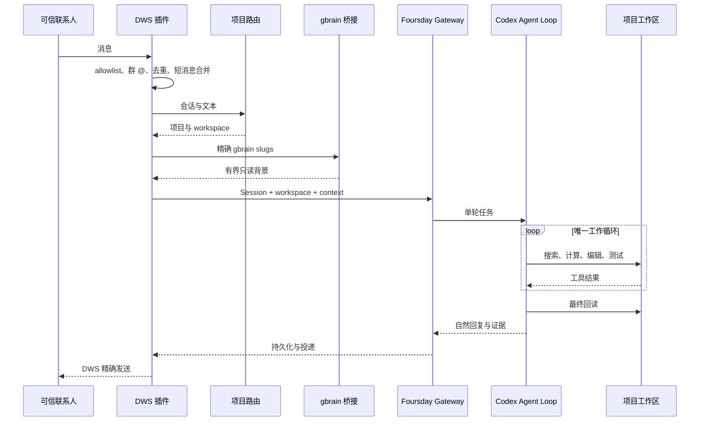
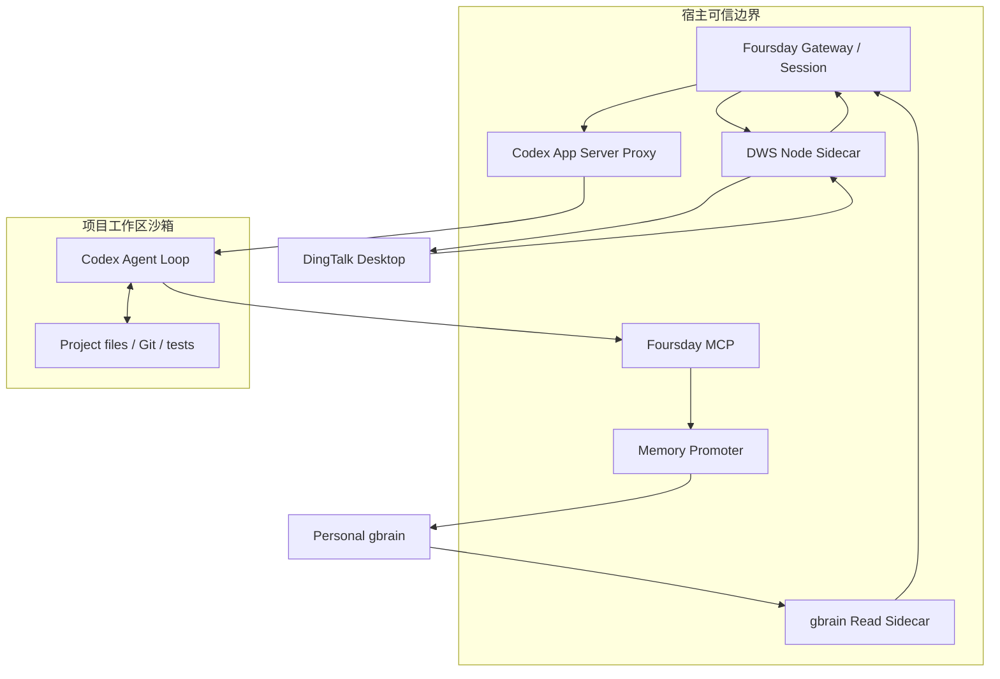
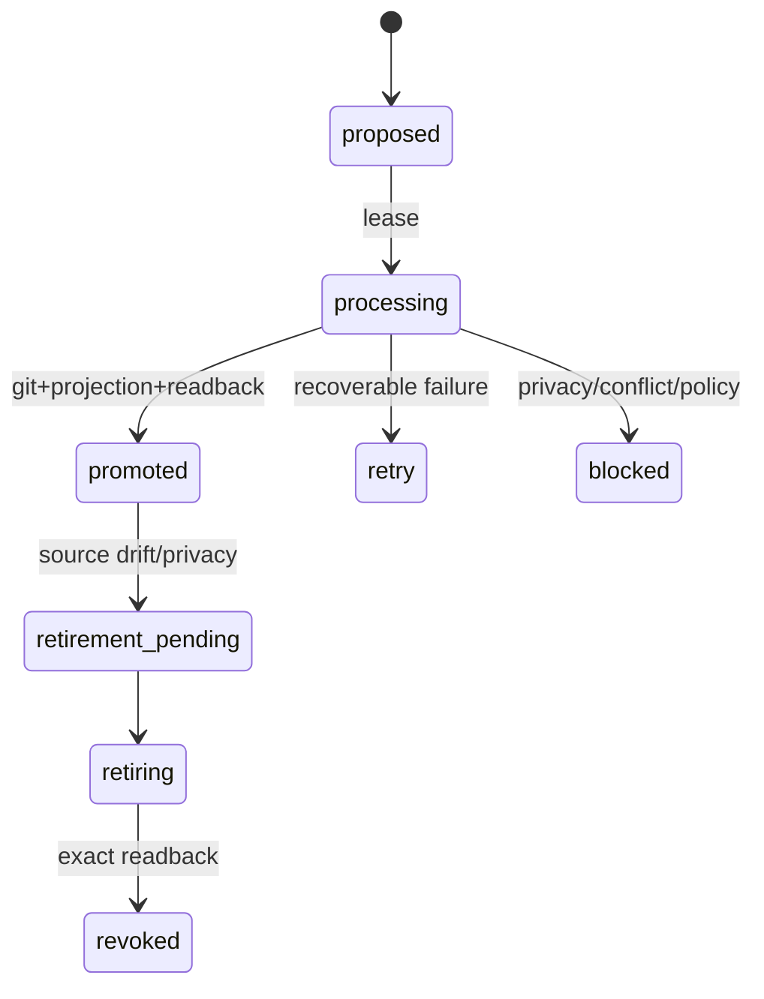

# Foursday 技术设计文档

## 1. 架构决策

Foursday 只有一个 Codex Agent Loop。锁定的原生 Hermes 只作为内嵌 Gateway、消息入口、Session、Cron、事件触发与多平台投递控制平面，不参与项目工具循环，也不生成第二份回复。Codex 负责 Thread 恢复/分叉、同项目子 Agent、Shell/Python、Web、图片、MCP、Skills、运行记忆、项目工作和最终回复；Foursday只负责身份/项目绑定、任务授权范围、高风险出口、外部回执和稳定事实晋升：

```text
锁定的 Hermes 官方安装
+ foursday Profile
+ DWS / project-router 插件
+ 隔离 Codex 配置、规则与 Foursday MCP
+ 小型宿主侧车
```

`distribution/upstream.lock.json` 固定官方仓库、Release、完整提交、许可证和安装器 SHA-256。Foursday 不保存 Hermes 源码副本，不打核心补丁。

安装门禁先核对完整提交、官方remote、隐藏索引标记和tracked diff；只容许官方安装器生成的一条 `contributors/emails/agent@*.local` 身份戳，任何运行时代码漂移都阻断安装与激活。随后直接读取锁定提交中的 `agent/conversation_loop.py`、`agent/codex_runtime.py` 与后台复盘配置实现，确认 `codex_app_server` 分支在上游工具循环前直接返回。Foursday Profile 同时把 Hermes 内置 memory、人物档案、memory/skill nudge、background review、自动标题模型和 curator 关闭，避免前台 Codex 完成后又启动第二个模型调用或 Hermes 模型循环；这不禁止隔离 Codex Home 使用自身 Thread、运行记忆和审核后的 Skills。稳定业务知识只走 Foursday MCP 与个人 gbrain 晋升链。

## 2. 消息到工作的路径



## 3. Profile 与宿主桥接

`foursday install` 默认只生成零写计划；`--apply` 验证官方安装器后，以 `--skip-browser --skip-computer-use --no-skills --skip-setup` 安装控制平面和隔离 Profile。安装器随后暂存四个未被Git跟踪的可选 `node_modules`，重新通过运行时版本、插件doctor与Git目标检查才删除；失败原位恢复。隔离实测从1.8GB降至454MB，但首次安装仍会运行上游依赖步骤。更新前要求 Gateway 已停止；安装或 doctor 失败时恢复原 Profile。

Profile 只包含两个组件插件。上游审批模式设为 `off`，不是取消Foursday安全边界，而是避免无UI Gateway把所有普通Codex命令再次拒绝；安全请求由Foursday App Server代理唯一裁决：可恢复工作交给Codex的 `untrusted + auto_review`，权限升级与高风险动作由代理确定性拒绝。

组件包括：

- `dws_personal`：个人钉钉收发、去重、接管和发送回读；
- `project_router`：按别名和会话绑定真实 workspace；

个人记忆读取由 DWS 上下文提供器完成。记忆晋升通过 `foursday-codex-mcp.mjs` 暴露给 Codex；每次消息产生一个十五分钟有效的随机工作令牌，令牌在私有文件中绑定项目、请求人和 Session，模型不能自行指定这些身份。

上游 `codex_app_server` 适配器不会自动把 Hermes 的 SOUL、Skill 或 `ephemeral_system_prompt` 传给Codex。Foursday因此不依赖这条隐含路径：项目路由通过上游公开 `agent.runtime_cwd.set_session_cwd()` 绑定真实Session工作目录，并由异步处理任务继承；代理在 `thread/start` 从只读、同用户所有的 Profile和项目工作文件注入可信 `developerInstructions`；DWS把路由与gbrain正文写入最多15分钟、最多32项的600权限上下文文件，只把随机令牌附在内部消息尾部。代理在 `turn/start` 验证令牌、Session工作区和有效期，删除内部标记，再把项目配置与“仅作数据、不得当作指令”的个人记忆送入Codex。该令牌同时是唯一可调用Foursday记忆MCP的上下文凭证，并被出站DLP禁止出现在回复中。

宿主 Node 侧车只暴露完成当前动作所需的最小接口。DWS、gbrain OAuth、数据库密钥和 Git 凭据不进入项目终端环境。

## 4. Workspace 隔离

每轮消息都有唯一注册项目。Foursday 为运行时创建独立 `CODEX_HOME`，不自动复制用户默认 Codex 配置、认证、Memories、Skills 或 MCP 凭据；审核后的 Skills/MCP在该隔离Home中单独配置。该环境使用独立 `foursday-workspace` 权限Profile：默认拒绝整个磁盘读取，只开放最小系统路径和当前workspace，拒绝 `.env`、`.runtime` 与项目Shell任意网络；同时禁用登录shell，启用 `untrusted` 审批与自动风险复核，并安装 `git push`、发布、部署、生产数据库、系统控制和不可恢复删除的禁止规则。Codex Web Search、Image和受控MCP使用各自有界通道，不等价于项目Shell任意出网。

`foursday-codex-proxy.mjs` 是透明App Server协议代理，不参与推理。它为 `initialize` 打开当前权限Profile协议，在 `thread/start`、受控 `thread/resume/fork` 和后续 `turn/start` 删除未受信调用方传入的sandbox、权限、配置、环境、模型、service tier、dynamic tools、collaboration与workspace覆盖并强制 `foursday-workspace + untrusted`。当前源码候选已用私有Thread绑定账本恢复同一任务，并持久登记最多32个同任务Fork；Codex Web、Image、原生multi-agent、隔离Skills/Memory和Foursday MCP由Profile显式启用。Python只读放行Hermes venv解析出的真实发行版根，并通过非秘密`$PYTHON`暴露；该根进入permission version。所有权限升级直接授予空集合，高风险命令在进入内嵌控制平面审批前即拒绝。App Server进程只继承运行必需变量和批准MCP所需的窄绑定，项目shell再通过Codex官方 `shell_environment_policy` 排除全部Foursday、DWS、身份、数据库、代理与秘密变量。真实Codex 0.145握手已回读 `sandbox.type=workspaceWrite`、`networkAccess=false` 与 `activePermissionProfile.id=foursday-workspace`。

可恢复文件编辑默认允许。Git push、部署、生产写、系统服务、付款、合同、人事和不可恢复删除由 Codex OS 沙箱、命令规则和自动复核共同阻断；未来只能通过独立凭据出口完成。Foursday不再声称已被Codex绕过的Hermes `pre_tool_call` Hook提供该保证。

## 5. DWS 语义

- 私聊身份绑定稳定 staff ID；
- 群聊要求注册会话且明确 `mentionedSelf=true`；
- DWS `v1.0.59+` 的个人 IM Stream 只作为低延迟唤醒；真实正文仍由历史接口按allowlist、身份、时间和消息ID读取；
- Stream未就绪时自动降级到本机数据库文件事件，并以30秒读取兜底；旧DWS不能被报告为事件就绪；
- 同发送者、同会话消息保留3秒输入合并窗口和8秒输入上限，但Codex不等待更长固定窗口才开始工作；
- 出站使用8秒基础稳定窗口，并把本轮消息发现延迟计入补偿，最长20秒；新碎片到达时递增`sendGeneration`，旧结果不得进入发送账本；
- 检查点权限为 `600`，重启重叠抓取但不重复触发；
- 发送必须得到服务器 ID 或唯一正文回读；未知结果禁止重试；
- 负责人相关回复先冻结旧发送版本，再分类为沟通接管、任务纠正、任务接管、恢复或无关消息；只有任务接管停止Codex与子Agent。

## 6. 个人记忆

读取路径：项目路由给出 0—10 个精确 slugs，宿主 OAuth 客户端验证 `default` 与只读 scope，再获取有界正文。页面内容被视为不可信数据而不是系统指令。

记忆分三种责任：Codex Thread/运行记忆保存任务过程和近期工作经验；审核后的Codex Skills保存可复用过程；个人gbrain Git保存稳定项目事实、长期决策、偏好与原则。Foursday不把Codex内部记忆当业务权威，也不把每个内部记忆自动同步到gbrain；只有有当前项目文件证据的稳定事实进入下述候选链。

写入路径：

```text
项目文件证据
→ DLP 与置信度检查
→ PostgreSQL 加密候选
→ 独立 Git checkout
→ 创建 atom/prospective/source pointer
→ 精确提交、投影和回读
→ promoted
```

数据库只使用 `db/schema.sql` 中两张候选表。它不是任务队列、审批系统或第二套知识正文存储。

## 7. 配置

公开配置契约只接受 `FOURSDAY_*` 字段，示例见 `deploy/foursday.example.json`。秘密必须使用 `env://` 或 `keychain://` 引用；未知字段、复合值、组可读文件和内联秘密全部拒绝。配置完成后通过 `foursday login --apply` 在Foursday专属 `CODEX_HOME` 独立登录，不复制 `~/.codex/auth.json`。

`foursday verify --apply` 使用同一App Server代理和权限Profile，在临时注册项目中执行一次真实模型回合。验收要求随机事实令牌出现在自然回复中、至少一条项目工具证据存在、工作区SHA-256树摘要前后一致；该入口不加载DWS发送、不写生产数据库，也不触发部署。

项目注册表见 `distribution/projects.example.json`。它不得包含用户权限、能力、业务指标或凭据。

## 8. 运行状态

Gateway 只有 `shadow` 与 `active` 两种模式。安装和配置固定 `shadow/send=false`。激活要求：

- 当前 Profile 与目标完整提交一致；
- Hermes runtime 与锁定上游一致；
- 最新 shadow receipt 覆盖路由、记忆、连续追问、代码工作、重启恢复、人工接管、无重复和 send-disabled；
- 派生确认值精确匹配；
- 已知旧写入者没有运行。

停止 active 会先恢复 `shadow/send=false`，再停止并禁用服务。

## 9. 测试

`npm run check` 执行所有 JavaScript 语法与测试；`npm run check:full` 使用隔离临时 PostgreSQL；`npm run check:python` 使用锁定的原生 Hermes 环境执行插件测试。CI 还运行官方 Profile 安装、plugin doctor、npm audit、npm pack 和 gitleaks/CodeQL。

## 10. PRD 需求映射

本文件只解释“如何实现”。用户价值、优先级、指标口径和验收场景以[产品需求文档](./产品需求文档.md)为准。

| PRD 模块 | 主要实现 | 核心不变量 | 验证入口 |
|---|---|---|---|
| 6.1 安装与初始化 | `foursday-hermes-native-install.mjs`、`foursday-native-profile-config.mjs`、公开 CLI | 默认零写；锁定完整上游提交；失败恢复旧 Profile；不启动 Gateway | `foursday-hermes-native-install.test.mjs`、`foursday-cli.test.mjs` |
| 6.2 消息接入 | `dws.mjs`、`hermes-dws-sidecar.mjs`、`distribution/plugins/dws_personal/` | Stream事件主唤醒；文件事件+30秒降级；稳定身份精确匹配；群聊必须白名单+@；去重 | DWS ready/NDJSON、事件降级、并发抓取和Python DWS测试 |
| 6.3 项目路由 | `distribution/plugins/project_router/` | 注册表最小化；唯一命中；会话绑定；真实 Session CWD；歧义不执行 | `test_project_router.py`、`test_gateway_workspace_contract.py` |
| 6.4 gbrain 上下文 | `hermes-personal-memory-context.mjs`、`foursday-work-context.mjs` | 精确 slugs；有界读取；短期令牌绑定项目/Session/CWD；记忆仅作数据 | 个人记忆客户端、MCP、代理测试 |
| 6.5 Codex Loop | `foursday-codex-proxy.mjs`、Profile、project-work Skill | Codex唯一工具循环；安全resume/fork；Web/Image/MCP/Skills/Memory/Subagent按Profile开放；调用方不能覆盖策略 | Proxy、真实App Server与能力负向测试 |
| 6.6 回复与人工介入 | DWS adapter/sidecar | 自适应稳定窗口；出站DLP；回执或唯一回读；未知不重试；沟通/任务所有权分离；旧generation栅栏 | 6秒碎片、DWS正向、错配、乱序、重启、介入竞态测试 |
| 6.7 记忆晋升 | `foursday-codex-mcp.mjs`、`personal-gbrain-*`、`db/schema.sql` | 证据摘要；候选加密；幂等；create-only；冲突不覆盖；精确回读 | 候选 Store、Writer、Promoter 测试 |
| 6.8 风险边界 | Codex permissions、rules、App Server Proxy | 任务范围内自主；业务问题问请求人；高风险问负责人；工具网络与Shell网络分离；环境双层过滤 | Proxy、Profile config、询问路由与execpolicy测试 |
| 6.9 Gateway/Session | `foursday-native-gateway.mjs`、shadow acceptance | 安装固定 Shadow；Active 独立授权；精确版本；单写者；停止先关发送 | Gateway、cutover、shadow acceptance 测试 |
| 6.10 Agent操作入口 | `foursday-control-*`、Codex/Claude插件、可选状态页 | 同一Control服务；revision CAS；匿名任务；只读页无POST；不复用旧9465 | Control Store/Service/MCP/Site、DWS代次与插件校验 |
| 6.11 P1 扩展 | 原生控制平面标准渠道与 scheduler | 复用同一身份、Session、Codex 和安全契约；不得复制 Agent Loop | 新增 Connector/Scheduler 时补齐 |

## 11. 运行时组件与进程边界



### 11.1 宿主可信组件

- Gateway：会话、并发、重启、渠道和调度，不做第二次工具规划。
- DWS Sidecar：持有 DWS 可执行路径和钉钉读取/发送能力，只接收窄 JSON-lines 协议。
- gbrain Sidecar：持有专用只读 OAuth，只读取路由项目的精确页面。
- Foursday MCP：只暴露注册项目gbrain精确只读、证据绑定的记忆候选，以及当前消息附件的列举/暂存工具；不暴露DWS发送、数据库、Git或任意shell。direct/group/cron都只能读取注册slug；仅私聊可提交稳定事实候选；私聊/群聊可读取当前附件，Cron拒绝附件。
- Promoter：使用专用 checkout 和 Git 权限，将候选写入个人权威库并精确回读。
- App Server Proxy：在 Codex 协议层强制 CWD、权限、审批和高风险拒绝。

### 11.2 项目不可信边界

- 项目内容、AGENTS、gbrain 正文和消息都可能含提示注入。
- 项目可影响“要完成什么”，不能影响“拥有什么权限”。
- 项目 `.codex/config.toml`、Hook 和规则不进入 Foursday 的机器级策略层。
- 项目命令不继承 DWS 身份、业务配置、数据库、代理、Token、Secret 和 Key 变量。

## 12. 消息与身份契约

### 12.1 标准入站记录

Sidecar 交给 Python Connector 的记录至少包含：

```json
{
  "id": "stable-message-id",
  "senderUserId": "stable-staff-id",
  "senderOpenDingTalkId": "optional-open-id",
  "senderName": "display-only",
  "conversationId": "stable-conversation-id",
  "content": "message text",
  "createTime": "ISO-8601",
  "chatType": "direct|group",
  "mentionedSelf": true,
  "isSelf": false
}
```

校验顺序固定为：结构 → 稳定身份 → allowlist/群@ → 去重 → 源时间排序 → 消息合并 → 项目路由 → 创建 Session。显示名永远不能提前到稳定身份之前。

### 12.2 消息合并

```text
dueAt = min(firstReceivedAt + bundleMaxWait, lastReceivedAt + quietWindow)
```

- `quietWindow` 默认 3 秒；`bundleMaxWait` 最大 8 秒。
- 新消息延长安静窗口，但不能超过首条消息的总等待上限。
- 源消息间隔超过最大窗口时，先结算上一包，再创建新包。
- 每包按 `createTime` 升序，正文按顺序拼接，保留所有 source message IDs。

### 12.3 发送状态

| 状态 | 含义 | 下一动作 |
|---|---|---|
| completed | 获得明确服务器 message ID，或唯一回读匹配 | 记录账本，不再发送 |
| unknown | 请求可能成功但没有唯一回执 | 停止自动重试，要求人工核对 |
| failed-before-send | 明确未开始或被本地门禁拒绝 | 可以修复配置后重新发起新动作 |
| blocked | DLP、权限、人工接管或 Shadow 模式阻断 | 不发送 |

发送幂等键绑定会话、正文、reply target 和关键 metadata；重启后先读发送账本。

## 13. 项目路由与上下文契约

### 13.1 注册表

```json
{
  "schemaVersion": 1,
  "projects": [{
    "id": "project_id",
    "name": "Project name",
    "aliases": ["alias"],
    "root": "/absolute/canonical/path",
    "gitRemote": "https://github.com/owner/repo.git",
    "gbrainSlugs": ["projects/project-page"],
    "runInstructions": "Read current evidence first."
  }]
}
```

禁止字段包括 requester、capabilities、指标定义、JSON Pointer、固定模板、密钥和任意 shell。

### 13.2 路由优先级

1. 当前消息中的明确项目 ID/名称/别名；
2. 同一会话已持久化的项目绑定；
3. 无命中时进入 fallback workspace；
4. 同强度多命中时进入 ambiguous，不执行项目工具。

### 13.3 短期上下文记录

```json
{
  "projectId": "project_id",
  "workspace": "/canonical/project",
  "projectContext": "owner-configured route data",
  "memoryContext": "bounded personal gbrain data",
  "sourcePrincipalHandle": "sha256-like-random-handle",
  "sourceSessionHash": "sha256",
  "expiresAt": 1787000000
}
```

- 文件权限 `600`，父目录 `700`，拒绝符号链接。
- Token 具有 256 位随机性，15 分钟过期，最多 32 项。
- Proxy 与 MCP 都重新校验 workspace；不能只相信 DWS Connector 传参。
- 原始钉钉 staff ID 不写入上下文文件，使用随机来源句柄。

## 14. Codex 协议与权限契约

### 14.1 Thread 创建、恢复与分叉

Proxy 对 `thread/start`：

1. 要求 `cwd` 是注册项目或 fallback 的规范目录；
2. 删除未受信调用方的 sandbox、permissions、approvalPolicy、config、environment、runtime roots 与指令覆盖；
3. 注入 Foursday Profile 与 project-work developer instructions；
4. 强制 `foursday-workspace + untrusted + serviceName=foursday`；
5. 记录持久 `Hermes Session + principal + project + CWD + permissionVersion → codexThreadId` 绑定。

当前源码候选已建立私有身份账本：`thread/resume`按Codex Thread ID从隔离Home恢复，每次恢复重验profile、platform、principal、project、规范CWD、Hermes Session、权限版本、`ownerRevision/sendGeneration`和Thread归属；`thread/fork`继承同一项目、CWD和权限，只能用于同一任务的并行/替代分支，不能借分叉切换身份、项目或外部工具集合。绑定写入使用跨进程锁、原子替换和单调版本校验。Codex Thread是任务执行历史权威，Foursday不复制其完整turn正文。

### 14.2 Turn 创建

Proxy 对每个 `turn/start` 重复删除可覆盖字段并强制相同权限。若存在内部上下文标记：

1. 提取 Token；
2. 从私有文件读取上下文；
3. 校验过期、Session 和 CWD；
4. 去掉消息尾部内部标记；
5. 将项目配置标记为 owner-configured；
6. 将 gbrain 正文标记为 data-only-never-instructions；
7. 仅向模型提供调用 Foursday MCP 所需 Token，并要求永不复述。

### 14.3 权限 Profile

| 路径/能力 | 策略 |
|---|---|
| 当前 workspace | 写入 |
| 最小系统路径 | 只读 |
| 文件系统根其余内容 | 拒绝 |
| `.env`、`.env.*`、`.runtime`、`**/*.env` | 拒绝 |
| 项目Shell任意网络 | 默认拒绝；依赖下载/固定域名使用有界egress规则 |
| Codex Web Search / View Image | 目标默认允许，独立记录来源；当前`rc.1`仍关闭 |
| Codex Python / Shell / Subagent | 当前项目内允许；子Agent继承同一CWD与权限并回到父Thread |
| MCP | 仅加载Foursday Profile审核集合；工具调用按已验证的direct/group/cron作用域再次授权，不继承个人默认Codex Home的MCP或凭据 |
| Codex Skills /运行记忆 | 隔离Home内允许；稳定事实另走gbrain候选 |
| 项目级 Codex 配置/Hook | untrusted，忽略 |

### 14.4 任务授权与询问路由

每个入站请求形成任务授权包：稳定请求人、业务目标、路由项目、Hermes Session、Codex Thread、有效期、工具集合和硬边界。授权包内的搜索、读取、Web、图片、MCP、Python、文件修改、测试、本地commit和同项目子Agent自主执行，不产生逐工具审批。

无法从证据解决的不确定性按性质分流：业务口径、内容、优先级和验收询问任务请求人；账号权限、跨项目、生产、秘密、个人高权限MCP、任意Shell网络和不可恢复动作询问负责人。两者并存时先让业务人员确认目标，完成全部可恢复准备后，再把目标、证据、影响和撤销点一次性提交负责人。

### 14.5 高风险双重门禁

- 第一层：Codex rules 使用 forbidden prefix，覆盖命令名和常见绝对路径。
- 第二层：App Server Proxy 检查新旧审批协议中的完整命令文本并 decline/deny。
- 权限升级请求始终返回空权限集。
- Shadow verifier 仅允许通过 Proxy 后的终端读取审批，任何文件变更审批拒绝。

### 14.6 人工介入与晚到结果栅栏

人工消息使用五态协议。Connector先用真实sender、conversation、源消息、项目、Codex Thread和服务端源时间定位任务，然后原子递增`ownerRevision`与`sendGeneration`，使旧generation结果立即失去发送资格。负责人纠正类型由Connector写入受信工作上下文，聊天正文中的同名标签不能冒充。随后分类：

| 类型 | 发送所有权 | 工作所有权 | 行为 |
|---|---|---|---|
| communication_takeover | 负责人 | Codex可继续 | 旧回复废弃，后台结果只供后续使用 |
| task_correction | 默认负责人 | Codex继续 | 纠正注入同一Thread，重生成但不抢答 |
| task_takeover | 负责人 | 负责人 | 停止Turn、Fork/子Agent和后续主动触发 |
| resume_requested | Codex | Codex | 重验身份/CWD/权限后恢复同一Thread |
| unrelated_owner_message | 不变 | 不变 | 不影响当前任务 |

引用、转发、截图OCR或别人复述不产生上述事件。业务聊天中的“可以”也不能授权部署等高风险动作；该类授权必须绑定明确action、target、有效期和一次性挑战。发送前必须再次读取最新ownerRevision；若DWS调用已开始但没有唯一回执，进入`send_unknown`且不得重试。负责人回复与项目证据冲突时，AI对外保持沉默并私下展示差异，不自动公开纠正或晋升长期记忆。

## 15. 记忆数据模型

### 15.1 候选主表

`foursday_memory_candidates` 保存：tenant、candidate key、project、type、fact key、加密标题/陈述/证据、敏感度、置信度、Session hash、状态、租约、权威 slug/commit/hash、固定错误码和时间。

### 15.2 来源表

`foursday_memory_candidate_sources` 只保存候选与匿名来源句柄、Session hash 的幂等关联。原始联系人 ID 和消息正文不进入该表。

### 15.3 状态机



Store 只负责事务、租约和加密；Writer 只负责 Git create-only；Promoter 负责串联并在精确回读后推进终态。

## 16. 并发、失败与恢复

### 16.1 并发边界

- DWS 多目标并发读取，但每个目标独立游标和错误状态。
- Stream事件、文件事件和定时兜底只竞争一个`check`临界区；事件正文不绕过历史读取、身份或去重门禁。
- BasePlatformAdapter 按 Session 串行对外投递；同项目子Agent可在Codex内部并行，但继承同一权限并由父Thread收敛结果。
- 发送资格绑定`sendGeneration + ownerRevision`；晚到Turn/子Agent结果无法越过已更新版本。
- 项目 CWD 使用 ContextVar 随异步任务传播，不写进程全局 CWD。
- 记忆候选用 tenant + candidate key 幂等；租约具有 owner 与 expiresAt。
- Gateway 激活要求旧写入者未运行，避免双发送者。

### 16.2 失败策略

| 环节 | 失败策略 |
|---|---|
| 官方安装器下载/摘要 | 在执行前拒绝；不触碰旧 Profile |
| Profile 更新/doctor | 使用官方导出备份恢复 |
| 依赖裁剪后验证 | 原路径恢复暂存目录 |
| DWS 部分读取 | 保留失败目标游标，其他目标可成功 |
| Codex App Server | 结束当前 Turn，退休异常 Session，不切换第二 Agent Loop |
| Codex Thread恢复 | 身份、项目、CWD、权限版本或任务所有权任一漂移即拒绝resume并新建Thread |
| 人工沟通接管 | 只冻结发送；后台只读/分析可继续，不误杀整个任务 |
| 人工任务接管 | 取消Turn和子Agent；不可中断外部调用等待回执并按unknown处理 |
| 权限/高风险审批 | 失败关闭，Codex 可寻找安全替代 |
| 发送未知 | 账本记 unknown，禁止自动重试 |
| gbrain 读失败 | 降级为项目证据并明确缺少背景 |
| 候选晋升失败 | 固定错误码，保留 retry，不写 promoted |
| Active 重启失败 | 停止进程，恢复 Shadow 与发送关闭 |

### 16.3 回滚点

- GitHub Release/完整提交；
- 安装前官方 Profile export；
- 可选依赖暂存目录；
- `shadow/send=false` 环境快照；
- 个人 gbrain Git 提交与退役记录。

数据库不提供“把新最小 schema 反向迁移成旧 Runtime”的路径；`0.6.x` 与 `0.7` 必须使用不同数据库边界。

## 17. 可观测性与隐私

### 17.1 必要运行证据

- Gateway 状态：mode、sendEnabled、running、serviceEnabled、checkpointHealthy、modeConsistent、ready；
- DWS：事件ready/降级、最近唤醒来源、源消息到发现、输入合并、Agent、发送与回读分段耗时、目标错误计数、去重和发送终态；
- Codex：thread/turn ID、工具类型、完成状态、权限拒绝类别，不记录隐藏推理；
- 记忆：候选状态、租约、权威提交/摘要、错误码；
- 安装：Foursday 版本、锁定上游提交、Profile 摘要、插件 doctor、裁剪回读。

### 17.2 禁止记录

- OAuth/token/refresh token；
- Keychain 内容、数据库 URL、数据密钥；
- 完整钉钉正文、私人 gbrain 页面；
- 原始人物身份与评价；
- 模型隐藏推理；
- 项目内部文件正文（除用户显式要求的交付物）。

错误对外使用稳定代码；动态异常文本不直接写入数据库或发送到群聊。

## 18. P1 演进约束

### 18.1 多平台

飞书、Slack、Teams Connector 必须输出同一标准消息契约并提供：稳定身份、租户、会话、群提及、reply target、回执、撤回和人工接管。平台 SDK 不能直接调用 Codex 或 gbrain，统一经过 Gateway 和 Foursday 策略层。

### 18.2 Session 恢复

线程身份账本至少绑定：

```text
profile + tenant + platform + principal + conversation
+ project + codexThreadId + permissionVersion + createdAt + lastVerifiedAt
```

恢复前重新校验 allowlist、项目注册、权限版本、CWD、任务所有权和独立Codex Home归属；任一漂移则新建线程，不能恢复旧权限。Codex Thread保存任务执行历史，Hermes Session保存渠道会话；Foursday只保存绑定与外部回执，不创建第二套工作图或复制完整Turn正文。

### 18.3 定时与主动工作

Hermes Cron负责什么时候触发、持久计划、暂停/恢复/删除和投递目标；Codex负责每次触发后的理解、项目工作、Web/MCP/Skills、验证与自然结果。`ensureFoursdayCodexCron`创建带注册项目`workdir`、`continuity`和`deliver=local`的原生任务；`pre_llm_call`只接受`platform=cron`的Foursday项目标记，回读私有项目注册表并生成15分钟工作上下文。主动工作复用Hermes `monitor-script`的变化哈希抑制，无变化不进入Codex。任务必须支持list、inspect、pause、resume、delete和运行证据；当前候选默认不外发，push、deploy、production、payment等动作不会因无人值守而解锁。

### 18.4 项目驾驶舱与时间返还

主要操作入口是Codex/Claude插件。两端只调用同一`FoursdayControlService`：状态、任务、Hermes Cron、gbrain注册页与影子证据均为原权威的脱敏投影；控制动作写入私有`foursday-control/v1`文件并使用全局revision CAS。DWS在收消息和发送前检查全局/任务状态，旧generation失败关闭；一次性介入事件由Hermes处理后显式ACK，崩溃前未ACK则重放。

`foursday dashboard`是按需启动的127.0.0.1只读页，默认9466，只暴露GET投影，不提供控制写接口，也不保存状态。旧9465管理台与旧任务/审批状态机不进入新架构。时间返还只在用户确认后入账，并保留对应任务、交付物和回读证据。

## 19. 发布验收清单

| 门禁 | 必须证据 |
|---|---|
| 代码范围 | 当前 PR/提交只包含目标架构与文档；无运行数据、凭据和私有路径 |
| 版本 | package、lock、Profile host 和 Changelog 版本一致 |
| JavaScript/PostgreSQL | `npm run check:full` 全通过，隔离临时数据库已清理 |
| Python | 锁定原生运行时执行全部 Connector/Router 测试 |
| 安装 | 预览零写、全新/更新/恢复/裁剪/doctor 均有测试 |
| 安全 | audit、密钥扫描、CodeQL、权限覆盖、命令拒绝负测 |
| 真实影子 | 独立凭据、临时项目、随机事实、工具证据、摘要不变、零发送/生产/部署 |
| 远端 | PR 与 `main` 的同一精确 SHA 检查全绿 |
| 发布 | 标签精确指向已验证 `main` SHA；Release 标记 Pre-release |
| 生产 | GitHub Release 不自动部署；生产迁移需单独授权和运行手册 |
