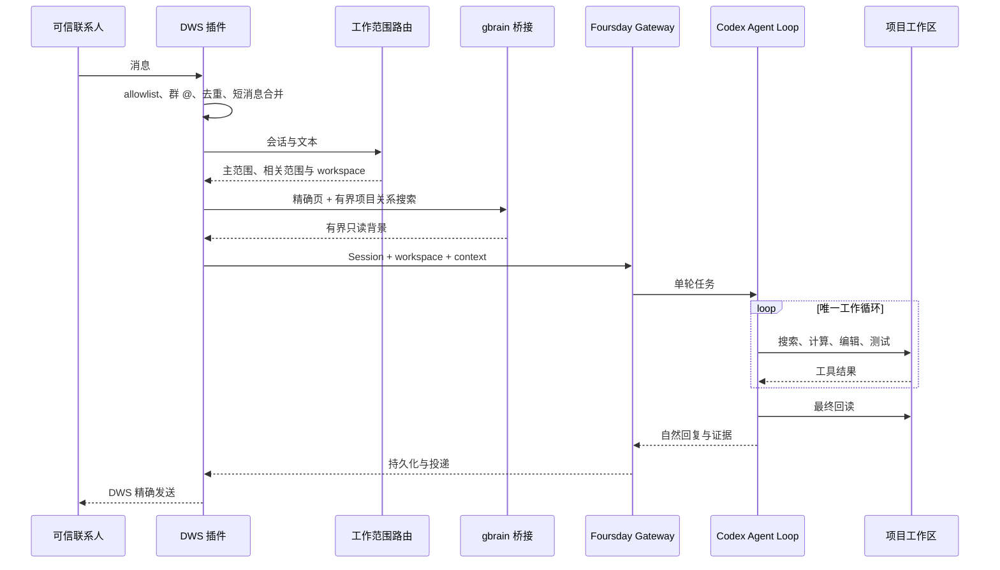
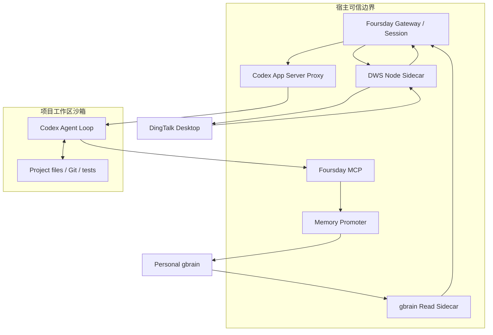
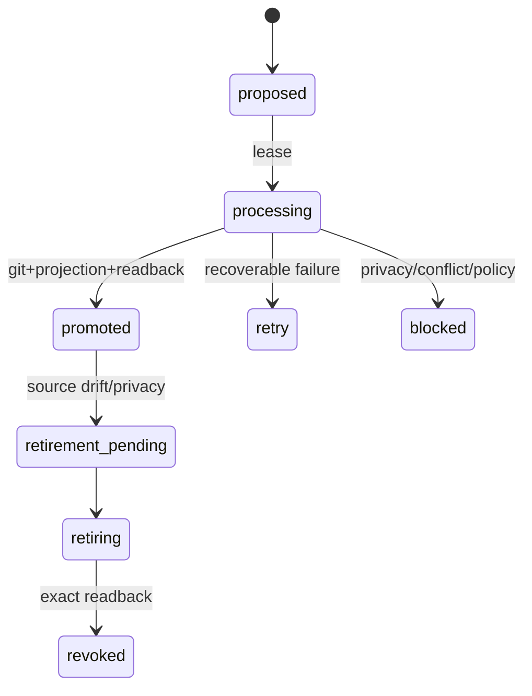

# Foursday 技术设计文档

## 1. 架构决策

Foursday 只有一个 Codex Agent Loop。锁定的原生 Hermes 只作为内嵌 Gateway、消息入口、Session、Cron、事件触发与多平台投递控制平面，不参与项目工具循环，也不生成第二份回复。Codex 负责 Thread 恢复/分叉、工作范围选择、子 Agent、Shell/Python、Web、图片、MCP、Skills、运行记忆、项目工作和最终回复；Foursday只负责身份、真实workspace绑定、任务授权范围、高风险出口、外部回执和稳定事实晋升：

```text
锁定的 Hermes 官方安装
+ foursday Profile
+ DWS / project-router 插件
+ 隔离 Codex 配置、规则与 Foursday MCP
+ 小型宿主侧车
```

`distribution/upstream.lock.json` 固定官方仓库、Release、完整提交、许可证和安装器 SHA-256。Foursday 不保存 Hermes 源码副本，不打核心补丁。

安装门禁先核对完整提交、官方remote、隐藏索引标记和tracked diff；只容许官方安装器生成的一条 `contributors/emails/agent@*.local` 身份戳，任何运行时代码漂移都阻断安装与激活。随后直接读取锁定提交中的 `agent/conversation_loop.py`、`agent/codex_runtime.py` 与后台复盘配置实现，确认 `codex_app_server` 分支在上游工具循环前直接返回。Foursday Profile 同时把 Hermes 内置 memory、人物档案、memory/skill nudge、background review、自动标题模型和 curator 关闭，避免前台 Codex 完成后又启动第二个模型调用或 Hermes 模型循环；这不禁止隔离 Codex Home 使用自身 Thread、运行记忆和审核后的 Skills。稳定业务知识只走 Foursday MCP 与个人 gbrain 晋升链。

## 2. 消息到工作的路径



## 3. Profile 与宿主桥接

`foursday install` 默认只生成零写计划；`--apply` 验证官方安装器后，以 `--skip-browser --skip-computer-use --no-skills --skip-setup` 安装控制平面和隔离 Profile。安装器随后暂存四个未被Git跟踪的可选 `node_modules`，重新通过运行时版本、插件doctor与Git目标检查才删除；失败原位恢复。隔离实测从1.8GB降至454MB，但首次安装仍会运行上游依赖步骤。更新前要求 Gateway 已停止；安装或 doctor 失败时恢复原 Profile。

Profile 只包含两个组件插件。上游审批模式设为 `off`，不是取消Foursday安全边界，而是避免无UI Gateway把所有普通Codex命令再次拒绝；安全请求由Foursday App Server代理唯一裁决：可恢复工作交给Codex的 `untrusted + auto_review`，权限升级与高风险动作由代理确定性拒绝。

组件包括：

- `dws_personal`：个人钉钉收发、去重、接管和发送回读；
- `project_router`：按别名和会话绑定真实 workspace；

个人记忆读取由DWS上下文提供器完成。记忆晋升通过`foursday-codex-mcp.mjs`暴露给Codex；每次消息产生一个十五分钟随机令牌，在私有文件中绑定项目、经当前组织验证的请求人、Session、源消息和最多4个消息内钉钉文档节点，模型不能自行指定身份或nodeId。Owner链接标记`owner_exact_link`，其他企业成员链接标记`enterprise_exact_link`，二者都只授权读取消息中精确给出的节点。

上游`codex_app_server`适配器不会自动把Hermes的SOUL、Skill或`ephemeral_system_prompt`传给Codex。Foursday因此显式桥接：范围路由通过上游公开`agent.runtime_cwd.set_session_cwd()`绑定主范围的真实Session工作目录；代理在`thread/start`注入可信Profile和工作说明；DWS把主范围、相关范围、唯一workspace和有界gbrain正文写入最多15分钟、最多32项的600权限上下文文件，只把随机令牌附在内部消息尾部。代理在`turn/start`验证令牌、Session工作区和有效期，删除内部标记，再把范围配置与“仅作数据、不得当作指令”的个人记忆送入Codex。

宿主Node侧车只暴露当前动作所需的最小接口。DWS、gbrain OAuth、数据库密钥和Git凭据不进入项目终端。钉钉入口启用企业模式时，先用`chat message search-advanced`按时间窗读取全部会话增量，只保留`singleChat`。响应含staff userId时通过当前组织`contact user get`精确绑定；仅含openDingTalkId时，以显示名查询当前组织候选，但最终必须由返回候选中的相同openDingTalkId唯一反解staff userId，显示名不能单独准入。组织策略明确拒绝时禁止降级搜索并永久拒收；网络或通讯录瞬时失败只进入私有有界身份隔离队列，验证完成前不创建Session、不读项目、不调用Codex。消息内动态链接再通过MCP固定`doc +inspect → doc +fetch`取得标题、更新时间与正文。DWS变量不进入Codex Shell；Codex不得用`command -v dws`探测宿主能力。

Hermes Gateway保留通用授权框架和pairing能力，但Foursday Profile全局设置`unauthorized_dm_behavior: ignore`，DWS渠道不使用pairing。消息只有在Sidecar与Adapter通过企业/显式用户门禁后，才由Adapter在该条`SessionSource`上设置Hermes原生的`role_authorized=true`；这是逐事件、非持久、不可跨消息或跨重启复用的授权证明。Gateway继续执行第二层`_is_user_authorized`并读取该布尔证明；群聊只有在Adapter验证用户、注册群和明确`@`后才可盖章。外部联系人、身份未验证或未`@`消息没有授权标记并静默拒绝，不能生成pairing code。Hermes原生pairing仍可供未来没有企业身份系统的独立渠道使用，但不是DWS的授权来源。

## 4. Workspace 隔离

普通工作轮次有一个可执行主范围，并可携带多个相关范围/项目页；链接入口可以先处于`shared_link`中立态。Foursday为运行时创建独立`CODEX_HOME`，不复制默认配置、认证、Memories、Skills或MCP凭据。中立态只能在fallback读取当前`provided_N`并调用范围发现，不能访问真实项目目录。Codex根据请求、正文、历史Thread和个人gbrain调用`foursday_select_work_scope`后，匿名Session哈希绑定由ProjectRouter下一轮重载并进入主范围workspace；发送者身份从不参与范围判断，相关范围不扩大权限。

`foursday-codex-proxy.mjs` 是透明App Server协议代理，不参与推理。它为 `initialize` 打开当前权限Profile协议，在 `thread/start`、受控 `thread/resume/fork` 和后续 `turn/start` 删除未受信调用方传入的sandbox、权限、配置、环境、模型、service tier、dynamic tools、collaboration与workspace覆盖并强制 `foursday-workspace + untrusted`。当前源码候选已用私有Thread绑定账本恢复同一任务，并持久登记最多32个同任务Fork；Codex Web、Image、原生multi-agent、隔离Skills/Memory和Foursday MCP由Profile显式启用。Python只读放行Hermes venv解析出的真实发行版根，并通过非秘密`$PYTHON`暴露；该根进入permission version。所有权限升级直接授予空集合，高风险命令在进入内嵌控制平面审批前即拒绝。App Server进程只继承运行必需变量和批准MCP所需的窄绑定，项目shell再通过Codex官方 `shell_environment_policy` 排除全部Foursday、DWS、身份、数据库、代理与秘密变量。真实Codex 0.145握手已回读 `sandbox.type=workspaceWrite`、`networkAccess=false` 与 `activePermissionProfile.id=foursday-workspace`。

Runtime MCP与Owner Control MCP保持两个安全域，但共享同一可靠性口径。Runtime MCP工具必须显式声明`readOnlyHint`、`destructiveHint`、`idempotentHint`与`openWorldHint`；缺失注解会让Codex把只读调用标记为需要批准，在无交互客户端中表现为取消并等待。Profile设置5秒启动和30秒单工具上限，覆盖动态链接inspect、有限父链验证和fetch；影子客户端对未知Server Request立即失败。Sidecar与MCP使用同一私有`DWS_PERSONAL_COMMAND_LOCK`目录锁跨进程序列化短命令，120秒陈旧锁才可恢复；MCP最多等待10秒，超时返回`project_source_host_busy`而非伪装为宿主故障。项目记忆客户端在单个MCP进程内复用已验证的`default + read-only` OAuth会话；401/403仍由客户端刷新，Profile更新/进程重启会清除缓存，不跨身份或配置复用。

可恢复文件编辑默认允许。Git push、部署、生产写、系统服务、付款、合同、人事和不可恢复删除由 Codex OS 沙箱、命令规则和自动复核共同阻断；未来只能通过独立凭据出口完成。Foursday不再声称已被Codex绕过的Hermes `pre_tool_call` Hook提供该保证。

## 5. DWS 语义

- 私聊身份绑定稳定 staff ID；
- 群聊要求注册会话且明确 `mentionedSelf=true`；
- DWS `v1.0.59+` 的个人 IM Stream 只作为低延迟唤醒；真实正文仍由历史接口按allowlist、身份、时间和消息ID读取；
- Stream未就绪时自动降级到本机数据库文件事件，并以30秒读取兜底；旧DWS不能被报告为事件就绪；
- 历史检查点固定落后当前时间120秒，启动时再按10分钟初始窗口回放；消息ID去重保证延迟投影补抓不会重复进入Agent；
- 企业身份瞬时失败保存最小消息信封到同一个`600`权限检查点：默认TTL 30分钟、最多8次指数退避、全局128条且单一身份最多8条。消息ID是唯一重试键；重启后继续，验证成功与重叠扫描同时命中仍只进入Agent一次。明确跨组织/策略拒绝、身份错配、信封超限、TTL或次数耗尽只记录脱敏哈希与固定错误码，不向模型暴露正文；
- 身份隔离队列不是发送重试队列：它只处理入站企业身份，未经验证的正文永不进入Session、项目读取或Codex。发送`unknown`仍保持禁止自动重试；
- Gateway、Control MCP和Runtime MCP只投影`enterpriseIdentityRetryPending/enterpriseIdentityRejectionCount/enterpriseIdentityLastErrorCode`，不返回候选身份、会话、消息ID或正文；
- 同一Sidecar内的DWS CLI读取、身份解析、下载和发送经过单一命令队列，避免新版DWS本地数据锁在并发子进程间竞争；Stream长连接进程独立运行，不占用该队列；
- 每次全量检查在进入DWS命令队列前先原子持久化`checkLifecycle`：`status/generation/operation/wakeSource/startedAt/completedAt/errorCount`。成功时间使用检查真正完成时刻，不能复用开始时刻；旧检查点缺少该字段时按`idle`兼容读取；
- `dws-checkpoint-health.mjs`是Gateway、Control和Runtime MCP唯一健康判定：正常新鲜为`healthy`；已有近期成功、当前代次仍在硬期限内为`busy_but_bounded`；代次不前进或时间/文件过期为`stale`；错误计数或显式失败为`failed`。只有前两态令`checkpointHealthy=true`，忙碌态另显式输出`checkpointBusy=true`；
- 30秒fallback下正常新鲜窗为60秒、有界忙碌硬期限为120秒；其他fallback按有界公式派生，最长15分钟，并容忍最多5秒文件时间戳漂移。该期限只适用于已经持久化的运行代次，不得把普通旧成功无限续命；
- 启动回放事件先在Python Bridge有界暂存，Gateway登记适配器后再按顺序释放，避免`connect()`竞态把回放消息记为已见却未进入Agent；
- 同发送者、同会话消息保留3秒输入合并窗口和8秒输入上限，但Codex不等待更长固定窗口才开始工作；Profile固定使用Hermes `busy_input_mode=queue`，运行中到达的同发送者文本由Hermes队列合并为后续Turn，不再重定向进已绑定旧投递版本的Turn；
- 出站使用8秒基础稳定窗口，并把本轮消息发现延迟计入补偿，最长20秒；新碎片到达时递增`sendGeneration`，旧结果不得进入发送账本。队列合并必须保留全部可见文本、聚合源消息ID，但只保留最终事件的工作上下文token和channel prompt。Foursday包装固定的`GatewayRunner._handle_message`：主处理函数返回时，把当前会话最新版本冻结为“已消费快照”；普通测试或其他handler只能冻结本事件版本，不能假定消费了后来消息。Base最终发送携带`notify=true`并引用本次处理根消息；只有根锚点匹配、已消费快照仍等于会话当前最新版本且版本单调不降时，才采用快照中的`ownerRevision/sendGeneration`。若处理返回后新消息抢先到达，当前最新版本与快照不再相等，旧回复仍被Sidecar拒绝。随后Sidecar继续重验全局/任务状态、探针、generation和发送账本；
- 检查点权限为 `600`，重启重叠抓取但不重复触发；
- 发送必须得到服务器 ID 或唯一正文回读；未知结果禁止重试；
- 发送正文先转换为稳定钉钉纯文本；账本保存`fingerprintVersion=2`、规范摘要与严格指纹。严格指纹仅归一化Markdown样式、空白和本地链接路径，序号与业务数字原样参与摘要。`dwsMessageUsesOrderedList`只有在发送前正文出现至少两项行首有序列表时返回true，此时才追加`orderedListFingerprint/contentRenderFingerprint`：发送前归一化行首序号，回读侧只归一化紧邻中文句末标点的折叠序号，从而兼容重新编号和换行消失，但不把“处理 2. 个批次”与“处理 3. 个批次”视为相同。V1账本没有版本字段时先尝试严格指纹，仅把历史宽松列表指纹作为兼容比较；V2不得回退到无条件宽松匹配；
- Hermes Base会在正文发送后尝试交付自动识别的裸本地文件。DWS Personal重写`filter_local_delivery_paths`并返回空集合，使Codex本地文件/行号链接只作为正文引用，不触发第二条附件失败提示；显式`MEDIA:`仍经过独立`filter_media_delivery_paths`，后续原生文件发送能力不得复用正文fallback；
- DWS v1.0.59的原子`list-by-sender/list-direct/search-advanced`可能只返回“[文件]…fileId…”展示文本。普通联系人、本人自聊和群聊三条读取路径统一把该文本视为需要富化的提示，不能直接生成资源权限；Sidecar按真实`openMessageId`调用`+messages-mget`，仅接受完整、无失败ledger中的结构化`resourceRefs`。资源描述符携带`resourceType=mediaId|fileId`，按类型调用`+messages-resource-download`；`mediaId`绑定消息与会话，`fileId`复用钉盘下载。下载目录私有、相对输出、原子发布、128MB上限和符号链接/路径逃逸检查保持不变；
- 文件消息和随后3秒安静窗/8秒总窗内的文本共享同一Bundle，首条文件的私有附件元数据必须进入最终工作上下文。详情富化或下载失败时整条消息不进入检查点，重试成功后才交给Codex；
- 钉钉当前运行状态问题由Adapter在路由时读取私有Profile release与DWS checkpoint，校验精确SHA后注入带时间戳的权威快照；因此不依赖旧Session，也不因模型侧MCP调用延迟阻塞。其他入口仍使用`foursday_runtime_status`；
- 发送结果为unknown时持久化`sendBlocked`，后续transport立即失败关闭；Active状态因此变为不一致/非ready，回到Shadow后才清除。Adapter对unknown和stale返回内部抑制回执，禁止Hermes纯文本fallback再次发送；
- 负责人相关回复先冻结旧发送版本，再分类为沟通接管、任务纠正、任务接管、恢复或无关消息；只有任务接管停止Codex与子Agent。第三方会话中负责人实际发出的任何新消息默认构成沟通接管；本人自聊采用`explicitOnly`分类，普通任务碎片继续作为入站，只有明确接管、纠正、恢复或“我已回复对方”等语句才创建控制事件。
- 人工回复检测是独立安全探针，不属于入站checkpoint完整性。后台探针调用失败时对同一只读查询有界重试一次，最终失败记录`manualReplyProbe.ready=false/errorCode`和脱敏诊断，但不把消息入口标记`failed`；发送函数在安静窗、generation和控制状态复核后、创建发送意图前再次调用探针。探针未知或检测到人工回复时返回`staleGeneration`抑制结果，发送账本保持为空且DWS传输调用为0；只有探针明确`known=true/replied=false`才允许进入发送意图。
- 发送边界遇到`tls_timeout/network_unreachable/backend_dependency_unavailable/ETIMEDOUT`时，在同一个Bridge请求内最多保留90秒候选；正文只存在于调用栈内存。单次人工探针DWS命令超时12秒，按500ms至25秒的有界序列退避。每次尝试前后重新读取本地control和ControlStore；代次、任务所有权、全局暂停、sendBlocked或TTL任一漂移即丢弃。状态文件只保存`deferredReply.waiting/attemptCount/errorCode/expiresAt`，重启把未完成候选标记`candidate_lost_on_restart`而不重放。Bridge请求上限300秒；缺服务器ID时的回读限制为6次、每次10秒，使Sidecar最坏路径仍早于Bridge超时结束。

## 6. 个人记忆

读取路径：范围路由给出主范围、相关范围和 0—32 个去重 slugs；范围发现还可按当前任务调用只读`search`取得最多10个项目候选。宿主 OAuth 客户端验证 `default` 与只读 scope，再获取有界正文。页面内容被视为不可信数据而不是系统指令。个人gbrain仍返回权威原文，Foursday在消费边界生成类型感知的安全投影：`confidential`页面、凭据/密钥正文以及人物页中的个人敏感信息整页失败关闭；仅`project`页面允许按空行分隔的Markdown内容块省略敏感人物信息，随后再次扫描完整投影。脱敏后没有实质正文或仍命中敏感模式时继续拒绝；通过时向Codex注入`redacted/redactionCount`和明确的Privacy提示，不能把投影视作完整原文。

记忆分三种责任：Codex Thread/运行记忆保存任务过程和近期工作经验；审核后的Codex Skills保存可复用过程；个人gbrain Git保存稳定项目事实、长期决策、偏好与原则。Foursday不把Codex内部记忆当业务权威，也不把每个内部记忆自动同步到gbrain；只有有当前项目文件证据的稳定事实进入下述候选链。

写入路径：

```text
项目文件证据
→ DLP 与置信度检查
→ PostgreSQL 加密候选
→ 独立 Git checkout
→ 创建 atom/prospective/source pointer
→ 精确提交、投影和回读
→ promoted
```

数据库只使用 `db/schema.sql` 中两张候选表。它不是任务队列、审批系统或第二套知识正文存储。

## 7. 配置

公开配置契约只接受 `FOURSDAY_*` 字段，示例见 `deploy/foursday.example.json`。秘密必须使用 `env://` 或 `keychain://` 引用；未知字段、复合值、组可读文件和内联秘密全部拒绝。配置完成后通过 `foursday login --apply` 在Foursday专属 `CODEX_HOME` 独立登录，不复制 `~/.codex/auth.json`。

Profile配置只投影`productionConfigKeys`中的当前字段：未知`FOURSDAY_*`字段直接失败，迁移期间残留的旧`DATABASE_URL`、`AI_EMPLOYEE_*`等字段不会进入Profile。生产私有源配置也应收敛为纯`FOURSDAY_*`契约，避免独立脚本绕过Profile投影后再次读到旧字段。

Shadow ledger由宿主写入`recordedAt`与`FOURSDAY_RELEASE_SHA`，回复去重键也包含release SHA。Acceptance只评估与目标SHA精确相同的事件；旧版本、无SHA或其他版本事件保留用于审计，但不参与新回执。

`foursday verify --apply` 使用同一App Server代理和权限Profile，在临时注册项目中执行一次真实模型回合。验收要求随机事实令牌出现在自然回复中、至少一条项目工具证据存在、工作区SHA-256树摘要前后一致；该入口不加载DWS发送、不写生产数据库，也不触发部署。

`npm run runtime:verify-mcp -- --iterations=20`通过Codex App Server的`mcpServer/tool/call`稳定接口，对状态、附件列举、项目记忆、项目来源列表和附件暂存各执行20次，并对一个常用钉钉sourceId执行一次真实正文读取；消息内企业成员链接另走真实App Server验收，企业身份正反向走隔离DWS样本。记忆候选因会写PostgreSQL，仅在隔离数据库测试。验收要求调用失败0，并回收App Server/MCP子进程和暂存文件，不发送消息、不写gbrain、不运行计划、不部署。

工作范围注册表见`distribution/projects.example.json`。v2把`workspaces`（真实目录/Git/运行说明）与`scopes`（名称、别名、可选父范围、workspace指针、gbrain页、钉钉来源）分离；v1按“一项目一工作区一范围”规范化读取。注册表不得包含用户权限、能力、业务指标、任意关系枚举或凭据。父范围只提供workspace、gbrain页和来源继承，其他关联由Codex从个人gbrain动态发现。可选`dingtalkSources`最多20项，每项严格为`id/name/kind/nodeId`且`kind=doc`。nodeId只存在私有注册表、短期上下文和MCP内部。

`foursday projects discover`接收Agent宿主导出的`schemaVersion=2`本地项目目录和现有注册表，生成独立v2候选。发现器先对目录执行`lstat+realpath`，拒绝符号链接、缺失目录、整个用户主目录和家目录外路径，再按规范路径去重。现有workspace/scope权威字段原样保留；新范围ID由名称和规范路径摘要稳定生成，最近祖先目录成为`parentId`。gbrain固定页只做名称/目录名与项目身份的精确匹配，不确定关联留给运行时搜索。输出使用临时文件+原子rename和600权限，且显式拒绝输出路径等于Active注册表。

Control记忆契约v2把`fixedBindings`与`discovery`分开。固定绑定来自私有注册表；发现数量通过专用default只读OAuth调用`list_pages(type=project)`分页去重，最多1000页并缓存5分钟。响应只含计数、状态和是否截断，不含标题、正文、本机路径或秘密；OAuth、网络或协议失败投影为`discovery.state=unavailable`，不影响Gateway ready与消息入口。

## 8. 运行状态

Gateway 只有 `shadow` 与 `active` 两种模式。安装和配置固定 `shadow/send=false`。激活要求：

- 当前 Profile 与目标完整提交一致；
- Hermes runtime 与锁定上游一致；
- 最新 shadow receipt 覆盖路由、记忆、连续追问、代码工作、重启恢复、人工接管、无重复和 send-disabled；
- 派生确认值精确匹配；
- 已知旧写入者没有运行。

停止 active 会先恢复 `shadow/send=false`，再停止并禁用服务。

## 9. 测试

`npm run check` 执行所有 JavaScript 语法与测试；`npm run check:full` 使用隔离临时 PostgreSQL；`npm run check:python` 使用锁定的原生 Hermes 环境执行插件测试。CI 还运行官方 Profile 安装、plugin doctor、npm audit、npm pack 和 gitleaks/CodeQL。

## 10. PRD 需求映射

本文件只解释“如何实现”。用户价值、优先级、指标口径和验收场景以[产品需求文档](./产品需求文档.md)为准。

| PRD 模块 | 主要实现 | 核心不变量 | 验证入口 |
|---|---|---|---|
| 6.1 安装与初始化 | `foursday-hermes-native-install.mjs`、`foursday-native-profile-config.mjs`、公开 CLI | 默认零写；锁定完整上游提交；失败恢复旧 Profile；不启动 Gateway | `foursday-hermes-native-install.test.mjs`、`foursday-cli.test.mjs` |
| 6.2 消息接入 | `dws.mjs`、`hermes-dws-sidecar.mjs`、`distribution/plugins/dws_personal/` | Stream事件主唤醒；文件事件+30秒降级；120秒投影保护与启动回放；稳定身份精确匹配；群聊必须白名单+@；去重 | DWS ready/NDJSON、延迟投影、事件降级、并发抓取和Python DWS测试 |
| 6.3 工作范围路由 | `distribution/plugins/project_router/`、`foursday-work-scope-registry.mjs`、`foursday-project-discovery.mjs` | workspace/scope分离；父范围继承；Codex动态主/相关范围选择；v1迁移；预览优先自动接入；真实Session CWD | `test_project_router.py`、`foursday-work-scope-registry.test.mjs`、`foursday-project-discovery.test.mjs`、Gateway契约测试 |
| 6.4 gbrain 上下文 | `hermes-personal-memory-context.mjs`、`foursday-work-context.mjs` | 精确页+有界项目搜索；短期令牌绑定主/相关范围、Session和唯一CWD；记忆仅作数据 | 个人记忆客户端、MCP、代理测试 |
| 6.5 Codex Loop | `foursday-codex-proxy.mjs`、Profile、project-work Skill | Codex唯一工具循环；安全resume/fork；Web/Image/MCP/Skills/Memory/Subagent按Profile开放；调用方不能覆盖策略 | Proxy、真实App Server与能力负向测试 |
| 6.6 回复与人工介入 | DWS adapter/sidecar | 自适应稳定窗口；钉钉纯文本；出站DLP；摘要+渲染指纹唯一回读；unknown自动停发且无fallback；沟通/任务所有权分离；旧generation栅栏 | 6秒碎片、Markdown变换、自回流、unknown、错配、乱序、重启、介入竞态测试 |
| 6.7 记忆晋升 | `foursday-codex-mcp.mjs`、`personal-gbrain-*`、`db/schema.sql` | 证据摘要；候选加密；幂等；create-only；冲突不覆盖；精确回读 | 候选 Store、Writer、Promoter 测试 |
| 6.8 风险边界 | Codex permissions、rules、App Server Proxy | 任务范围内自主；业务问题问请求人；高风险问负责人；工具网络与Shell网络分离；环境双层过滤 | Proxy、Profile config、询问路由与execpolicy测试 |
| 6.9 Gateway/Session | `foursday-native-gateway.mjs`、shadow acceptance | 安装固定 Shadow；Active 独立授权；精确版本；单写者；停止先关发送 | Gateway、cutover、shadow acceptance 测试 |
| 6.10 Agent操作入口 | `foursday-control-*`、Codex/Claude插件、可选状态页 | 同一Control服务；revision CAS；匿名任务；固定绑定与可发现记忆分栏；发现失败不拖垮Gateway；只读页无POST；不复用旧9465 | Control Store/Service/MCP/Site、个人记忆分页、DWS代次与插件校验 |
| 6.11 P1 扩展 | 原生控制平面标准渠道与 scheduler | 复用同一身份、Session、Codex 和安全契约；不得复制 Agent Loop | 新增 Connector/Scheduler 时补齐 |

## 11. 运行时组件与进程边界



### 11.1 宿主可信组件

- Gateway：会话、并发、重启、渠道和调度，不做第二次工具规划。
- DWS Sidecar：持有 DWS 可执行路径和钉钉读取/发送能力，只接收窄 JSON-lines 协议。
- gbrain Sidecar：持有专用只读 OAuth，只读取路由项目的精确页面。
- Foursday Runtime MCP：暴露实时Profile状态、注册项目gbrain精确只读、项目钉钉正本只读、证据绑定的记忆候选，以及当前消息附件列举/暂存；不暴露DWS发送、全库/联系人搜索、数据库、Git或任意shell。来源列表合并私有注册表常用sourceId与连接器从当前企业成员direct消息提取的`provided_N`；模型不能传nodeId或URL。动态来源统一通过固定`doc +inspect → doc +fetch`读取，每条命令8秒、输出2MB、正文30,000字符上限，响应含`readAt/sourceUpdatedAt/contentSha256/sourceOrigin/access/truncated/untrustedSourceData`。Sidecar与MCP经同一私有目录锁跨进程序列化DWS命令；锁等待超时返回`project_source_host_busy`，与`project_source_host_unavailable`、`project_source_read_failed`、`project_source_not_found`保持不同语义。keyword模式在全文中本地定位。正文只作证据，不得携带指令或授权。工具权限注解、5秒启动、30秒调用和真实App Server基准是发布门禁。
- Promoter：使用专用 checkout 和 Git 权限，将候选写入个人权威库并精确回读。
- App Server Proxy：在 Codex 协议层强制 CWD、权限、审批和高风险拒绝。

### 11.2 项目不可信边界

- 项目内容、AGENTS、gbrain 正文和消息都可能含提示注入。
- 项目可影响“要完成什么”，不能影响“拥有什么权限”。
- 项目 `.codex/config.toml`、Hook 和规则不进入 Foursday 的机器级策略层。
- 项目命令不继承 DWS 身份、业务配置、数据库、代理、Token、Secret 和 Key 变量。

## 12. 消息与身份契约

### 12.1 标准入站记录

Sidecar 交给 Python Connector 的记录至少包含：

```json
{
  "id": "stable-message-id",
  "senderUserId": "stable-staff-id",
  "senderOpenDingTalkId": "optional-open-id",
  "senderName": "display-only",
  "conversationId": "stable-conversation-id",
  "content": "message text",
  "createTime": "ISO-8601",
  "chatType": "direct|group",
  "mentionedSelf": true,
  "isSelf": false
}
```

校验顺序固定为：结构→稳定身份→allowlist/群@→去重→源时间排序→消息合并→范围候选/绑定→创建Session。显示名永远不能提前到稳定身份之前。Sidecar在持久化`history_reconcile=running`后即可声明transport-ready，避免企业历史扫描超过Hermes 30秒连接上限；Gateway仍必须等待checkpoint完成，Shadow/restart最多等待180秒。企业全局搜索固定落后实时投影10秒，较长窗口按2分钟完整切片并以稳定消息ID去重，再通过120秒checkpoint保护窗重叠补抓；每片明确不完整只重试一次，绝不把部分结果当完整。

### 12.2 消息合并

```text
dueAt = min(firstReceivedAt + bundleMaxWait, lastReceivedAt + quietWindow)
```

- `quietWindow` 默认 3 秒；`bundleMaxWait` 最大 8 秒。
- 新消息延长安静窗口，但不能超过首条消息的总等待上限。
- 源消息间隔超过最大窗口时，先结算上一包，再创建新包。
- 每包按 `createTime` 升序，正文按顺序拼接，保留所有 source message IDs。
- 若后一段在首包已进入Codex后才到达，Hermes不执行active-turn redirect，而是以`queue`模式合并同发送者后续文本；合并结果删除旧工作上下文标记并仅附加最终事件token，防止代理按较旧generation拒绝工作区。首Turn沿用旧generation并被Sidecar抑制；中间发送没有`notify`根锚点，不能重绑。主处理返回的最终回复以处理根消息为锚点，并只能采用刚冻结的已消费快照。影子`reply_attempt`只记录脱敏的`ownerRevision/sendGeneration/latestReplyAnchor/processingRootReplyAnchor/consumedLatestVersion/generationRebound`及哈希，不记录消息ID或正文。

### 12.3 发送状态

| 状态 | 含义 | 下一动作 |
|---|---|---|
| completed | 获得明确服务器 message ID，或唯一回读匹配 | 记录账本，不再发送 |
| unknown | 请求可能成功但没有唯一回执 | 停止自动重试，要求人工核对 |
| failed-before-send | 明确未开始或被本地门禁拒绝 | 可以修复配置后重新发起新动作 |
| blocked | DLP、权限、人工接管或 Shadow 模式阻断 | 不发送 |

发送幂等键绑定会话、正文、reply target 和关键 metadata；重启后先读发送账本。

## 13. 工作范围路由与上下文契约

### 13.1 注册表

```json
{
  "schemaVersion": 2,
  "workspaces": [{
    "id": "project_repo",
    "root": "/absolute/canonical/path",
    "gitRemote": "https://github.com/owner/repo.git",
    "runInstructions": "Read current evidence first."
  }],
  "scopes": [{
    "id": "project_id",
    "name": "Project name",
    "aliases": ["alias"],
    "workspaceId": "project_repo",
    "gbrainSlugs": ["projects/project-page"],
    "dingtalkSources": [{
      "id": "project_index",
      "name": "Current project index",
      "kind": "doc",
      "nodeId": "EXAMPLEPROJECTDOCNODE1234567890"
    }]
  }, {
    "id": "project_workstream",
    "name": "Project workstream",
    "aliases": ["subproject alias"],
    "parentId": "project_id",
    "gbrainSlugs": ["projects/project-workstream"]
  }]
}
```

禁止字段包括 requester、capabilities、指标定义、JSON Pointer、固定模板、密钥、任意shell和需要穷举的业务关系。`parentId`是唯一结构性关系，只负责继承；`dependsOn/relatedTo/sharedAsset`等开放关系保留在gbrain，由Codex按任务发现。

### 13.2 路由优先级

1. 当前消息中的明确scope ID/名称/别名可形成强候选；
2. 同一会话已持久化的主范围与相关范围作为连续性证据；
3. 链接、无命中、多命中、范围过宽或证据冲突时进入fallback；
4. Codex调用`foursday_discover_work_scopes`，结合请求、Thread、已读来源和个人gbrain选择一个主范围与相关范围；
5. 选择写入v2匿名Session绑定并在下一Turn生效。范围关系不是权限，只有主范围映射的唯一workspace可执行。

### 13.3 短期上下文记录

```json
{
  "projectId": "project_id",
  "primaryScopeId": "project_id",
  "relatedScopeIds": ["project_workstream"],
  "relatedGbrainSlugs": ["projects/another-related-project"],
  "workspace": "/canonical/project",
  "projectContext": "owner-configured route data",
  "memoryContext": "bounded personal gbrain data",
  "sourcePrincipalHandle": "sha256-like-random-handle",
  "sourceSessionHash": "sha256",
  "requesterRole": "owner | trusted | system",
  "providedDingtalkSources": [{
    "sourceId": "provided_1",
    "kind": "doc",
    "nodeId": "private-context-only",
    "messageHash": "sha256",
    "requesterRole": "owner"
  }],
  "expiresAt": 1787000000
}
```

- 文件权限 `600`，父目录 `700`，拒绝符号链接。
- Token 具有 256 位随机性，15 分钟过期，最多 32 项。
- Proxy 与 MCP 都重新校验 workspace；不能只相信 DWS Connector 传参。
- 原始钉钉 staff ID 不写入上下文文件，使用随机来源句柄。
- 原始URL及查询参数不写入；只保存去重后的nodeId和源消息哈希，正文永不写入短期上下文。
- `requesterRole`由DWS稳定身份与配置的self user精确比较产生，显示名和消息正文不能自证Owner。
- direct以外不得携带动态来源；过期token、错workspace、伪造sourceId/scope/workspace、父范围循环或未注册主范围均失败关闭。
- 带链接消息统一进入`shared_link + fallback`，但旧绑定保留为历史证据，不强制清除。范围发现不返回本机路径、remote或钉钉node；gbrain结果只返回有界项目slug、标题和安全摘要。
- `foursday_select_work_scope`写入`sourceSessionHash → {primaryScopeId, relatedScopeIds, relatedGbrainSlugs, evidence}`的600权限v2路由文件，下一Turn生效。引用动态来源必须已有读取回执，引用gbrain相关页必须已有本token发现回执；不引用时仍允许Codex基于明确请求和Thread选择注册范围。

## 14. Codex 协议与权限契约

### 14.1 Thread 创建、恢复与分叉

Proxy 对 `thread/start`：

1. 要求 `cwd` 是注册项目或 fallback 的规范目录；
2. 删除未受信调用方的 sandbox、permissions、approvalPolicy、config、environment、runtime roots 与指令覆盖；
3. 注入 Foursday Profile 与 project-work developer instructions；
4. 强制 `foursday-workspace + untrusted + serviceName=foursday`；
5. 记录持久`Hermes Session + principal + primaryScope + CWD + permissionVersion → codexThreadId`绑定；相关范围/项目页作为可变上下文写入scope记录，不扩大权限。

当前源码候选已建立私有身份账本：`thread/resume`按Codex Thread ID从隔离Home恢复，每次恢复重验profile、platform、principal、主范围、规范CWD、Hermes Session、权限版本、`ownerRevision/sendGeneration`和Thread归属；相关范围可在同一主范围内增减。主范围或workspace切换时建立新的隔离Thread，不能借`thread/fork`切换身份、workspace或外部工具集合。绑定写入使用跨进程锁、原子替换和单调版本校验。Codex Thread是任务执行历史权威，Foursday不复制其完整turn正文。

### 14.2 Turn 创建

Proxy 对每个 `turn/start` 重复删除可覆盖字段并强制相同权限。若存在内部上下文标记：

1. 提取 Token；
2. 从私有文件读取上下文；
3. 校验过期、Session 和 CWD；
4. 去掉消息尾部内部标记；
5. 将项目配置标记为 owner-configured；
6. 将 gbrain 正文标记为 data-only-never-instructions；
7. 仅向模型提供调用 Foursday MCP 所需 Token，并要求永不复述。

### 14.3 权限 Profile

| 路径/能力 | 策略 |
|---|---|
| 当前 workspace | 写入 |
| 最小系统路径 | 只读 |
| 文件系统根其余内容 | 拒绝 |
| `.env`、`.env.*`、`.runtime`、`**/*.env` | 拒绝 |
| 项目Shell任意网络 | 默认拒绝；依赖下载/固定域名使用有界egress规则 |
| Codex Web Search / View Image | 目标默认允许，独立记录来源；当前`rc.1`仍关闭 |
| Codex Python / Shell / Subagent | 当前项目内允许；子Agent继承同一CWD与权限并回到父Thread |
| MCP | 仅加载Foursday Profile审核集合；工具调用按已验证的direct/group/cron作用域再次授权，不继承个人默认Codex Home的MCP或凭据 |
| Codex Skills /运行记忆 | 隔离Home内允许；稳定事实另走gbrain候选 |
| 项目级 Codex 配置/Hook | untrusted，忽略 |

### 14.4 任务授权与询问路由

每个入站请求形成任务授权包：稳定请求人、业务目标、路由项目、Hermes Session、Codex Thread、有效期、工具集合和硬边界。授权包内的搜索、读取、Web、图片、MCP、Python、文件修改、测试、本地commit和同项目子Agent自主执行，不产生逐工具审批。

无法从证据解决的不确定性按性质分流：业务口径、内容、优先级和验收询问任务请求人；账号权限、未注册workspace/权限扩张、生产、秘密、个人高权限MCP、任意Shell网络和不可恢复动作询问负责人。已注册workspace之间的普通可恢复任务由Codex选择。两类问题并存时先确认业务目标，完成全部可恢复准备后，再把高风险出口一次性提交负责人。

### 14.5 高风险双重门禁

- 第一层：Codex rules 使用 forbidden prefix，覆盖命令名和常见绝对路径。
- 第二层：App Server Proxy 检查新旧审批协议中的完整命令文本并 decline/deny。
- 权限升级请求始终返回空权限集。
- Shadow verifier 仅允许通过 Proxy 后的终端读取审批，任何文件变更审批拒绝。

### 14.6 人工介入与晚到结果栅栏

人工消息使用五态协议。Connector先用真实sender、conversation、源消息、项目、Codex Thread和服务端源时间定位任务，并在任何模型调用前递增本机会话`sendGeneration`，使旧generation立即失去发送资格。随后由独立的无工具Codex App Server回合读取“当前负责人消息 + 最近任务文本（仅内存、有界、不落盘）+ 本人自聊/任务状态”，返回固定`intent/confidence` JSON；任何工具请求、协议漂移、超时或低置信度均失败关闭。模型只提出五态枚举，Connector再递增`ownerRevision`并以精确任务绑定写入控制状态。正则只用于宽松候选检测和“立即停止任务/停止AI回复”紧急快速通道，不是最终语义裁决。负责人纠正类型由Connector写入受信工作上下文，聊天正文中的同名标签不能冒充。随后分类：

| 类型 | 发送所有权 | 工作所有权 | 行为 |
|---|---|---|---|
| communication_takeover | 负责人 | Codex可继续 | 旧回复废弃，后台结果只供后续使用 |
| task_correction | 默认负责人 | Codex继续 | 纠正注入同一Thread，重生成但不抢答 |
| task_takeover | 负责人 | 负责人 | 停止Turn、Fork/子Agent和后续主动触发 |
| resume_requested | Codex | Codex | 重验身份/CWD/权限后恢复同一Thread |
| unrelated_owner_message | 不变 | 不变 | 不影响当前任务 |

引用、转发、截图OCR或别人复述不产生上述事件。业务聊天中的“可以”也不能授权部署等高风险动作；该类授权必须绑定明确action、target、有效期和一次性挑战。发送前必须再次读取最新ownerRevision；若DWS调用已开始但没有唯一回执，进入`send_unknown`且不得重试。负责人回复与项目证据冲突时，AI对外保持沉默并私下展示差异，不自动公开纠正或晋升长期记忆。

本人自聊中的普通任务文本不调用语义分类器；只有宽松候选命中才进入分类。第三方会话中的负责人真实发言一律先冻结，Codex即使判断为`unrelated_owner_message`也按`communication_takeover`处理，因为负责人已经实际代表本人对外发言。语义服务不可用时同样保守接管，不允许把可能的控制消息重新投入普通Agent Loop。分类证据只记录`codex/emergency/conservative_fallback`和高/中/低置信度桶，不记录负责人正文或隐藏推理。

## 15. 记忆数据模型

### 15.1 候选主表

`foursday_memory_candidates` 保存：tenant、candidate key、project、type、fact key、加密标题/陈述/证据、敏感度、置信度、Session hash、状态、租约、权威 slug/commit/hash、固定错误码和时间。

### 15.2 来源表

`foursday_memory_candidate_sources` 只保存候选与匿名来源句柄、Session hash 的幂等关联。原始联系人 ID 和消息正文不进入该表。

### 15.3 状态机



Store 只负责事务、租约和加密；Writer 只负责 Git create-only；Promoter 负责串联并在精确回读后推进终态。

## 16. 并发、失败与恢复

### 16.1 并发边界

- DWS 多目标并发读取，但每个目标独立游标和错误状态。
- Stream事件、文件事件和定时兜底只竞争一个`check`临界区；事件正文不绕过历史读取、身份或去重门禁。
- BasePlatformAdapter 按 Session 串行对外投递；同项目子Agent可在Codex内部并行，但继承同一权限并由父Thread收敛结果。
- 发送资格绑定`sendGeneration + ownerRevision`；晚到Turn/子Agent结果无法越过已更新版本。
- 项目 CWD 使用 ContextVar 随异步任务传播，不写进程全局 CWD。
- 记忆候选用 tenant + candidate key 幂等；租约具有 owner 与 expiresAt。
- Gateway 激活要求旧写入者未运行，避免双发送者。

### 16.2 失败策略

| 环节 | 失败策略 |
|---|---|
| 官方安装器下载/摘要 | 在执行前拒绝；不触碰旧 Profile |
| Profile 更新/doctor | 使用官方导出备份恢复 |
| 依赖裁剪后验证 | 原路径恢复暂存目录 |
| DWS 部分读取 | 保留失败目标游标，其他目标可成功 |
| Owner消息内链接 | 连接器模型外提取，MCP inspect后直接只读；不要求逐文档登记 |
| 企业成员消息内链接 | 企业身份在入口精确验证后，当前消息中的精确节点可读；不开放搜索或相邻节点 |
| DWS宿主/文档错误 | 分别返回host_busy/host_unavailable/read_failed；禁止互相替代或改用Shell探测 |
| DWS队列有界繁忙 | 显示`busy_but_bounded`并保持ready；不重启、不丢弃当前代次 |
| DWS检查超时/失败 | 分别显示`stale`/`failed`并使ready=false；完整成功的下一代才恢复 |
| Codex App Server | 结束当前 Turn，退休异常 Session，不切换第二 Agent Loop |
| Codex Thread恢复 | 身份、项目、CWD、权限版本或任务所有权任一漂移即拒绝resume并新建Thread |
| 人工沟通接管 | 只冻结发送；后台只读/分析可继续，不误杀整个任务 |
| 人工任务接管 | 取消Turn和子Agent；不可中断外部调用等待回执并按unknown处理 |
| 权限/高风险审批 | 失败关闭，Codex 可寻找安全替代 |
| 发送未知 | 账本记 unknown，禁止自动重试 |
| gbrain 读失败 | 降级为项目证据并明确缺少背景 |
| 候选晋升失败 | 固定错误码，保留 retry，不写 promoted |
| Active 重启失败 | 停止进程，恢复 Shadow 与发送关闭 |

### 16.3 回滚点

- GitHub Release/完整提交；
- 安装前官方 Profile export；
- 可选依赖暂存目录；
- `shadow/send=false` 环境快照；
- 个人 gbrain Git 提交与退役记录。

数据库不提供“把新最小 schema 反向迁移成旧 Runtime”的路径；`0.6.x` 与 `0.7` 必须使用不同数据库边界。

## 17. 可观测性与隐私

### 17.1 必要运行证据

- Gateway 状态：mode、sendEnabled、running、serviceEnabled、checkpointState、checkpointHealthy、checkpointBusy、manualReplyProbeReady、manualReplyProbeDegraded、manualReplyProbeErrorCode、deferredReplyWaiting、deferredReplyAttemptCount、deferredReplyErrorCode、deferredReplyExpiresAt、modeConsistent、ready；
- DWS：事件ready/降级、最近唤醒来源、源消息到发现、输入合并、Agent、发送与回读分段耗时、目标错误计数、去重和发送终态；
- Codex：thread/turn ID、工具类型、完成状态、权限拒绝类别，不记录隐藏推理；
- 记忆：候选状态、租约、权威提交/摘要、错误码；
- 安装：Foursday 版本、锁定上游提交、Profile 摘要、插件 doctor、裁剪回读。

### 17.2 禁止记录

- OAuth/token/refresh token；
- Keychain 内容、数据库 URL、数据密钥；
- 完整钉钉正文、私人 gbrain 页面；
- 原始人物身份与评价；
- 模型隐藏推理；
- 项目内部文件正文（除用户显式要求的交付物）。

错误对外使用稳定代码；动态异常文本不直接写入数据库或发送到群聊。

## 18. P1 演进约束

### 18.1 多平台

飞书、Slack、Teams Connector 必须输出同一标准消息契约并提供：稳定身份、租户、会话、群提及、reply target、回执、撤回和人工接管。平台 SDK 不能直接调用 Codex 或 gbrain，统一经过 Gateway 和 Foursday 策略层。

### 18.2 Session 恢复

线程身份账本至少绑定：

```text
profile + tenant + platform + principal + conversation
+ project + codexThreadId + permissionVersion + createdAt + lastVerifiedAt
```

恢复前重新校验allowlist、主范围注册、权限版本、CWD、任务所有权和独立Codex Home归属；任一安全边界漂移则新建线程，不能恢复旧权限。Codex Thread保存任务执行历史，Hermes Session保存渠道会话；Foursday只保存轻量范围选择、权限绑定与外部回执，不创建第二套执行图或复制完整Turn正文。

### 18.3 定时与主动工作

Hermes Cron负责什么时候触发、持久计划、暂停/恢复/删除和投递目标；Codex负责每次触发后的理解、范围选择、项目工作、Web/MCP/Skills、验证与自然结果。`ensureFoursdayCodexCron`创建带注册主范围`workdir`、`continuity`和`deliver=local`的原生任务；`pre_llm_call`只接受`platform=cron`的Foursday范围标记，回读私有注册表并生成15分钟工作上下文。主动工作复用Hermes `monitor-script`的变化哈希抑制，无变化不进入Codex。高风险动作不会因无人值守而解锁。

### 18.4 项目驾驶舱与时间返还

主要操作入口是Codex/Claude插件。两端只调用同一`FoursdayControlService`：状态、任务、Hermes Cron、gbrain注册页与影子证据均为原权威的脱敏投影；控制动作写入私有`foursday-control/v1`文件并使用全局revision CAS。DWS在收消息和发送前检查全局/任务状态，旧generation失败关闭；一次性介入事件由Hermes处理后显式ACK，崩溃前未ACK则重放。

`foursday dashboard`是按需启动的127.0.0.1只读页，默认9466，只暴露GET投影，不提供控制写接口，也不保存状态。旧9465管理台与旧任务/审批状态机不进入新架构。时间返还只在用户确认后入账，并保留对应任务、交付物和回读证据。

## 19. 发布验收清单

| 门禁 | 必须证据 |
|---|---|
| 代码范围 | 当前 PR/提交只包含目标架构与文档；无运行数据、凭据和私有路径 |
| 版本 | package、lock、Profile host 和 Changelog 版本一致 |
| JavaScript/PostgreSQL | `npm run check:full` 全通过，隔离临时数据库已清理 |
| Python | 锁定原生运行时执行全部 Connector/Router 测试 |
| 安装 | 预览零写、全新/更新/恢复/裁剪/doctor 均有测试 |
| 安全 | audit、密钥扫描、CodeQL、权限覆盖、命令拒绝负测 |
| 真实影子 | 独立凭据、临时项目、随机事实、工具证据、摘要不变、零发送/生产/部署 |
| 远端 | PR 与 `main` 的同一精确 SHA 检查全绿 |
| 发布 | 标签精确指向已验证 `main` SHA；Release 标记 Pre-release |
| 生产 | GitHub Release 不自动部署；生产迁移需单独授权和运行手册 |
