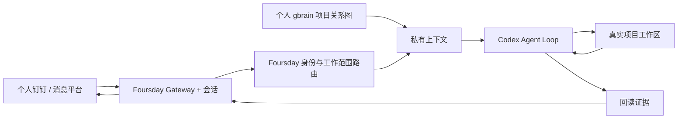

# Foursday

Foursday 是由个人记忆驱动、能够在真实项目中自主工作的 AI 工作分身。

它通过Foursday Gateway接入个人钉钉、开放式工作范围路由和个人gbrain，由Codex作为唯一工作循环完成任务。它不是一套为每个问题预设capability、JSON指针或固定回复模板的流程机器人。

当前公开版本为 `v0.8.0-rc.1` 候选版。GitHub Release、技术部署和生产激活是三个独立状态；真实发送仍需影子验收、显式激活和回读。

## 能做什么

- 只接受当前企业稳定身份可验证的私聊成员和被`@`的授权群聊；
- 根据会话、项目别名和注册表进入正确项目；
- 按项目授权读取个人 gbrain；
- 让 Codex 在真实工作区搜索、计算、改文件和运行测试；
- 由Codex从完整上下文生成岗位合同、目标、交付物、验收条件和证据摘要，程序只约束身份、版本与高风险边界；
- 回读结果并自然回复；
- 负责人介入时先冻结旧回复，再按沟通接管、任务纠正、任务接管或恢复处理。

Git 推送、合并、生产部署、生产数据写入、不可恢复删除、付款、合同、人事决定和秘密外发仍是独立硬边界。

## 当前架构



Foursday 不再维护自研 Agent Runtime、Hermes Fork、旧自管 Gateway、能力清单工作流或第二套长期知识库。旧实现已经从当前代码和主文档删除，Git 历史仍可恢复。

当前源码候选采用Codex-first边界：Hermes负责消息入口、Session、Cron和投递；Codex负责Thread、工具、工作范围选择和最终回复；Foursday只做身份、真实workspace、任务范围、高风险出口、人工介入、发送稳定和gbrain晋升。注册表v2把真实workspace与项目/子项目范围分离，个人gbrain提供持续变化的关联图；Codex每个任务可选择一个主范围和多个相关范围，相关范围不扩大文件权限。个人默认白名单是当前钉钉企业，外部与未知身份拒绝。业务问题问请求人，高风险权限问负责人。真实发送与生产激活仍是独立发布门禁。

## 安装

```bash
git clone https://github.com/ruiwang20010702/foursday.git
cd foursday
npm ci --ignore-scripts
npx --no-install foursday install
npx --no-install foursday install --apply
```

安装器会验证锁定的上游安装器，跳过浏览器、Computer Use与内置Skills，并在运行时和插件doctor回读通过后裁剪可选Node依赖。隔离实测安装体积由1.8GB降至454MB；首次安装时间仍受上游依赖步骤影响。安装不会启动Gateway或发送消息。

复制并填写：

- [`deploy/foursday.example.json`](../../deploy/foursday.example.json)
- [`distribution/projects.example.json`](../../distribution/projects.example.json)

如果 Codex 已保存本地项目，可以先让 Codex 把项目清单导出到一个权限为600的私有JSON，再自动生成v2候选，不需要手写每个目录：

```bash
npx --no-install foursday projects discover \
  --catalog /绝对私有路径/codex-projects.json \
  --output /绝对私有路径/projects.v2.json

npx --no-install foursday projects discover \
  --catalog /绝对私有路径/codex-projects.json \
  --output /绝对私有路径/projects.v2.json \
  --apply
```

发现器保留已有项目ID和固定记忆页，按最近的已保存父目录建立项目/子项目关系，只做精确gbrain身份匹配，并自动排除整个用户主目录、家目录以外路径、符号链接和重复目录。输出只是独立候选，不能覆盖Active注册表；后续仍需单独执行配置、Shadow验收和激活。

随后配置并启动只读影子模式：

```bash
FOURSDAY_CONFIG_FILE=/absolute/private/foursday.json npx --no-install foursday configure --apply --registry /absolute/private/projects.json
FOURSDAY_CONFIG_FILE=/absolute/private/foursday.json npx --no-install foursday login --apply
FOURSDAY_CONFIG_FILE=/absolute/private/foursday.json npx --no-install foursday verify --apply
npx --no-install foursday gateway install-shadow --apply
npx --no-install foursday gateway start-shadow --apply
```

`foursday verify` 会在临时项目中运行一次真实 Codex，只接受包含随机文件证据、具有工具调用证据且工作区摘要前后一致的结果；它不发钉钉、不写生产、不部署。切换 active 必须使用绑定精确提交的最新 shadow acceptance；安装不会自动继承任何凭据、联系人或发送权限。

## 在Codex或Claude中操作

Foursday不再要求用户打开独立管理产品。Codex和Claude插件都调用同一Control MCP，可查看状态、任务、定时工作、记忆范围和证据，并以精确revision执行暂停、接管、纠正与恢复。

macOS用户还可以构建可选桌宠工作现场。它复用已经安装的Codex pet素材，透明悬浮并根据空闲、工作、等待、验收和异常显示Foursday状态；点击后先汇总“需要我／AI负责／最近处理”数量，再以项目优先的侧栏直接展开任务。同一项目在整个侧栏只出现一次，不用下拉切换，也不会把多条任务显示成多个项目。绑定优先匹配当前任务代次；短暂未路由的新任务显示“正在识别项目”，旧孤儿记录进入“未归档历史”。项目归属由Codex自动判断，不要求同事创建项目名或文件夹。“AI负责”只表示任务所有权仍在AI，不代表此刻有Turn运行。详情显示经过身份校验的联系人显示名与渠道、`Foursday · Codex`执行者、真实Thread位置、最近更新时间和脱敏活动；稳定身份ID仍不展示也不依赖显示名鉴权。没有任务合同时明确说明证据尚未开始统计。隔离Thread不会出现在主Codex侧边栏，界面只提供诊断编号复制，不展示无效深链。普通任务仍默认自主执行，面板不是审批中心；它不展示原始思维链、不修改Codex App，也不创建第二状态机：

项目文件夹默认展开，点击标题即可收起或重新展开，不会暂停任务。新任务显示Codex生成的行动摘要；旧任务可显式运行本机摘要回填，只保存脱敏标题和精确任务代次，证据不足时仍显示时间而不猜测。

```bash
npm run pet:build
npm run pet:build -- --apply
open ".runtime/foursday-pet/Foursday Pet.app"
```

记忆状态明确区分“固定绑定范围/页面”和“个人gbrain可发现项目数”。可发现项目只提供按任务选择的知识上下文，不自动获得本地文件权限；gbrain目录临时不可用时只把发现数量标为暂不可用，不影响Gateway消息健康。

在仓库克隆目录安装Agent入口：

```bash
npm install --global --ignore-scripts .

codex plugin marketplace add .
codex plugin add foursday@foursday-local

claude plugin marketplace add . --scope user
claude plugin install foursday@foursday-local --scope user
```

安装后新建Codex任务或Claude Code会话。两个入口使用同一`foursday` CLI与Control服务，不复制运行状态。

```bash
npx --no-install foursday control status
npx --no-install foursday control tasks
npx --no-install foursday dashboard
```

`dashboard`默认只在`127.0.0.1:9466`提供只读投影，不保存第二套状态。旧9465页面属于已移除的旧架构，不作为新版本操作入口或状态权威；迁移清理不得连带删除PostgreSQL、钥匙串或gbrain数据。

## 记忆边界

| 存储 | 责任 |
|---|---|
| 个人 PRIVATE gbrain Git | 唯一长期业务知识权威 |
| gbrain PostgreSQL | 可重建检索与图投影 |
| Foursday 会话存储 | 会话和工具历史，由内嵌控制平面提供 |
| Foursday 私有任务账本 | 当前岗位合同、生命周期和有界证据摘要 |
| Foursday PostgreSQL | 加密的记忆晋升队列 |

Foursday 不创建第二个知识仓库，也不复制个人页面正文。

## 继续阅读

- [产品需求文档](../产品需求文档.md)
- [设计总览](../设计总览.md)
- [技术设计文档](../技术设计文档.md)
- [安装与运行](../en/deployment.md)
- [生产迁移与回滚](./生产迁移与回滚.md)
- [同企业真实工作灰度测试指南](./同企业真实工作灰度测试指南.md)
- [安全说明](./安全说明.md)
- [集成扩展](./集成扩展指南.md)
