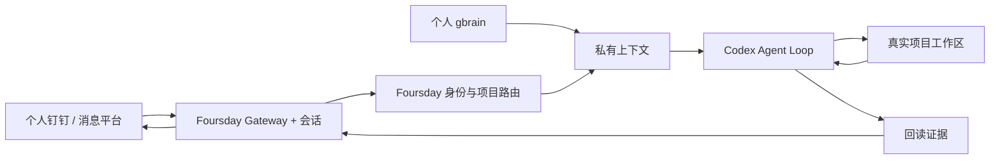

# Foursday

Foursday 是由个人记忆驱动、能够在真实项目中自主工作的 AI 工作分身。

它通过 Foursday Gateway 接入个人钉钉、项目路由和个人 gbrain，由 Codex 作为唯一工作循环完成任务。它不是一套为每个问题预设 capability、JSON 指针或固定回复模板的流程机器人。

当前公开版本为 `v0.8.0-rc.1` 候选版。GitHub Release、技术部署和生产激活是三个独立状态；真实发送仍需影子验收、显式激活和回读。

## 能做什么

- 只接受 allowlist 中的可信联系人和被 `@` 的授权群聊；
- 根据会话、项目别名和注册表进入正确项目；
- 按项目授权读取个人 gbrain；
- 让 Codex 在真实工作区搜索、计算、改文件和运行测试；
- 回读结果并自然回复；
- 负责人介入时先冻结旧回复，再按沟通接管、任务纠正、任务接管或恢复处理。

Git 推送、合并、生产部署、生产数据写入、不可恢复删除、付款、合同、人事决定和秘密外发仍是独立硬边界。

## 当前架构



Foursday 不再维护自研 Agent Runtime、Hermes Fork、旧自管 Gateway、能力清单工作流或第二套长期知识库。旧实现已经从当前代码和主文档删除，Git 历史仍可恢复。

当前源码候选采用Codex-first边界：Hermes负责消息入口、Session、Cron和投递；DWS `v1.0.59+` Stream作为个人消息主唤醒，文件事件和30秒读取兜底；Codex负责Thread恢复/分叉、子Agent、Shell/Python、Web、图片、审核MCP、隔离Skills/运行记忆与项目工作；Foursday只做身份、项目、任务范围、高风险出口、人工介入、自适应发送稳定和gbrain晋升。任务范围内可恢复工作默认自主完成，业务问题问请求人，高风险权限问负责人。真实发送与生产激活仍是独立发布门禁。

## 安装

```bash
git clone https://github.com/ruiwang20010702/foursday.git
cd foursday
npm ci --ignore-scripts
npx --no-install foursday install
npx --no-install foursday install --apply
```

安装器会验证锁定的上游安装器，跳过浏览器、Computer Use与内置Skills，并在运行时和插件doctor回读通过后裁剪可选Node依赖。隔离实测安装体积由1.8GB降至454MB；首次安装时间仍受上游依赖步骤影响。安装不会启动Gateway或发送消息。

复制并填写：

- [`deploy/foursday.example.json`](../../deploy/foursday.example.json)
- [`distribution/projects.example.json`](../../distribution/projects.example.json)

随后配置并启动只读影子模式：

```bash
FOURSDAY_CONFIG_FILE=/absolute/private/foursday.json npx --no-install foursday configure --apply --registry /absolute/private/projects.json
FOURSDAY_CONFIG_FILE=/absolute/private/foursday.json npx --no-install foursday login --apply
FOURSDAY_CONFIG_FILE=/absolute/private/foursday.json npx --no-install foursday verify --apply
npx --no-install foursday gateway install-shadow --apply
npx --no-install foursday gateway start-shadow --apply
```

`foursday verify` 会在临时项目中运行一次真实 Codex，只接受包含随机文件证据、具有工具调用证据且工作区摘要前后一致的结果；它不发钉钉、不写生产、不部署。切换 active 必须使用绑定精确提交的最新 shadow acceptance；安装不会自动继承任何凭据、联系人或发送权限。

## 在Codex或Claude中操作

Foursday不再要求用户打开独立管理产品。Codex和Claude插件都调用同一Control MCP，可查看状态、任务、定时工作、记忆范围和证据，并以精确revision执行暂停、接管、纠正与恢复。

在仓库克隆目录安装Agent入口：

```bash
npm install --global --ignore-scripts .

codex plugin marketplace add .
codex plugin add foursday@foursday-local

claude plugin marketplace add . --scope user
claude plugin install foursday@foursday-local --scope user
```

安装后新建Codex任务或Claude Code会话。两个入口使用同一`foursday` CLI与Control服务，不复制运行状态。

```bash
npx --no-install foursday control status
npx --no-install foursday control tasks
npx --no-install foursday dashboard
```

`dashboard`默认只在`127.0.0.1:9466`提供只读投影，不保存第二套状态。旧9465页面属于已移除的旧架构，不作为新版本操作入口或状态权威；迁移清理不得连带删除PostgreSQL、钥匙串或gbrain数据。

## 记忆边界

| 存储 | 责任 |
|---|---|
| 个人 PRIVATE gbrain Git | 唯一长期业务知识权威 |
| gbrain PostgreSQL | 可重建检索与图投影 |
| Foursday 会话存储 | 会话和工具历史，由内嵌控制平面提供 |
| Foursday PostgreSQL | 加密的记忆晋升队列 |

Foursday 不创建第二个知识仓库，也不复制个人页面正文。

## 继续阅读

- [产品需求文档](../产品需求文档.md)
- [设计总览](../设计总览.md)
- [技术设计文档](../技术设计文档.md)
- [安装与运行](../en/deployment.md)
- [生产迁移与回滚](./生产迁移与回滚.md)
- [安全说明](./安全说明.md)
- [集成扩展](./集成扩展指南.md)
