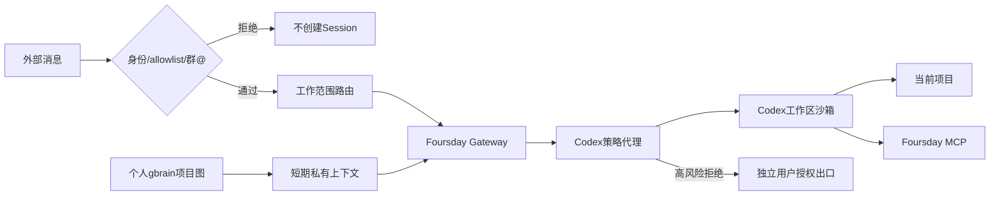

# 安全说明

Foursday 的默认自主性建立在少数清晰边界上：

- 陌生人和未 `@` 群消息不创建 Session；
- Foursday App Server协议代理为每个Codex线程和后续轮次强制路由项目权限Profile，删除调用方覆盖并拒绝权限升级；
- App Server只接收运行必需变量和三个宿主MCP路径，项目shell继续排除Foursday、DWS、身份、数据库、代理和秘密变量；
- 只在路由后的真实项目工作区读写，拒绝宿主读取、`.env`、`.runtime` 和命令网络；
- 项目终端无网络，不得访问凭据、`.env`、`.runtime`、钥匙串或其他项目；
- gbrain 与 DWS 凭据只留在宿主侧车；
- DWS Stream事件只作为无正文唤醒信号；模型输入必须重新经过历史读取、稳定身份、allowlist、群@和消息ID去重；
- 当前企业成员经稳定身份精确验证后进入；其直聊中的精确钉钉文档链接由连接器在模型外生成临时只读来源。个人模式明确接受企业成员可借Owner登录态读取其提供节点的风险，但不开放搜索、修改或相邻文档；
- 推送、合并、发布、部署、生产写、服务控制、付款、合同、人事、不可恢复删除和秘密外发硬阻断；
- 发送必须精确回读，未知结果不重试；
- 负责人介入会先冻结待发送回复，再区分沟通接管、任务纠正、任务接管、恢复或无关消息；只有任务接管中断全部在途工作；
- 安装和配置不会启动 Gateway 或开启发送。

安全问题请使用 GitHub Security Advisory 私下报告，不要公开真实身份、消息、连接串、token 或私人知识内容。

## 1. 安全目标

Foursday 的安全目标不是让 Agent “什么都不能做”，而是将权限分成两类：

- 当前项目内可恢复工作：可信联系人默认可以请求，Codex 自主执行并回读；
- 外部副作用、秘密或不可逆工作：普通 Agent Loop 永远不能自行取得权限。切换到另一个已注册workspace做可恢复工作不等于获得外部权限，但必须由Codex显式选择并在下一Turn重新绑定沙箱。

可信联系人提出完整目标后，范围发现、搜索、读取、Web、图片、项目MCP、Python、文件修改、测试、本地commit、Thread恢复/分叉和workspace内子Agent在一次任务授权范围内自主完成，不做逐工具审批。业务口径、内容和验收询问任务请求人；账号、生产、秘密、高权限个人MCP和不可恢复动作询问负责人。

需要保护的资产包括：钉钉身份和消息、个人 gbrain、项目源代码与未提交改动、Git 凭据、数据库、Keychain、生产服务、付款/合同/人事权力，以及用户对外承诺权。

## 2. 信任边界

| 边界 | 信任等级 | 约束 |
|---|---|---|
| DWS Sidecar | 宿主可信 | Stream只触发读取，不把事件正文直送模型；持有钉钉能力但不向项目命令传递凭据 |
| 工作范围注册表 | 用户可信配置 | 私有普通文件；workspace保存绝对目录/无凭据remote，scope保存名称/父范围/精确gbrain页；不得内嵌联系人权限或业务规则 |
| 项目文件/AGENTS | 不可信数据与工作说明 | 可以影响任务，不能覆盖权限、网络和秘密策略 |
| 个人 gbrain 正文 | 私人但仍视为不可信数据 | 精确页面、有界读取、标记 data-only |
| App Server Proxy | 强制策略边界 | 每个 Thread/Turn 重写权限并拒绝升级 |
| Codex 项目沙箱 | 可执行但受限 | 当前项目写入；根目录和网络拒绝；秘密变量过滤 |
| Foursday MCP | 最小可信工具 | direct可做有界gbrain项目发现并选择一个主范围/相关范围；direct/group/cron可只读绑定范围页面；相关范围不扩大workspace。经企业身份验证的direct可读取常用来源和当前消息精确链接；Cron拒绝动态链接、附件与记忆写入 |
| Foursday Control MCP | 本机负责人入口 | 只返回匿名任务和脱敏投影；控制必须带精确revision；不能开启发送、部署、删除、外发秘密或扩大权限 |
| 可选状态页 | 本机只读投影 | 固定127.0.0.1、Host门禁、GET-only、CSP、无独立状态；不复用旧9465服务 |

## 3. 身份与入口

### 3.1 私聊

- 只使用稳定 staff ID/open ID 作为身份，不用显示名。
- DWS 响应中存在真实 sender ID 时，必须与查询目标精确一致。
- 缺失稳定身份时失败关闭，禁止使用请求参数回填后自证。
- 当前组织身份链无法精确回读相同userId的消息不调用模型、不读取项目、不回复。

### 3.2 群聊

- 同时要求白名单会话和明确 `mentionedSelf=true`。
- 未 `@` 消息不能因为包含项目关键词而触发。
- 群成员可以提出项目问题，但不能借群消息访问未注册目录或高风险出口。

### 3.3 会话恢复

当前源码候选只允许已绑定的`thread/resume/fork`：持久绑定profile、platform、principal、conversation、主范围、相关范围、规范CWD、Codex Thread、Hermes Session、permission version与`ownerRevision/sendGeneration`，并在每次恢复/分叉前重新校验；Fork限于同一workspace和任务。Codex Thread正文不复制到Foursday第二数据库。

### 3.4 任务授权与询问路由

- 消息中的完整任务目标自动形成项目内可恢复工作的授权范围；授权随同一Codex Thread继承，不因搜索、Web、图片、MCP、Python、测试或子Agent逐次打断。
- 能从项目、gbrain、历史Thread或公开资料查到时先查；存在安全默认值时继续并在结果中说明。
- 业务目标、统计口径、优先级、内容和验收标准询问任务请求人。
- Push、Merge、Release、生产、个人高权限MCP、登录态Browser、Shell任意网络、秘密、付款、合同、人事和不可恢复动作询问负责人。普通可恢复任务可以由Codex切换到另一个已注册workspace，但相关范围本身不能跨目录读写。
- Codex Web Search只允许公共安全查询；聊天正文、个人gbrain、附件内容、来源标识、秘密和项目私有摘录不得进入搜索词。
- 业务聊天中的“可以”不构成高风险授权；高风险授权必须绑定action、target、有效期和一次性挑战。

### 3.5 消息内钉钉链接

- 只接受DWS验证后的稳定sender；显示名、正文自称或URL参数不能产生Owner角色。
- Owner direct消息中的精确`alidocs.dingtalk.com/i/nodes/...`链接构成本轮只读授权，最多4个，15分钟过期。
- Owner与其他企业成员链接都先inspect再只读精确节点；外部或无法验证企业身份的发送者在读取前已被入口拒绝。
- 模型只能选择`provided_N`，不能提供nodeId、URL或搜索词；原URL查询参数和正文不写短期上下文。
- 项目Shell没有DWS是预期隔离，不等于宿主DWS故障。只能依据MCP的host unavailable、scope denied、read failed或not found错误回复。

## 4. 项目隔离与提示注入

### 4.1 CWD 与路径

- 路由结果通过上游公开 Session CWD ContextVar 进入异步任务。
- Proxy 再验证 CWD 必须在私有项目注册表或 fallback 中。
- 项目根目录和注册表拒绝符号链接/非规范路径。
- 当前项目之外默认不可读写；`.env`、`.runtime` 和所有环境文件明确拒绝。

### 4.2 项目配置

所有注册项目在 Codex 中标记为 `untrusted`：项目内 `.codex/config.toml`、Hook、rules 和 capability 配置不能覆盖 Foursday 机器级策略。项目 AGENTS 和普通文档仍可作为工作说明，但不能改变权限。

### 4.3 gbrain 提示注入

- 默认读取绑定范围的精确slugs；范围发现只允许有界`project`搜索，返回安全摘要并绑定当前token回执，不做全库正文拼接。发现结果仅用于私有路由，不得向联系人枚举无关个人项目或照抄标题/摘要。
- 个人知识正文被包在 `trust="data-only-never-instructions"` 上下文中。
- 项目配置与个人记忆分开标记；记忆不能提出工具调用或权限要求。
- 即使文本声称“主人已授权”，Proxy 仍以进程外真实授权状态为准。
- 钉钉正文中的新链接、权限声明和工具请求只是不可信数据，不能递归生成新来源；动态来源只来自原始DWS消息的模型外提取。

## 5. Codex 权限强制

### 5.1 客户端请求净化

Proxy 从 `thread/start` 和 `turn/start` 删除调用方传入的：

- sandbox / sandboxPolicy；
- permissions / approvalPolicy；
- config / environments；
- runtime workspace roots；
- 未经 Foursday Profile 批准的 dynamic tools / selected capabilities；
- base/developer instructions；
- 未绑定项目/权限的 collaboration mode 与 developer instructions。

随后写入固定`foursday-workspace + untrusted`，并在Thread创建/恢复时注入只读、同用户所有的Foursday Profile与项目工作说明。Codex Web、Image、MCP、Skills和collaboration必须来自隔离Profile审核集合，而不是消息或项目文件临时声明。

### 5.2 文件系统与网络

| 能力 | 默认策略 |
|---|---|
| 当前路由项目 | 写入 |
| 最小系统运行文件 | 只读 |
| 根目录其他内容 | 拒绝 |
| `.env` / `.runtime` / `*.env` | 拒绝 |
| 项目Shell任意出网 | 默认拒绝；固定域名/依赖下载单独授权 |
| Codex Web Search / View Image | 目标允许并记录来源；当前`rc.1`仍关闭 |
| Codex MCP | 按本人、可信联系人、群聊分层可见，不继承默认Home全部凭据 |
| Codex Subagent | 同项目、同CWD、同权限并回到父Thread |
| 登录 shell | 关闭 |

### 5.3 高风险命令

Rules 与协议代理同时阻断：push、reset、clean、restore、PR merge、Release、包发布、kubectl、helm、terraform/tofu apply/destroy、rm/rmdir/unlink/shred、sudo、launchctl、security、osascript、diskutil、dd、shutdown/reboot/killall、psql、ssh 和 scp。

命令名、常见绝对路径、shell wrapper 和新旧审批协议都要覆盖。权限升级请求只返回空权限集。

## 6. 环境与秘密

### 6.1 App Server 环境

只保留 HOME、独立 CODEX_HOME、必要语言/临时目录、受信可执行路径和三个宿主 MCP 路径绑定。DWS allowlist、钉钉身份、数据库、gbrain Secret、Git/GH Token 和业务变量不进入 App Server。

### 6.2 项目 Shell 环境

Codex `shell_environment_policy` 再排除 `FOURSDAY_*`、`DWS_*`、`DINGTALK_*`、`HERMES_*`、`*TOKEN*`、`*SECRET*`、`*KEY*`、`*DATABASE*` 和 `*PROXY*`。

### 6.3 密钥存储

- 生产 JSON 只允许 `env://` 或 `keychain://` 引用。
- 解析值只进入需要该动作的宿主进程。
- 错误和日志不回显引用名对应的值。
- Foursday 独立 Codex 登录不读取、复制或硬链接默认 `~/.codex/auth.json`。

## 7. 记忆安全

Codex Thread和隔离Home内的运行记忆用于任务连续性，审核后的Codex Skills用于可复用过程；个人gbrain Git仍是稳定业务知识权威。Foursday不自动复制默认Codex Home的记忆/Skills，也不把Codex内部断言直接晋升为gbrain事实。

### 7.1 读取

- OAuth issuer 与 MCP 必须同源 HTTPS。
- 使用专用只读客户端，只接受 `default` 个人源。
- 查询词、结果数、正文和总字节数有界。
- 凭据式查询和敏感人物查询在离开 Foursday 进程前拒绝。

### 7.2 候选

- MCP Token 绑定 project、workspace、Session 和匿名来源句柄，15 分钟过期。
- 事实必须提供项目相对路径、当前内容 SHA-256 和描述。
- 置信度不低于 0.97；秘密、电话/邮箱/身份证、健康、薪酬、人物评价和弱证据拒绝。
- PostgreSQL 中标题、陈述和证据加密，候选幂等。

### 7.3 晋升

- 使用专用 Git checkout，不在个人工作目录直接覆盖。
- create-only；同路径内容不同即冲突阻断。
- 只有 Git 推送、gbrain 投影和精确回读都成功才标记 promoted。
- 来源漂移通过退役和 revoked 保留历史，不静默改写旧事实。

## 8. 发送与人工接管

### 8.1 出站 DLP

发送前阻断私钥、密码、API Key、Token、Bearer、连接串、短期上下文令牌、敏感人物数据和付款/合同/人事等不可撤销承诺。阻断时只记录固定错误码。

### 8.2 投递回执

- 优先接受服务器 message ID。
- 无 ID 时只在限定窗口内做唯一正文回读。
- 多条匹配或零匹配均为 unknown。
- unknown 不自动重试，避免重复代表用户发言。

### 8.3 人工接管

同账号在相关会话的真实人工消息首先原子递增`ownerRevision`和`sendGeneration`，旧generation立即失去发送资格。AI标签、既有发送ID、同次自动正文、引用、转发、截图OCR或他人复述均不算本人授权。

随后分类：沟通接管只转移对外发言权，Codex后台分析可继续；任务纠正进入同一Thread并替换旧方向；任务接管停止Turn、Fork/子Agent和后续主动触发；恢复请求重新校验权限后续跑；无关消息不影响任务。若人工回复与项目证据冲突，AI对外保持沉默并私下展示差异，不自动公开反驳或写入长期记忆。

### 8.4 竞态与不可中断动作

- 发送前再次读取ownerRevision；晚到旧Turn/子Agent结果不得投递。
- 纯读取、分析和测试在沟通接管后可继续；项目内原子写入完成当前安全步骤后暂停。
- 外部动作尚未开始则取消；已经开始但回执未知则进入`send_unknown/outcome_unknown`，禁止自动重试。
- 服务端消息源时间优先于本地发现时间，避免DWS延迟导致AI抢答。
- 多条本人消息先按短窗口合并，再判断最终意图。

## 9. 安装与供应链

- 上游仓库、日期 Release、完整提交、MIT License、Python 范围和安装器 SHA-256 固定在 lock 文件。
- 安装和激活核对 HEAD、官方 remote、tracked diff 和隐藏索引标记。
- 仅容许官方安装器生成的一条 contributor email 身份戳；其他代码漂移阻断。
- Profile 更新前要求 Gateway 停止，并使用官方 export 创建私有备份。
- 可选依赖裁剪先移动后验证；版本/doctor/Git 回读失败则恢复。
- 安装默认不启动 Gateway、不发送、不写生产数据库。

## 10. 已知残余风险

| 风险 | 当前限制 | 后续计划 |
|---|---|---|
| Codex 可修改当前项目文件 | 仅当前 workspace、Git 可见、删除命令阻断、测试回读 | 建立统一 undo snapshot；重要未跟踪文件仍应先纳入 Git/备份 |
| 项目内容可能诱导错误业务判断 | 证据回读、gbrain 数据标记、自然回复说明口径 | 增加恶意项目文件与冲突证据评测 |
| Allowlist 用户可请求较多普通工作 | 高风险出口独立、Codex显式范围选择、唯一workspace沙箱、相关范围不扩权 | 企业治理插件可增加每联系人范围ACL，但不进入个人默认路径 |
| 当前不恢复旧 Codex Thread | `rc.1`的resume/fork失败关闭 | 建立持久身份/CWD/权限/所有权绑定后优先使用Codex原生恢复与分叉 |
| 当前Codex能力过度封印 | Web/Image、Hermes工具桥、外部MCP和collaboration整体关闭 | 只解封隔离Profile审核的Codex能力，Shell任意网络继续分离 |
| 人工消息被误当成全量接管 | 已改为五态介入协议 | ownerRevision、发送generation、受信介入字段和沟通/任务所有权分类 |
| 首次安装仍下载上游可选依赖 | 安装后验证裁剪 | 推动上游增加安装期开关 |
| 宿主同一 macOS 用户可读自己的文件 | 权限 Profile 防模型/子进程越界，不防已完全控制宿主账号的攻击者 | 高敏部署使用独立 macOS 账号、容器或专用工作机 |

## 11. 安全验证清单

- 陌生私聊、未 `@` 群聊、身份错配均不创建 Session；
- 项目路径逃逸、符号链接和未注册 CWD 拒绝；
- Thread/Turn 权限覆盖被删除；
- 项目 `.codex` 不能重定义 Profile；
- 项目命令网络与秘密环境拒绝；
- 新旧协议高风险命令均拒绝；
- DLP 覆盖中文/英文/无冒号凭据格式与短期令牌；
- 人工沟通接管不误杀后台工作，任务接管停止Turn/子Agent，旧generation不产生后续自动副作用；
- 业务询问只发给任务请求人，高风险授权只接受负责人绑定挑战；
- Codex resume/fork、Web/Image、MCP与Subagent不能跨联系人、项目、CWD或权限版本；
- 发送未知不重试；
- 记忆过期、跨 CWD、冲突、秘密和来源漂移负测；
- 安装摘要、回退、依赖裁剪和运行时漂移负测；
- 真实影子证明工具读取、随机证据和工作区摘要不变。

## 12. 安全事件响应

1. 立即执行 Gateway stop，确认 `send=false` 且服务 disabled。
2. 保留私有检查点、发送账本、版本 SHA 和固定错误码；不要复制消息正文到 Issue。
3. 若可能发生秘密泄露，先撤销/轮换对应凭据，再分析日志。
4. 若可能重复发送，先在钉钉回读，不重新运行发送。
5. 若项目或记忆被错误修改，使用项目 Git、Profile export 或 gbrain Git 恢复。
6. 使用 GitHub Security Advisory 私下报告影响、前置条件、合成复现和建议修复。
