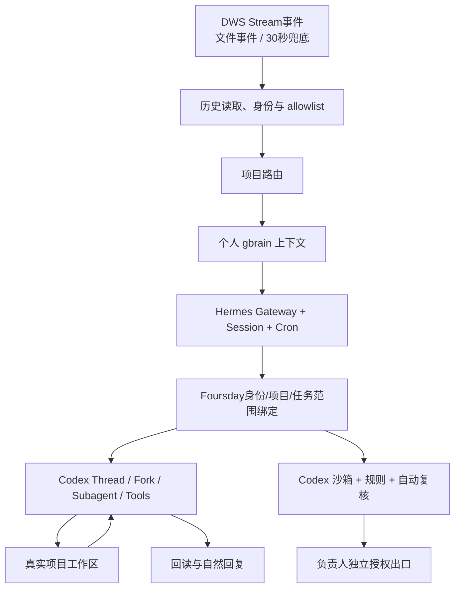

# Foursday 设计总览

## 产品定义

Foursday 是“个人记忆驱动的工作分身”：可信联系人提出工作，Foursday 自动找到项目，由 Codex 唯一工作循环完成可恢复工作，并用真实证据回复。

默认个人模式不使用项目 capability manifest、逐联系人项目授权或固定业务指标。企业治理可以未来作为独立插件提供，但不进入个人安装主路径。

目标职责是：Hermes负责消息入口、Session、Cron、事件触发与结果投递；Codex负责Thread恢复/分叉、子Agent、Shell/Python、Web、图片、MCP、Skills、运行记忆、项目工作与自然回复；Foursday只负责稳定身份、项目/CWD绑定、任务授权范围、人工沟通/任务所有权、高风险出口、外部回执和gbrain稳定事实晋升。

当前公开版本为`v0.8.0-rc.1`。源码验收、GitHub Release、某台实例的技术部署和生产激活是相互独立的状态。

## 组件地图



| 责任 | 当前入口 |
|---|---|
| Hermes 版本锁与安装 | `src/hermes-upstream.mjs`、`src/foursday-hermes-native-install.mjs` |
| Profile 配置与 Gateway | `src/foursday-native-profile-config.mjs`、`src/foursday-native-gateway.mjs` |
| 个人钉钉 | DWS `v1.0.59+` Stream主唤醒；文件事件/30秒降级；`distribution/plugins/dws_personal/`、`src/hermes-dws-sidecar.mjs` |
| 项目路由 | `distribution/plugins/project_router/`、`distribution/projects.example.json` |
| 个人记忆读取 | `distribution/plugins/dws_personal/memory.py`、`src/hermes-personal-memory-context.mjs` |
| 记忆晋升 | `src/foursday-codex-mcp.mjs`、`src/hermes-memory-candidate-sidecar.mjs`、`src/personal-gbrain-*.mjs` |
| 高风险边界 | Foursday专属 Codex `config.toml`、`rules/` 与自动复核 |
| 工作方式 | `distribution/profile/SOUL.md`、`distribution/skills/project-work/` |
| 负责人操作 | 统一Control MCP、Codex/Claude薄插件、按需只读状态页 |

## 自主与询问

- 任务范围内可恢复工作默认自主执行，不逐工具审批。
- 能查到先查；业务口径、内容和验收问任务请求人。
- 账号、跨项目、生产、秘密、个人高权限MCP和不可恢复动作问负责人。
- 负责人回复先冻结旧发送，再区分沟通接管、任务纠正、任务接管、恢复或无关消息。

## 数据归属

```text
个人 gbrain Git        长期知识正文
gbrain PostgreSQL      可重建检索投影
Foursday 会话存储      会话和工具轨迹，由内嵌控制平面提供
Foursday PostgreSQL    记忆晋升队列
项目 Git               代码、文档和交付物
```

旧 Agent Runtime、旧管理台、旧 Gateway、旧计划/审批状态机、能力预算、项目配方、影子增长指标和历史导入器不再属于当前架构。

## 版本范围

| 优先级 | 当前边界 |
|---|---|
| P0 | 个人钉钉DWS Stream/降级入口、自适应发送稳定、allowlist、项目路由、个人gbrain、Codex工作循环、Thread恢复/同任务Fork、Web/Image、分层MCP、隔离Skills/Memory、子Agent、附件、五态介入、安全边界和影子验证 |
| P1 | 飞书、Slack、Teams、多平台Session，以及Hermes Cron/Monitor的产品配置入口与日报/提醒/风险预警配方；Cron→Codex本地结果核心已在源码候选实现 |
| P2 | 企业治理插件、配方生态、团队级策略和规模化运营能力 |

P1/P2未完成部分不应被当前安装或Release页面表述为已交付能力。详细验收以[产品需求文档](./产品需求文档.md)为准。

## 文档职责

- [产品需求文档](./产品需求文档.md)：用户价值、默认行为与验收。
- [技术设计文档](./技术设计文档.md)：实现、信任边界和失败行为。
- [英文架构](./en/architecture.md)：公开技术概览。
- [安装与运行](./en/deployment.md)：唯一当前安装路径。
- [生产迁移与回滚](./指南/生产迁移与回滚.md)：候选版进入生产前的隔离、验收、激活和回退边界。
- [安全说明](./指南/安全说明.md)：信任、工作区、秘密、记忆与外发边界。
- [集成扩展](./指南/集成扩展指南.md)：新增平台、Skill 和 Hook 的方式。
